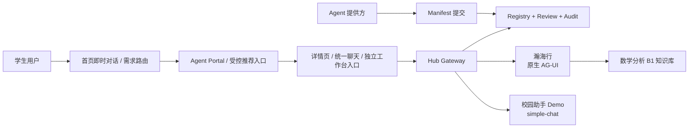

# Campus Agent Hub 实现规格

本文件是当前 Hub 工程的权威规格，记录已经冻结并实现的边界。历史 Personal Main Agent 方案只保存在 Git 归档标签 `archive-v0.4-personal-main-agent`，不再作为开发依据。

## 1. 产品定位

Campus Agent Hub 是校园 Agent 的应用广场、统一接入协议和治理平台。瀚海行是首个 Featured Agent，不是 Hub 本体；其他队伍的校园 Agent 可以用相同 Contract 接入。

平台的执行链仍只做确定性接入和治理；首页另提供不执行任务的发现助手：

- 首页即时模式使用用户全局模型提供普通对话；
- 首页路由模式将需求匹配到“静态功能表 ∩ 运行时 active Registry”，模型只返回候选 `agent_id` 和理由；
- 后端拒绝伪造、下线或不在功能表中的 `agent_id`，用户点击受控推荐入口后才进入 Agent；
- Gateway 根据 URL 中的 `agent_id` 查询 Registry 并转发；
- Hub、瀚海行和第三方 Agent 是独立 HTTP 服务和独立数据边界；
- Hub 不理解具体 Agent 的业务，不修改其回答语义；
- 平台没有可执行任务的 Main Agent、递归委派、A2A 或 Agent 间调用；首页需求路由只做推荐，不调用目标 Agent。

## 2. 系统结构



代码位置：

| 目录 | 责任 |
|---|---|
| `apps/hub` | 独立 Hub 后端、Registry 数据库与 Portal |
| `contracts/campus-agent-hub/v1` | Contract Schema、示例和 Conformance Runner |
| `apps/course-agent` | 瀚海行及其 Hub AG-UI / Featured 适配层 |
| `apps/demo-agent` | 独立第三方接入演示，使用 `simple-chat` |
| `deploy` | 三服务编排、运行时 seed 与凭据注入 |

Hub 使用独立 `hub.sqlite3`，不复用瀚海行数据库、Session 或业务函数。所有调用必须经过 HTTP。

## 3. 三种接入等级

| 等级 | 要求 | 用户体验 |
|---|---|---|
| Link App | 有效 `launch_url` | 从 Portal 打开外部应用，不进入统一聊天 |
| Connected Agent | AG-UI 或 `simple-chat`、聊天端点、健康端点 | 在 Hub 的统一聊天容器内使用 |
| Featured Agent | Connected 要求、`full-workspace` 能力、审核通过的回调地址 | 同时提供统一聊天和 Agent 自己的完整工作台 |

Featured 是平台审核结果，Agent 提供方不能在 Manifest 中自行声明。

## 4. Contract v1

Contract 的唯一机器可读来源位于 `contracts/campus-agent-hub/v1`。依赖锁定为 `@ag-ui/core@0.0.57`。

### 4.1 Manifest

```json
{
  "schema_version": "1.0",
  "id": "campus-helper-demo",
  "name": "校园助手 Demo",
  "description": "用于演示标准接入的独立服务",
  "version": "1.1.0",
  "owner": "Demo Team",
  "category": "校园生活",
  "tags": ["演示", "校园生活"],
  "integration": {
    "mode": "connected",
    "protocol": "simple-chat",
    "launch_url": "https://agent.example.edu.cn/",
    "chat_endpoint": "https://agent.example.edu.cn/api/chat",
    "health_endpoint": "https://agent.example.edu.cn/api/health"
  },
  "capabilities": ["simple-chat"],
  "data_policy": {
    "receives_user_identity": true,
    "receives_files": false,
    "stores_conversation": false
  }
}
```

`trust_level`、审核状态、活动版本、内部凭据和审计记录是 Registry 私有元数据，不属于 Manifest。

### 4.2 统一聊天

原生 Connected Agent 接收官方 `RunAgentInput` 并返回 AG-UI SSE：

```text
RUN_STARTED
TEXT_MESSAGE_START
TEXT_MESSAGE_CONTENT ...
TEXT_MESSAGE_END
RUN_FINISHED | RUN_ERROR
```

所有事件必须通过官方 `EventSchemas`。`simple-chat` Agent 返回 Contract JSON，Gateway 的通用适配器把它转换为同一 AG-UI 事件链。Gateway 不能按具体 `agent_id` 增加业务条件分支。

## 5. Registry 与治理

Agent 记录和版本记录分离：

```text
version review: pending -> approved | rejected
version deploy: staged -> active -> superseded
agent status: pending -> active -> suspended -> active
```

- 同一 Agent 可以提交多个语义化版本；
- 批准新版本时原子切换活动版本，旧版本变为 `superseded`；
- 提交后自动执行并保存 URL、启动页、健康、协议和图标检查，最新机器检查未通过时不得批准；
- 管理员可以暂停、恢复和回滚；
- 只有 `active` 且存在活动版本的 Agent 对普通用户可见和可调用；
- Featured 必须是 Connected，具有回调地址和 `full-workspace` 能力。

## 6. 身份与 Featured 工作台

Hub 使用 Ed25519/EdDSA JWT：

- JWT Header 必须包含固定算法 `EdDSA` 和 `kid`；
- 公钥通过 `/.well-known/jwks.json` 发布；
- JWT 最长 120 秒，允许 30 秒时钟偏差；
- Gateway 调用 scope 是 `chat:invoke`；
- Featured 工作台 scope 是 `workspace:enter`；
- Agent 必须校验 `iss`、`aud`、`sub`、`iat`、`exp`、`jti`、scope 和请求 ID；
- 标准身份头只有 `Authorization: Bearer <JWT>`。

Featured 流程：

1. 浏览器生成不可预测的 `state`；
2. Hub 生成 60 秒一次性授权码；
3. 浏览器进入平台注册的固定回调地址；
4. Agent 服务端使用 `client_secret_basic` 向 `/oauth/token` 兑换 JWT；
5. Agent 校验 JWT 后建立自己的本地 Session；
6. 授权码被消费后不可重放。

Client secret 只在创建时返回一次，Hub 只保存 Argon2id 哈希。部署脚本把 secret 写入运行时卷，不进入 Git、浏览器、Manifest 或日志。

Client secret 支持短窗口轮换和立即撤销；Hub Ed25519 私钥默认保存在运行时 volume，重启后保持稳定，并可通过当前与上一把 JWK 完成显式公钥轮换。

`X-Hub-User` 只允许在显式 `HUB_DEMO_MODE=true` 时用于比赛 Demo；默认关闭。公开部署必须替换为可信登录会话或统一身份提供方，并关闭前端演示身份切换。

## 7. URL 与数据安全

- 第三方外部 Endpoint 必须是公网 HTTPS，禁止私网、回环、保留地址和危险重定向；
- 第三方域名在提交和调用前必须解析并拒绝所有回环、私网、链路本地、保留或未指定地址；正式公开部署还应使用受控出口网络降低 DNS rebinding 风险；
- 第一方内部 Endpoint 只允许管理员提交，并要求服务端精确 origin 白名单；
- 公共 Agent API 使用白名单字段输出，隐藏聊天、健康、回调端点和 Registry 元数据；
- Gateway 不接受浏览器传入的目标 URL、API Key 或任意模型地址；
- Gateway 使用持久化的每用户/每 Agent 限流、请求/响应大小上限和缓存健康状态准入；
- 外部图标由 Hub 下载并校验类型、大小与文件签名，浏览器不直连图标源站；
- Agent 输出、Markdown、链接、文件和错误信息都按不可信输入处理；
- 审计只保存必要元数据，不保存明文凭据、完整私人文件或完整私人聊天正文。

## 8. 当前 API

| 方法 | 路径 | 用途 |
|---|---|---|
| POST | `/api/registry/agents` | 提交 Manifest 版本 |
| GET | `/api/agents` | 普通用户可见的 active Agent |
| GET | `/api/agents/{agent_id}` | Agent 公开详情 |
| GET | `/api/admin/agents` | 管理员查看全部 Agent 与版本 |
| POST | `/api/admin/agents/{id}/versions/{version}/review` | 批准或拒绝版本 |
| POST | `/api/admin/agents/{id}/versions/{version}/checks` | 重跑版本级自动验收 |
| POST | `/api/admin/agents/{id}/suspend` | 暂停 Agent |
| POST | `/api/admin/agents/{id}/restore` | 恢复 Agent |
| POST | `/api/admin/agents/{id}/rollback` | 回滚活动版本 |
| POST | `/api/admin/agents/{id}/credentials` | 创建一次可见的 Agent 凭据 |
| POST | `/api/admin/agents/{id}/credentials/{credential}/status` | 轮换或撤销凭据 |
| POST | `/api/gateway/agents/{id}/runs` | 统一 AG-UI Gateway |
| POST | `/api/agents/{id}/workspace/start` | 发起 Featured 工作台授权 |
| POST | `/oauth/token` | 服务端授权码兑换 |
| POST | `/api/agents/{id}/health/check` | 管理员触发健康检查 |
| GET | `/.well-known/jwks.json` | Hub JWT 公钥 |

## 9. Portal

Portal 提供：

- 应用广场搜索、分类、标签和接入等级筛选；
- Agent 详情与数据策略提示；
- 统一 AG-UI 聊天、流式输出、取消、重试、安全 Markdown 和数学渲染；
- 开发者提交与 Manifest 预览；
- 管理员审核、Featured 授予、暂停、恢复和回滚；
- 演示身份 `demo-a`、`demo-b`、`demo-c` 的权限切换。

API 失败必须显示真实错误，不允许使用静态 Agent、伪造回答或本地修改审核状态来冒充成功。

## 10. 部署与演示

Docker Compose 是新电脑的标准演示路径：

```powershell
Copy-Item .env.example .env
.\deploy\run-demo.ps1
```

启动过程会：

1. 构建 Hub、瀚海行和示例 Agent；
2. 提交并审核瀚海行和示例 Agent；
3. 将瀚海行设为 Featured；
4. 在运行时卷生成并注入 Featured credential；
5. 幂等导入数学分析 B1 的 25 份 OCR 资料；
6. 在 `http://127.0.0.1:8100/` 提供 Portal。

真实模型服务只配置在本地 `.env`。运行时数据库、日志、凭据和上传文件都位于忽略目录或 Docker volume。

## 11. 比赛 Demo 证明点

1. Portal 同时展示瀚海行和独立校园助手 Demo；
2. 两个 Agent 复用同一聊天 UI，但分别走原生 AG-UI 和 `simple-chat`；
3. 提交新 Manifest、管理员批准后，卡片自动出现；
4. 暂停 Agent 后立即从广场消失且无法调用，恢复后重新可用；
5. 瀚海行能从统一聊天进入完整知识库工作台；
6. Gateway 中没有具体 Agent 的业务分支；
7. 公共接口不泄露内部 Endpoint 或凭据。
8. 首页普通问题可由全局模型流式回答，专业需求可推荐已上线 Agent，并由用户一键进入；模型伪造的 Agent ID 不会生成入口。

## 12. v1 明确不做

- 能自动执行任务的 Main Agent、Supervisor、未经用户确认的 Agent 调用；
- Agent 之间发现、通信、规划、递归调用或 A2A；
- 自动运行未知第三方代码；
- 无审核的开放市场；
- 生产级计费和商业结算；
- 普通用户向任意 URL 发送私人资料。

这些能力如需引入，必须作为新版本重新设计和审计，不能暗中扩展当前 Gateway。
