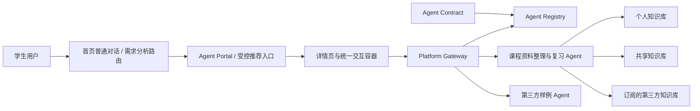

# AI for better life In ustc

面向中国科学技术大学校园学习场景的插件化 AI Agent 平台。

本项目参加中国科学技术大学“一〇七”杯算力与智能体开发大赛本科生组智能体赛道。当前方案先把“课程资料整理与复习 Agent”做深，再把它的接入方式沉淀为统一 Contract、Registry、Gateway 和 Agent Portal，让其他独立校园 Agent 能以插件形式接入同一平台。

> 当前状态：Campus Agent Hub `v0.2.0`、瀚海行 `v0.9.0` 和三个独立 Demo Agent 已形成可演示闭环。Hub 已实现 Contract v1、版本级自动验收、审批门禁、Registry、Gateway、持久限流、异步健康监测、Agent Portal、首页即时对话与需求路由、统一聊天、Featured 工作台授权和多模型配置中心；瀚海行保留数学分析 B1 知识库、引用、OCR 资料、课程知识广场和完整工作台。

> 新电脑部署：安装并启动 Docker Desktop 后运行 `./deploy/run-demo.ps1 -Detached`，脚本会校验 Compose 配置、构建三项服务、注册并审核四个 Agent（含两个 Future Work Demo）、生成运行时凭据、导入 25 份数学分析资料，并在三个健康接口和四个 Agent 全部就绪后报告成功。模型 API 只填写在本地 `.env`，不得提交到 Git。

> 身份说明：当前 `demo-a`、`demo-b`、`demo-c` 和 `X-Hub-User` 只用于比赛演示与权限流程验收，不是生产登录方案。若部署到公开网络，必须先接入真实身份认证并移除浏览器端演示身份切换。

## 一句话定位

一个可注册、审核、展示和统一调用独立校园 Agent 的应用广场；瀚海行是首个 Featured 标杆 Agent。

## 当前产品方案

项目由两部分组成：

1. **课程资料整理与复习 Agent**：围绕个人知识库、共享知识库和订阅的第三方知识库，完成资料导入、权限隔离、模型直答、按用户所选资料检索、引用和删除失效闭环。
2. **插件化 Agent 接入平台**：用统一接入契约管理 Agent 的注册、审核、展示和访问，使新 Agent 接入时不需要修改 Gateway 业务路由代码。

当前版本仍由用户最终确认要进入哪个 Agent，并新增首页助手缩短发现路径：

- 首页提供普通对话与需求分析路由两个模式：普通模式以最短路径流式回答，路由模式分析需求并推荐已注册 Agent；
- 路由模型只从静态功能检索表与运行时已审核、已启用 Agent 的交集中给出推荐，未命中时回退为普通回答；
- 模型只返回候选 `agent_id` 和理由，平台后端再次校验，前端生成受控直达入口；
- 用户点击推荐卡片后才会进入对应 Agent，不自动替用户调用或执行任务；
- 用户主动进入某个 Agent 的详情页和统一交互容器；
- Gateway 根据用户已选择的 `agent_id` 做确定性代理、鉴权、超时、取消和审计；
- 每个 Agent 独立运行，拥有自己的业务逻辑、知识库和运行边界；
- 平台不设置可执行任务的 Main Agent，也不允许 Agent 之间相互调用或递归委派。



## 课程资料 Agent

课程资料 Agent 是首个真实应用，也是平台的第一方参考实现。MVP 重点验证：

- 个人、共享、订阅第三方三类知识空间；
- 文本型 PDF、PPTX 基础文本、Markdown/TXT 和一种简单图片 OCR；
- 上传、解析、分块、去重、全文/向量检索和来源引用；
- 课程问答、章节总结和复习提纲；
- 检索前权限过滤、跨用户隔离和资料删除后的索引失效；
- 至少一个课程的合规演示资料和固定评测问题集。

大语言模型负责查询改写、总结和回答组织；资料权限、检索、引用、版本与删除由确定性应用逻辑控制。

### 当前可交付切片

本轮先交付数学分析 B1 单课程 Agent：

- 个人知识空间和邀请制数学分析 B1 共享空间；
- PDF 导入、页级解析、中文全文检索、引用和删除失效；
- 普通问题默认由模型直接回答，不访问课程索引；
- 资料问答展示全部可用文件，支持按日常学习、备考刷题预设或逐份勾选，并严格限定本轮检索范围；
- 助手回答支持多段文字引用；引用可进入下一轮主对话，或在原回答下方开启可折叠、可恢复的 GPT-5.6 独立解释分支；
- 主问答与独立解释分支通过 POST + SSE 实时追加模型正文，引用、usage 和最终状态在结束事件中统一确认；
- 本地管理员、投稿作者和普通订阅者三种身份的隔离测试；
- 免费知识广场：个人资料以不可变快照投稿，管理员逐份审核预览、下载和 RAG 权限，用户订阅后以只读知识空间使用；
- 公开库支持新版自动切换、旧版审计与回滚、暂停、恢复、下架和取消订阅后的即时权限失效；
- 通过服务器端环境变量调用 OpenAI Responses-compatible 的 `gpt-5.6-sol`；
- 模型不可用时返回检索结果的降级模式。

实现目录为 [`apps/course-agent`](./apps/course-agent)，运行、配置、导入和 Docker 命令以该目录 README 为准。API Key 只放在本地 `.env`，不提交到 Git。

## 插件平台

平台只处理独立 Agent 的公共接入能力，不侵入其内部框架。

| 组成 | 主要职责 |
|---|---|
| Contract | 定义 Manifest、交互事件、错误、文件引用、健康检查和版本规则 |
| Registry | 保存 Agent 版本、分类、状态和审核记录 |
| Review | 执行 Schema、连通性、协议与基础安全验收 |
| Gateway | 按已选择的 `agent_id` 代理请求，并处理鉴权、超时、取消和日志 |
| Agent Portal | 展示已审核并启用的 Agent，支持筛选和主动选择 |
| 首页助手 | 使用全局模型即时回答，或从受控功能表推荐当前 active Agent；不自动执行 Agent |
| 统一交互容器 | 提供消息、流式输出、文件、引用、状态、取消和错误展示 |

Contract v1 的统一交互边界使用 `@ag-ui/core@0.0.57` 的 `RunAgentInput` 与 SSE 事件。能力完整的 Agent 直接实现 AG-UI；简单 Agent 可实现 `simple-chat` JSON，由 Gateway 通用适配成 AG-UI。MCP 只用于 Agent 内部连接工具或知识源，不是 Hub 的必需协议；A2A 和跨 Agent 编排不在 v1 范围内。

## MVP 成功标准

比赛版本至少需要证明：

- 一个学生可以从统一门户选择并使用课程资料 Agent；
- 课程 Agent 能同时使用该学生有权访问的三类知识库；
- 上传、带引用问答和删除失效可以端到端演示；
- 投稿、审核、订阅、进入订阅库、换版和取消订阅可以端到端演示；
- 直接问答的检索次数为 0，资料问答只能命中用户本轮勾选且有权访问的文件；
- 两个测试用户之间的个人资料检索命中为 0；
- 平台具备版本化 Manifest、交互协议、注册审核和确定性 Gateway；
- 一个独立进程的极简第三方 Agent 能按同一 Contract 接入并自动出现在门户；
- 接入新 Agent 时 Gateway 业务路由代码修改为 0 行；
- Featured Agent 通过 60 秒一次性授权码进入独立工作台，授权码不可重放；
- 固定评测和安全测试能够复现结果。

## 当前不做

- 能自动执行任务的 Main Agent、Supervisor 或未经用户确认的 Agent 调用；
- Agent 间通信、多 Agent 规划、递归委派和协作网络；
- 无审核的开放 Agent 市场；
- 自动运行未知第三方代码；
- 生产级计费、商业结算或普通用户任意配置模型 `base_url`；
- 未经授权的课程资料、点评和附件的批量同步或公开再分发。

## 文档导航

- [项目更新日志](./CHANGELOG.md)：按日期和提交号记录平台级功能、修复、验证和重要文档变化。
- [项目产品文档](./项目产品文档.md)：当前产品定义、架构边界、MVP、评测、分工和风险，是现阶段实施依据。
- [设计文档](./设计文档.md)：面向比赛提交的完整设计思路、技术架构、功能模块、技术难点和验收证据。
- [作品简介](./作品简介.md)：面向报名和作品提交的简明介绍、模型/API 说明与创新点。
- [Hub 顶层设计](./docs/superpowers/specs/2026-08-05-campus-agent-hub-top-level-design.md)：当前实现的安全边界、身份协议与三种接入等级。
- [USTC-Agent-Hub Contract v1](./contracts/campus-agent-hub/v1/README.md)：Manifest、Health、simple-chat Schema、示例和契约测试。
- [首页需求路由 Skill](./apps/hub/skills/agent-routing/SKILL.md) 与 [Agent 功能检索表](./apps/hub/skills/agent-routing/AGENT_CATALOG.md)：维护需求匹配规则与可推荐 Agent 的简短公开能力摘要。
- [Future Work Demo Agent 设计](./docs/superpowers/specs/2026-08-20-future-work-agent-demos-design.md)：评课社区与校园公共服务 Demo 的边界和后续接入计划。
- [一键演示部署](./deploy/README.md)：Hub、瀚海行、示例 Agent 的 Docker Compose 启动与运行时 seed。
- [课程复习 Agent 部署与审计指南](./docs/COURSE_AGENT_DEPLOYMENT.md)：面向新电脑、队友和代码 Agent 的逐步安装、配置、资料导入、验收、Docker 与排障说明。
- [订阅知识库广场设计](./docs/superpowers/specs/2026-08-04-subscription-library-marketplace-design.md)：投稿快照、审核状态机、权限矩阵、版本切换和 API 契约。
- [统一 OCR 处理链路状态与后续待办](./docs/OCR_PIPELINE_TODO.md)：记录 DeepSeek-OCR-2 sidecar 接入、全量回填结果、运行方式和后续产品化任务。
- [比赛要求](./比赛要求.md)：官方比赛信息的本地整理，最终以组委会最新通知为准。
- [agent.md](./agent.md)：本工作目录的协作约定、已确认决策和安全经验。

当前仓库已经交付 Hub 平台闭环与数学分析 B1 Demo；单独调试瀚海行时，启动、导入和测试命令见 [`apps/course-agent/README.md`](./apps/course-agent/README.md)。

## 方案版本与归档

当前 `main` 只呈现插件化平台方案。此前的 Personal Main Agent + Specialist 单跳编排方案没有被删除，已完整保存在 Git 历史中：

- [归档：v0.4 Personal Main Agent 单跳架构](https://github.com/xytsakura/ai-for-better-life-in-ustc/tree/archive-v0.4-personal-main-agent)
- 归档提交：`c49719e`
- 描述性标签：`archive-v0.4-personal-main-agent`
- 原有兼容标签：`V0.0`

归档版本只用于回溯设计演进，不再作为当前实现依据。需要恢复时可从归档标签创建新分支，不应直接把旧文档复制回 `main`。

### 2026-08-06 平台治理加固

- Manifest 提交后自动保存版本级机器验收证据；管理员批准前必须通过 URL、启动页、健康与聊天 Contract 检查，并可在管理页重跑检查；
- Gateway 增加请求/响应大小上限、SQLite 持久限流、连续健康失败准入、AG-UI 生命周期校验、取消状态和 usage 元数据审计；
- Featured client secret 支持轮换和撤销，旧 secret 仅在短轮换窗口内有效；旧版本授权码在版本切换后立即失效；
- 外部图标由 Hub 下载并校验 MIME、大小和文件签名，浏览器只加载 Hub 安全副本；
- Hub Ed25519 私钥默认保存在忽略的运行时目录，服务重启不再静默更换签名身份；
- 独立 Conformance Runner 与固定 Demo 验收脚本均已实测；两种聊天协议、Featured 工作台和授权码防重放连续 10/10 轮通过。

### 语义化版本

本项目遵循 [Semantic Versioning 2.0.0](https://semver.org/lang/zh-CN/) 规范，版本号格式为 `v<主版本>.<次版本>.<修订号>`。

| 版本 | 标签 | 说明 |
|------|------|------|
| v0.1.0 | `3a2ee52` | 数学分析 B1 课程 Agent Demo 初始交付（PDF 导入、FTS5 检索、三类知识空间、引用回答） |
| v0.1.1 | `d62e3fd` | 添加课程 Agent Demo 使用说明文档 |
| v0.2.0 | `2b58c1c` | 课程回答支持安全 Markdown 渲染 |
| v0.3.0 | `9e9cc74` | 课程公式使用本地 KaTeX 离线渲染 |
| v0.4.0 | `f2341e7` | 支持可选课程资料来源切换 |
| v0.4.1 | `56d118b` | 添加可复现的课程 Agent 部署与审计指南 |
| v0.5.0 | `HEAD~1` | 引入可插拔架构协议（SearchBackend、DocumentParser、ChunkingStrategy、IndexWriter、Tokenizer），为向量检索、知识图谱、OCR 等后续升级预留扩展点 |
| v0.6.0 | `befe86b` 之前 | 参考腾讯 ima 重写前端，并完成多段引用与 GPT-5.6 独立解释分支 |
| v0.7.0 | `2eb49c4` | 新增免费订阅知识库广场、不可变投稿快照、管理员审核、订阅空间和版本治理 |
| v0.8.0 | 当前 | 主问答与 GPT-5.6 独立解释分支支持真实 SSE 流式输出、取消和异常中断保护 |

**版本号同步位置**：
- `apps/course-agent/course_agent/__init__.py` → `__version__`
- `apps/course-agent/pyproject.toml` → `project.version`
- `apps/course-agent/course_agent/main.py` → FastAPI `version`
- Git 标签 → `git tag v<version>`

**发版规则**：
- 文档/样式修复 → PATCH（修订号 +1）
- 新增功能、向后兼容 → MINOR（次版本号 +1）
- 破坏性变更 → MAJOR（主版本号 +1，当前 0.x 阶段 MINOR 可承载）
- 每次发版需同步更新上述 3 个代码位置，并创建对应 Git 标签

## 实施顺序

1. 已完成：数学分析 B1 的知识导入、权限、检索、引用、OCR 和删除失效闭环。
2. 已完成：Contract v1、Registry、审核治理、Gateway、Portal 和统一聊天容器。
3. 已完成：瀚海行原生 AG-UI 接入与独立 `simple-chat` Agent 接入，Gateway 无 Agent 业务分支。
4. 已完成：Featured 工作台一次性授权码、EdDSA JWT/JWKS 和运行时凭据注入。
5. 已完成：一键部署、浏览器验收、契约/安全回归和 10 轮比赛演示验收脚本。
6. 后续生产化：接入真实登录、配置公网 HTTPS 与受控出站网络；这些不是本地比赛 Demo 的前置条件。

首个演示课程已冻结为数学分析 B1，共享模型采用邀请制学习小组；公开资料通过已实现的订阅知识库广场发布。评课社区分析仍作为后续 Agent 或 Link App 预留，不进入本轮核心闭环。

## 轻量协作方式

团队当前采用简单 Git 协作，不强制任务看板或复杂 Pull Request 流程。

开始工作前：

```bash
git pull --ff-only
```

完成一个边界清晰的修改后：

```bash
git status
git add <changed-files>
git commit -m "docs: describe the change"
git push
```

协作约定：

- 方向变化先在群内确认，再同步到产品文档和 README；
- 提交信息说明“改了什么”，一次提交尽量只处理一个主题；
- 功能、修复、重构和重要文档提交同步更新根目录 [`CHANGELOG.md`](./CHANGELOG.md)；
- 推送前检查远程更新，冲突时保留并理解队友修改，不覆盖他人工作；
- API key、密码、Cookie、CSRF token、个人敏感信息和未脱敏数据不得提交到仓库。

## 数据、隐私与版权

- 权限过滤必须发生在检索和模型调用之前；
- 个人知识库默认仅本人可见，私人内容和私人回答不得进入跨用户缓存；
- 用户删除资料后，应停止检索并清理关联索引和缓存；
- 第三方订阅源必须记录来源、访问方式、许可范围和缓存期限；
- `file_ref` 必须由平台重新鉴权，不能接受任意本地路径或未经校验的下载地址；
- 第三方 Agent、网页、文档、OCR 文本和模型输出均按不可信输入处理；
- 评课社区没有可共享的通用用户 API token，任何成员的登录 Cookie 都不得进入聊天、文档、日志或仓库；
- 评课社区源码许可不等于用户点评和附件内容获得开放许可；
- 未获授权的教材、讲义、真题、点评、附件和登录限定内容不得进入公共知识库。

## 团队信息

- 队伍名称：`AI for better life In ustc`
- 参赛组别：本科生组
- 参赛赛道：智能体赛道
- 团队规模：3 名本科生
- 报名状态：已完成

## 相关链接

- [比赛通知](https://mp.weixin.qq.com/s/AZKK8QSrTQWR3u0yO4d_kA)
- [本科生算力平台](https://107.ustc.edu.cn/)
- [USTC 评课社区](https://icourse.club/)
- [GitHub 私有仓库](https://github.com/xytsakura/ai-for-better-life-in-ustc)
