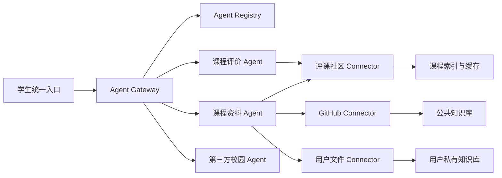

# AI for better life In ustc

面向中国科学技术大学校园场景的开放式 AI Agent 集成与调度平台。

本项目参加中国科学技术大学“一〇七”杯算力与智能体开发大赛本科生组智能体赛道。团队希望建设校园智能体的上游基础设施：用统一协议发现、接入和调度不同团队开发的校园 Agent，并通过两个可运行 Demo 验证平台能力。

> 当前状态：方案设计与技术调研。代码尚未开始实现，本文不会提供未经验证的安装或部署命令。

## 项目定位

校园相关的 AI Agent 往往各自解决一个问题，例如课程查询、复习资料检索、校园寻路或事务办理。功能分散意味着学生需要反复寻找入口，不同 Agent 也难以互相协作。

本项目建设一个类似“我的科大”统一入口的 Agent 集成框架：

- 第三方 Agent 按标准协议发布能力后，可通过白名单真实接入平台；
- 平台理解用户意图，发现并调度合适的 Agent；
- 独立 Agent 之间采用 A2A，Agent 与工具/数据源之间采用 MCP；
- 平台 REST 接口采用 OpenAPI 3.1 与 JSON Schema 2020-12；
- 任务过程可追踪、可取消、可解释，并保留来源引用和错误状态；
- 比赛版本通过课程评价 Deep Research 和课程资料复习助手完成端到端验证。

## 核心模块

### 1. Agent Gateway

协议调度层负责 Agent 注册、能力发现、意图路由、任务生命周期、流式结果、权限边界和可观测性。第一版采用白名单接入，不建设开放市场、多租户计费或复杂审核系统。

### 2. 课程评价 Deep Research Agent

面向自然语言选课调研，聚合课程字段、教师信息、不同学期点评和允许访问的附件，输出带来源、时间、样本数量和不确定性说明的课程报告。课程摘要按数据版本缓存，出现新点评时增量更新。

### 3. 课程资料与复习 Agent

统一组织课程主页、经许可的 GitHub 资源、课程共享资料和用户个人资料，提供带引用的混合检索与复习问答。公共知识库、课程共享空间和用户私有空间相互隔离。

## 总体架构



详细说明见[总体架构](./docs/architecture/overview.md)。

## 技术路线

当前批准的技术方向如下，最终依赖版本将在实施计划和可运行代码中锁定：

| 层次 | 方案 |
|---|---|
| 前端 | React/Next.js 统一入口，具体选择在实现阶段确认 |
| API Gateway | Python、FastAPI、Pydantic |
| Agent 互操作 | A2A 与官方 Python SDK |
| 工具和数据连接 | MCP 与官方 Python SDK |
| 接口契约 | OpenAPI 3.1、JSON Schema 2020-12 |
| 数据与向量检索 | PostgreSQL、pgvector |
| 缓存与轻量任务协调 | Redis |
| 文件存储 | 开发期本地对象存储，部署期使用兼容 S3 的存储 |
| 可观测性 | OpenTelemetry、结构化日志 |
| 本地编排 | Docker Compose |

## 文档导航

### 项目与计划

- [比赛要求](./比赛要求.md)
- [总体架构](./docs/architecture/overview.md)
- [项目路线图](./docs/roadmap.md)
- [2026-07-19 方案会议记录](./docs/meetings/2026-07-19-project-direction.md)

### 三份独立设计

- [协议调度层设计](./docs/designs/01-agent-gateway.md)
- [课程评价 Deep Research Agent 设计](./docs/designs/02-course-research-agent.md)
- [课程资料与复习 Agent 设计](./docs/designs/03-study-rag-agent.md)

### 技术调研与决策

- [Agent 协议选型调研](./docs/research/agent-protocols.md)
- [评课社区集成调研](./docs/research/icourse-integration.md)
- [ADR-0001：采用标准优先的 Agent 集成架构](./docs/decisions/0001-standards-first-agent-integration.md)

## 规划中的仓库结构

```text
.
├── README.md
├── agent.md
├── 比赛要求.md
├── docs/
│   ├── architecture/
│   ├── decisions/
│   ├── designs/
│   ├── meetings/
│   ├── research/
│   └── roadmap.md
├── apps/                       # 实施阶段创建：统一前端
├── services/                   # 实施阶段创建：Gateway
├── agents/                     # 实施阶段创建：两个 Demo Agent
├── connectors/                 # 实施阶段创建：评课社区/GitHub/用户文件
├── packages/                   # 实施阶段创建：协议 SDK、Schema、共享库
├── infra/                      # 实施阶段创建：本地编排与部署
├── scripts/                    # 实施阶段创建：开发、导入、评测脚本
└── tests/                      # 实施阶段创建：协议、集成、端到端评测
```

代码目录将在实施计划批准后按实际需要创建，当前不维护空目录和空包。

## 协作方式

团队采用轻量 Git 协作：重要方向先在群内讨论，形成结论后写入仓库。修改前先同步远程内容，提交信息应说明本次变化，发生冲突时不得覆盖他人工作。

```bash
git pull
git add <changed-files>
git commit -m "docs: describe the change"
git push
```

随着代码量增长，团队可再引入功能分支和 Pull Request；当前不要求复杂流程。

## 数据、隐私与版权

- 不得提交 API key、密码、Cookie、CSRF token、个人敏感信息或未脱敏数据；
- 评课社区没有通用用户 API token，不共享队长或任何成员的登录 Cookie；
- 公共数据使用服务器连接器，登录限定内容优先由用户本地浏览器连接器读取，凭据不离开用户设备；
- 评课社区代码的 AGPLv3 许可不等于用户点评和课程附件获得开源许可；
- 未明确授权的教材、真题、讲义和附件不复制到公共知识库，只保存必要元数据与来源链接；
- 用户上传资料进入个人私有空间，并支持删除和索引失效。

## 官方信息

- [比赛通知](https://mp.weixin.qq.com/s/AZKK8QSrTQWR3u0yO4d_kA)
- [本科生算力平台](https://107.ustc.edu.cn/)
- [USTC 评课社区](https://icourse.club/)
- [项目私有仓库](https://github.com/xytsakura/ai-for-better-life-in-ustc)

## 团队

- 队伍名称：AI for better life In ustc
- 参赛组别：本科生组
- 参赛赛道：智能体赛道
- 团队规模：3 名本科生
- 报名状态：已完成
