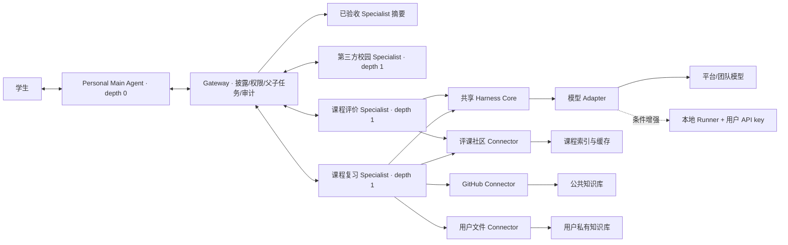

# AI for better life In ustc

面向中国科学技术大学校园场景、以 Personal Main Agent 为统一入口的开放式 AI Agent 集成与调度平台。

本项目参加中国科学技术大学“一〇七”杯算力与智能体开发大赛本科生组智能体赛道。团队希望建设校园智能体的上游基础设施：用统一协议发现、接入和调度不同团队开发的校园 Agent，并通过两个可运行 Demo 验证平台能力。

> 当前状态：`v0.4` Personal Main Agent + Specialist 单跳编排设计发布版，三路独立审计与修复复审已通过。代码尚未开始实现，本文不会提供未经验证的安装或部署命令。

## 项目定位

校园相关的 AI Agent 往往各自解决一个问题，例如课程查询、复习资料检索、校园寻路或事务办理。功能分散意味着学生需要反复寻找入口，不同 Agent 也难以互相协作。

本项目建设一个类似“我的科大”统一入口、但由每位用户自己的 Main Agent 主持交互的校园 Agent 平台：

- 用户无论处理通用问题还是校园专业问题，都只与 Personal Main Agent 对话；
- 平台把已验收 Specialist 的简短能力像 skills 一样渐进披露给 Main Agent；
- Main Agent 判断任务适合某个领域时，编写 query 和最小上下文授权，通过 Gateway 调用一个 Specialist；
- Specialist 使用自己的领域 pipeline、Harness、知识库和公共 QA 完成工作，最终由 Main Agent 提炼并答复；
- 每个用户回合最多一个 child task，固定两层，Specialist 不能递归调用 Agent；
- 第三方 Agent 按标准协议注册和验收后，也可成为平台 Specialist；
- 每个用户可以按预算和隐私需求选择 GPT、DeepSeek、学校模型或其他已批准 provider；
- 公共任务可以平台托管；CLI 本地 Runner 保留完整契约，在主从闭环稳定后作为条件增强；
- 独立 Agent 之间采用 A2A Protocol 1.0 `HTTP+JSON`，Agent 与工具/数据源之间采用 MCP；
- 平台 REST 接口采用 OpenAPI 3.1 与 JSON Schema 2020-12；
- 任务过程可追踪、可取消、可解释，并保留来源引用和错误状态；
- 比赛版本通过课程评价 Deep Research 和课程资料复习助手完成端到端验证。

现有平台已经普遍具备“多个 Agent、工作流、知识库和统一聊天入口”，因此本项目不把这些通用功能本身作为创新点。比赛需要重点证明：

- 独立第三方 Agent 只提供标准 Agent Card、A2A endpoint 和业务 Schema，即可在 Gateway 业务代码零修改的情况下接入；
- Main Agent 只看到平台整理的已验收能力摘要，不接触 endpoint、凭据或第三方内部提示词；
- Main Agent 负责语义选择，Gateway 负责确定性授权、父子任务、预算、限深和审计；
- Specialist 只获得字段级、目的绑定、短期个人上下文，不能获得完整 Profile、ModelProfile 或用户密钥；
- 平台能把校园场景的权限范围、来源证据、失败状态和审计信息随任务一起治理；
- 同一 Agent 模板无需改业务流程即可切换不同 provider 与本地/托管执行，并共享公共证据而不泄露私人回答；
- 同一协议调度层可以承载 Deep Research、权限隔离 RAG 和一个独立校园通知 Agent；
- 接入过程、协议兼容性、检索质量和安全边界都有固定脚本与量化结果，不只依赖架构图说明。

## 核心模块

### 1. Personal Main Agent

Main Agent 是用户唯一入口，使用用户选择的模型，负责理解目标、发现专业能力、编写子任务、申请个人上下文并综合最终回答。不需要专业能力时直接回答；需要时每回合最多调用一个 Specialist。

### 2. Specialist Registry 与 Gateway

Registry 只保存并披露经过平台验收的 Specialist 版本。Gateway 不做自由推理，而是负责目录过滤、字段级 ContextGrant、root/child task、A2A、预算、取消、超时、递归拒绝、Artifact 校验和审计。

### 3. 课程评价 Specialist

面向自然语言选课调研，聚合课程字段、教师信息、不同学期点评和允许访问的附件，输出带来源、时间、样本数量和不确定性说明的课程报告。课程摘要按数据版本缓存，出现新点评时增量更新。

### 4. 课程资料与复习 Specialist

统一组织课程主页、经许可的 GitHub 资源、课程共享资料和用户个人资料，提供带引用的混合检索与复习问答。公共知识库、课程共享空间和用户私有空间相互隔离。MVP 固定支持文本型 PDF、PPTX 基础文本和 PNG/JPEG 图片 OCR。

## 总体架构



详细说明见[总体架构](./docs/architecture/overview.md)。

## 技术路线

当前批准的技术方向如下，最终依赖版本将在实施 spike 和可运行代码中锁定：

| 层次 | MVP 基线 | 条件采用 |
|---|---|---|
| 前端 | React + Vite 或团队熟悉的等价轻方案 | Next.js 不作为硬要求 |
| API Gateway | Python、FastAPI、Pydantic | 无 |
| Main Agent 编排 | 单一 Personal Main Agent、CatalogSummary/CapabilityDetail、每回合一个 child | 多 Specialist、并行和递归后置 |
| 个人 Agent Harness | AgentTemplate、AgentProfile、ModelProfile、显式 Python pipeline | 自动长期记忆和模板市场后置 |
| 模型接入 | 一个 OpenAI-compatible adapter、provider capability map、白名单 `base_url` | 生产级多 provider adapter 后置 |
| 混合执行 | 平台/团队测试模型 | 一个只出站 CLI Runner 条件增强；真实托管 BYOK 后置 |
| Agent 互操作 | A2A 1.0、root task + 一个 depth=1 child task | fan-out、多跳和 Agent 相互调用后置 |
| 工具和数据连接 | MCP 与官方 Python SDK，只标准化需要复用的边界 | 不把所有本地函数强制包装为 MCP |
| 接口契约 | OpenAPI 3.1、JSON Schema 2020-12 | 无 |
| 数据与向量检索 | PostgreSQL、pgvector、PostgreSQL 全文检索 | 重排模型后置 |
| 事件与缓存 | PostgreSQL 事件表、进程内通知 | 出现明确瓶颈后加入 Redis |
| 文件存储 | 受控本地文件区、服务端权限记录 | 跨容器共享时升级 S3/MinIO |
| 可观测性 | 结构化 JSON 日志、correlation ID | 核心链路稳定后接 OpenTelemetry Collector |
| Agent 内部编排 | 显式 Python pipeline | LangGraph 两天 spike 证明收益后用于课程研究 Agent |
| 本地编排 | Docker Compose | 无 |

## 文档导航

### 项目与计划

- [比赛要求](./比赛要求.md)
- [总体架构](./docs/architecture/overview.md)
- [项目路线图](./docs/roadmap.md)
- [2026-07-19 方案会议记录](./docs/meetings/2026-07-19-project-direction.md)
- [v0.4 Personal Main Agent 单跳编排审计（当前）](./docs/audits/2026-07-19-v0.4-main-agent-audit.md)
- [v0.3 个人 Agent Harness 集成审计（历史）](./docs/audits/2026-07-19-v0.3-personal-agent-audit.md)
- [v0.2 发布前技术审计（历史）](./docs/audits/2026-07-19-publication-audit.md)

### 五份独立设计

- [协议调度层设计](./docs/designs/01-agent-gateway.md)
- [课程评价 Deep Research Specialist 设计](./docs/designs/02-course-research-agent.md)
- [课程资料与复习 Specialist 设计](./docs/designs/03-study-rag-agent.md)
- [个人 Agent Harness 与混合模型运行时设计](./docs/designs/04-personal-agent-harness.md)
- [Personal Main Agent 与 Specialist 单跳编排设计](./docs/designs/05-personal-main-agent-orchestration.md)

### 技术调研与决策

- [Agent 协议选型调研](./docs/research/agent-protocols.md)
- [评课社区集成调研](./docs/research/icourse-integration.md)
- [竞品与参考实现技术调研](./docs/research/competitive-landscape.md)
- [多模型接入、BYOK 与本地 Runner 技术调研](./docs/research/model-provider-byok.md)
- [平台威胁模型](./docs/security/threat-model.md)
- [ADR-0001：采用标准优先的 Agent 集成架构](./docs/decisions/0001-standards-first-agent-integration.md)
- [ADR-0002：采用纵向闭环优先的比赛 MVP](./docs/decisions/0002-competition-mvp-scope.md)
- [ADR-0003：采用模板化个人 Agent 与混合模型运行时](./docs/decisions/0003-hybrid-personal-agent-runtime.md)
- [v0.4 个人 Agent Harness 设计规格](./docs/superpowers/specs/2026-07-19-personal-agent-harness-design.md)
- [ADR-0004：采用 Personal Main Agent 与单跳 Specialist 编排](./docs/decisions/0004-personal-main-agent-single-hop-orchestration.md)
- [v0.4 Main Agent 编排设计规格](./docs/superpowers/specs/2026-07-19-personal-main-agent-orchestration-design.md)

## 规划中的仓库结构

```text
.
├── README.md
├── agent.md
├── 比赛要求.md
├── docs/
│   ├── architecture/
│   ├── audits/
│   ├── decisions/
│   ├── designs/
│   ├── meetings/
│   ├── research/
│   ├── security/
│   └── roadmap.md
├── apps/                       # 实施阶段创建：统一前端
├── services/                   # 实施阶段创建：Gateway
├── agents/                     # 实施阶段创建：Main Agent + 两个内置 Specialist + 外部示例
├── runners/                    # 条件增强时创建：本地 Runner
├── connectors/                 # 实施阶段创建：评课社区/GitHub/用户文件
├── packages/                   # 实施阶段创建：Harness、协议 SDK、Schema、模型 adapter
├── infra/                      # 实施阶段创建：本地编排与部署
├── scripts/                    # 实施阶段创建：开发、导入、评测脚本
└── tests/                      # 实施阶段创建：协议、集成、端到端评测
```

代码目录将在实施计划批准后按实际需要创建，当前不维护空目录和空包。

## 协作方式

团队采用轻量 Git 协作：重要方向先在群内讨论，形成结论后写入仓库。修改前先同步远程内容，提交信息应说明本次变化，发生冲突时不得覆盖他人工作。

```bash
git pull
git add <changed-files>
git commit -m "docs: describe the change"
git push
```

随着代码量增长，团队可再引入功能分支和 Pull Request；当前不要求复杂流程。

## 数据、隐私与版权

- 不得提交 API key、密码、Cookie、CSRF token、个人敏感信息或未脱敏数据；
- 比赛硬 MVP 使用平台/团队受控测试凭据；真实 BYOK 仍只允许保存在本地 Runner，但 Runner 在主从闭环稳定后作为条件增强；
- 平台只允许管理员维护的模型 provider 和 `base_url`，不接受任意用户 URL，也不做静默模型切换；
- `private` 与 `local_authenticated` 数据默认不向远端发送；未启用合规本地 Runner 时拒绝或降级为公开模式，例外发送必须逐次显示 provider 与数据范围并确认；
- Main Agent 只提出任务所需字段/引用，Gateway 生成字段级 `ContextGrant` 与 `AuthorizedContextBundle`；完整 Profile、ModelProfile、会话、私人记忆和密钥不得进入第三方 A2A payload；
- Specialist 固定 `depth=1`、`can_delegate=false`，不能继续调用 Agent，也不能直接写入用户长期记忆；
- SpecialistArtifact 必须先经 Gateway 校验，Main Agent 最终答复必须保留原始引用、限制和数据范围；
- 评课社区没有通用用户 API token，不共享队长或任何成员的登录 Cookie；
- 公共数据使用服务器连接器，登录限定内容优先由用户本地浏览器连接器读取，凭据不离开用户设备；
- 未获评课社区明确授权时，登录限定点评和附件不进入服务器事件、对象存储、内容指纹、向量索引、Artifact 或共享缓存；
- 评课社区代码的 AGPLv3 许可不等于用户点评和课程附件获得开源许可；
- 未明确授权的教材、真题、讲义和附件不复制到公共知识库，只保存必要元数据与来源链接；
- 用户上传资料进入个人私有空间，并支持删除和索引失效。
- Agent Card、第三方 Agent 输出、网页、点评和文件即使来自白名单也按不可信输入处理，必须通过 SSRF、Schema、权限、提示注入和文件沙箱检查。
- 公共缓存与私人生成分层：模型可共享公开证据，个人记忆、私人回答和用户级 usage 不得跨用户命中。

## 官方信息

- [比赛通知](https://mp.weixin.qq.com/s/AZKK8QSrTQWR3u0yO4d_kA)
- [本科生算力平台](https://107.ustc.edu.cn/)
- [USTC 评课社区](https://icourse.club/)
- [项目私有仓库](https://github.com/xytsakura/ai-for-better-life-in-ustc)

## 团队

- 队伍名称：AI for better life In ustc
- 参赛组别：本科生组
- 参赛赛道：智能体赛道
- 团队规模：3 名本科生
- 报名状态：已完成
