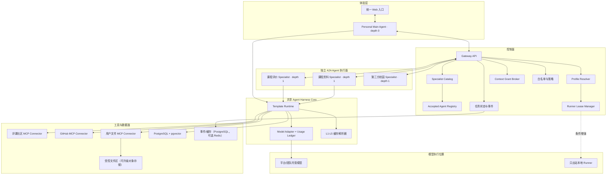
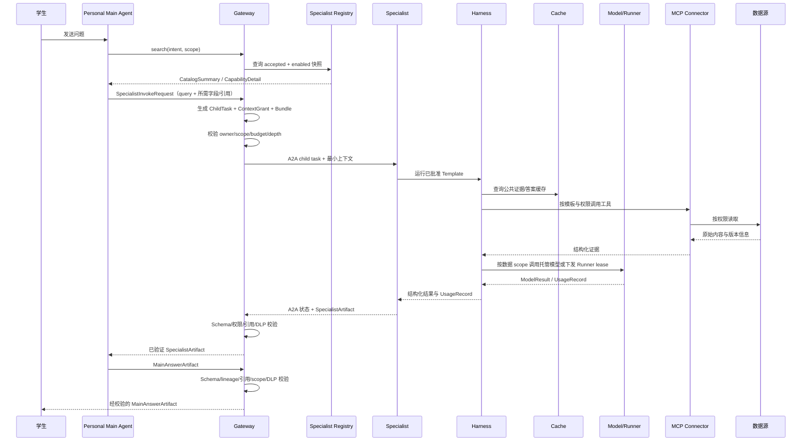

# 校园 Agent 集成平台总体架构

## 1. 项目目标

建设一个标准兼容、以 Personal Main Agent 为唯一用户入口、可真实接入专业 Specialist 的校园智能体平台。Main Agent 负责理解用户、渐进发现能力、编写专业子任务和最终综合；Gateway 负责确定性权限、父子任务和 A2A；独立 Specialist 保持领域 pipeline、知识库和部署边界。

比赛版本不追求覆盖全部校园场景，而是用两个课程相关 Agent 证明：

1. 不同 Agent 可以按统一协议注册和被调用；
2. Agent 可以通过标准工具接口访问外部数据；
3. 平台能够处理长任务、追问、失败、取消和来源引用；
4. 第三方开发者可以根据文档在较短时间内完成接入。
5. 同一 Agent 模板可以在不同模型和本地/托管运行时执行，公共证据可复用，私人知识不串用。
6. Main Agent 每回合最多调用一个 depth=1 Specialist，Specialist 无法递归调用 Agent。
7. 用户个人信息通过字段级 ContextGrant 下发，最终答案保留 Specialist 引用和限制。

平台的创新点不是“把多个聊天机器人放在一个页面”，而是让独立 Agent 在不修改 Gateway 业务代码的情况下，通过标准协议、校园能力契约、权限范围和证据链完成真实接入与治理。比赛必须用固定脚本和代码 diff 证明这一点。

## 2. 设计原则

- **标准优先**：锁定 A2A Protocol 1.0 `HTTP+JSON`、MCP 2025-06-18 授权语义、OpenAPI 3.1 和 JSON Schema 2020-12，不重新发明完整协议。
- **主从分层**：Main Agent 是唯一交互与最终回答层，Specialist 是专业执行层，不能继续委派。
- **确定性控制**：Main Agent 做语义选择，Gateway 做目录过滤、权限、任务、预算、限深和审计，不做自由推理。
- **渐进披露**：Main Agent 先看平台整理的 CatalogSummary，需要调用时再读取 CapabilityDetail。
- **独立边界**：Gateway 不读取 Specialist 内部状态，Specialist 不直接依赖平台数据库结构。
- **最小可用**：比赛版只实现 Main Agent 单跳闭环、两个内置 Specialist 和一个外部示例 Specialist。
- **凭据不转发**：用户或数据源凭据不作为 Agent 任务参数跨服务透传。
- **模板与用户配置分离**：共享 `AgentTemplate` 不包含个人密钥或知识空间，用户 `AgentProfile` 不复制业务代码。
- **数据范围先于模型路由**：先确定 public、course_shared、private 或 local_authenticated，再决定 provider 与执行位置。
- **显式模型切换**：provider、密钥归属和本地/托管执行不允许静默 fallback。
- **来源可追踪**：结论必须关联来源、抓取时间、数据版本和权限空间。
- **渐进增强**：公共数据链路先跑通，再增加登录限定内容和个性化资料。

## 3. 分层结构



## 4. 五个核心子系统

### 4.1 Personal Main Agent

Main Agent 是用户唯一对话入口，使用用户的 AgentProfile 和 ModelProfile。它先判断是否可以直接回答；需要专业能力时，通过 Gateway 搜索/描述已验收 Specialist，提交只含 query、期望产物和所需字段/引用的 SpecialistInvokeRequest。Gateway 再生成 ChildTask、ContextGrant 与 AuthorizedContextBundle，Main 最后把已验证 SpecialistArtifact 综合为 MainAnswerArtifact。无论直接回答还是专业综合，MainAnswerArtifact 都经 Gateway 做确定性的 Schema、lineage、引用、scope、DLP 和安全渲染校验后再返回用户；Gateway 不改写语义。

详细设计见[Personal Main Agent 与 Specialist 单跳编排设计](../designs/05-personal-main-agent-orchestration.md)。

### 4.2 Specialist Registry 与 Agent Gateway

Registry 保存 Agent Card 冻结快照、平台整理的 CatalogSummary/CapabilityDetail、版本、Schema、健康和验收状态。只有 accepted + enabled 版本可以披露。Gateway 负责字段级授权、root/child task、A2A 任务代理、预算、事件、取消、超时、递归拒绝和 Artifact 校验，不负责自然语言综合。

详细设计见[协议调度层设计](../designs/01-agent-gateway.md)。

### 4.3 个人 Agent Harness 与混合模型运行时

Harness Core 是 Main Agent、内置 Specialist 和本地 Runner 可复用的运行核心，负责模板、Profile/ModelProfile 执行快照、模型 adapter、MCP、缓存、预算和输出校验。内置 Specialist 共享安全和模型核心，但拥有独立领域 pipeline 配置、工具、知识库、Schema、评测集和缓存 namespace。CLI Runner 调整为主从闭环稳定后的条件增强。

Main Agent 与 Specialist 是明确父子层级：Main Agent `depth=0`、每回合最多创建一个 child；Specialist `depth=1`、`can_delegate=false`。模型 provider 是 Harness 内部 adapter，不是 A2A Agent 或 MCP Tool。

详细设计见[个人 Agent Harness 与混合模型运行时设计](../designs/04-personal-agent-harness.md)。

### 4.4 课程评价 Specialist

该 Agent 将课程查询转换为带证据的调研任务：完成课程消歧、页面采集、结构化、观点聚合、时效分析、缓存和报告生成。它通过 MCP Connector 访问评课社区，Gateway 不直接抓取课程页面。

详细设计见[课程评价 Specialist 设计](../designs/02-course-research-agent.md)。

### 4.5 课程资料与复习 Specialist

该 Agent 负责课程资料准入、解析、索引、混合检索和带引用问答。公共、课程共享和个人私有空间使用相同检索接口，但权限过滤在检索前执行。

详细设计见[课程资料 Specialist 设计](../designs/03-study-rag-agent.md)。

## 5. 端到端任务流



Main Agent 可直接回答而不创建 child。创建 child 时固定 `depth=1`，票据 `can_delegate=false`。第三方 Specialist 只接收 query、data scope 和 Gateway 生成的最小授权包，不接收用户 ModelProfile、API key、Cookie、完整个人记忆或完整会话。

## 6. 数据与权限边界

| 数据类型 | 默认访问方式 | 存储策略 |
|---|---|---|
| 公开课程元数据 | 服务器公共 Connector | 可缓存结构化字段和版本 |
| 公开点评 | 限速读取，保留来源 | 优先摘要与索引，不公开复制全量正文 |
| 登录限定点评/附件链接 | 获授权后的用户本地 Connector 或官方只读接口 | 未获授权时仅本地处理，不进入服务器或共享索引 |
| 经许可的 GitHub 课程资源 | GitHub Connector | 保存仓库、提交版本和解析索引 |
| 用户个人资料 | 用户上传 Connector | 私有空间、访问控制、可删除；部署支持时启用静态加密 |
| Main Agent 个人上下文 | Context Broker 按字段级 ContextGrant 读取 | 只向指定 child 生成短期 AuthorizedContextBundle，不复制完整 Profile |
| 用户模型 API key | 本地 Runner；生产演进可用独立 Secret Store | MVP 不收集普通用户托管 key，不进入业务数据库、事件或日志 |
| 公共专业问答 | 通过质量门槛的公共 QA/SpecialistArtifact | 记录 Specialist、模型、提示、证据和策略版本，可跨用户复用 |
| 私人生成结果 | 用户私有服务端空间或本地加密缓存 | 不跨用户命中，不自动晋升为公共答案 |

登录凭据属于数据连接器，不属于 A2A 任务载荷。Gateway 不接收原始 Cookie。未获评课社区明确授权时，登录限定证据和附件默认只在用户本地处理，不进入 Gateway 事件、服务器缓存、对象存储或共享 RAG；公开导出必须重新走公开模式。

平台组件继续使用版本化 `TaskRequest`、`TaskEvent`、`ArtifactEnvelope` 和 `FileRef`，并新增 CatalogSummary、CapabilityDetail、SpecialistInvokeRequest、SpecialistTaskEnvelope、ContextGrant、AuthorizedContextBundle、SpecialistArtifact 和 MainAnswerArtifact。Profile、Model、Cache 和 Runtime Policy 留在 Gateway/Harness 治理层，不作为第三方 Agent 业务载荷。用户文件先进入受控文件区，A2A child 只携带限定权限的文件引用；`FileRef` 不构成授权，Gateway 必须按当前身份解析服务端记录。

详细威胁和控制见[平台威胁模型](../security/threat-model.md)。

## 7. 技术选型

- Python、FastAPI、Pydantic 作为 Gateway、Agent 和 Connector 的主要实现栈；
- 官方 A2A Python SDK 实现 Agent Card、任务和流式协议，官方 MCP Python SDK 实现需要跨模块复用的数据工具；
- PostgreSQL 保存注册、任务、事件、权限和文档元数据，pgvector 与 PostgreSQL 全文检索组成混合检索；
- React + Vite 或团队已熟悉的等价方案提供演示入口；
- 开发期使用受控本地文件区，部署确需跨容器共享时再使用 S3/MinIO；
- MVP 先用结构化 JSON 日志和 correlation ID；OpenTelemetry instrumentation 可以预留，Collector 后置；
- Redis 只在 PostgreSQL 事件表和单进程通知不能满足 SSE/缓存时加入；
- LangGraph 只在课程研究两天 spike 证明能简化 checkpoint 和人工确认后加入，不作为 Gateway 硬依赖；
- Docker Compose 提供统一的本地开发环境。
- Main Agent 通过结构化 `specialist.search/describe/invoke` 使用 Gateway；底层 Agent 互操作仍是 A2A；
- root task 每回合最多一个 depth=1 child，Specialist 票据不包含继续委派权限；
- 模型接入先实现一个 OpenAI-compatible adapter，并按 provider/model 维护能力快照；兼容接口不等于语义完全一致；
- 本地 Runner 只通过出站长轮询/订阅领取短租约，不开放用户电脑入站端口；
- Usage Ledger 独立记录 token、缓存命中和预算，不能只依赖 provider 后台账单。

具体依赖必须在实施阶段通过最小原型验证并锁定版本。

选型证据和竞品比较见[竞品与参考实现技术调研](../research/competitive-landscape.md)，模型与 Runner 依据见[多模型接入、BYOK 与本地 Runner 技术调研](../research/model-provider-byok.md)，MVP 取舍见 [ADR-0002](../decisions/0002-competition-mvp-scope.md)、[ADR-0003](../decisions/0003-hybrid-personal-agent-runtime.md) 与 [ADR-0004](../decisions/0004-personal-main-agent-single-hop-orchestration.md)。

## 8. 仓库边界

```text
apps/web                 统一用户入口
services/gateway         Specialist 目录、授权、父子任务和 A2A 代理
services/harness         Template/Profile 运行、模型适配、缓存与预算
agents/main              Personal Main Agent
agents/course-research   内置 Specialist 1
agents/study-rag         内置 Specialist 2
runners/local            条件增强：只出站 CLI 本地 Runner
connectors/icourse       评课社区 MCP Connector
connectors/github        GitHub MCP Connector
connectors/user-files    用户文件 MCP Connector
packages/protocol-sdk    外部 Agent 接入封装和示例
packages/model-adapters  统一模型请求和 provider capability map
packages/schemas         共享 JSON Schema
packages/shared          仅放稳定且确实复用的代码
tests                    协议、集成、评测和端到端测试
```

这些代码目录在实施计划批准后创建。现在仅维护已经有内容的文档目录。

## 9. MVP 验收

- 所有普通用户消息只进入 Personal Main Agent，专业结果最终也由 Main Agent 答复；
- Main Agent 只看到 accepted + enabled 的平台整理能力摘要，Card 变化后停止披露；
- 每回合最多一个 child、固定 depth=1；self-route、第二 child、fan-out 和 Specialist 递归 100% 被拒绝；
- ContextGrant 只下发白名单字段/引用，跨用户个人上下文为零命中；
- 两个内置 Specialist 以独立进程发布 Agent Card，并通过 A2A 被 Gateway 调用；
- 一个独立部署/独立进程的最小外部示例 Specialist 根据接入文档完成白名单注册，无需修改 Gateway，不能用进程内 mock 代替；
- 外部示例 Specialist 固定实现 `campus.notice.lookup`，用 10 条公开样例任务证明正常、无结果、追问、取消和不可达；
- 用户能看到任务进度、追问、完成、失败、超时和取消状态；
- 课程评价报告包含来源、时间和样本说明；
- 课程资料回答包含引用，并遵守公共/私有空间隔离；
- 热门课程重复查询能命中缓存，新内容能触发增量更新；
- 日志和 trace 不包含模型密钥、登录 Cookie 或私人文件正文；
- Agent Card SSRF、FileRef 越权、恶意 Artifact、提示注入和恶意文件用例被拒绝；
- 可用演示脚本稳定复现 Main Agent -> Specialist -> Main Agent 两条核心流程。
- 同一 AgentTemplate 支持平台模型与本地 Runner 契约；真实 Runner 只在主从闭环稳定后作为条件增强；
- 公共问题可命中 L4 公共 QA/SpecialistArtifact，用户也可显式用自己的模型生成私有 MainAnswerArtifact；
- 模型能力不匹配、预算超限和 key 撤销均可解释失败，不发生静默 fallback；启用 Runner 时，离线也必须可解释失败；
- 用户 A 的 ModelProfile、私人记忆和私人生成缓存对用户 B 零可见。

## 10. 明确不做

- 不做开放 Agent 市场、计费结算、复杂租户和自动安全审核；
- 不承诺接入所有校园系统；
- 不绕过数据源登录、权限或反爬限制；
- 不批量复制和公开再分发版权不明确的课程资料；
- 不在比赛版实现复杂多 Agent 自主协商网络，Gateway 只做可解释编排。
- 不做多个/并行/递归 Specialist，不允许 Specialist 相互调用；
- 不收集普通用户真实托管 BYOK，不开放任意 `base_url`，不实现自动模型竞价、自动 failover、多设备 Runner 或开放模板市场。
