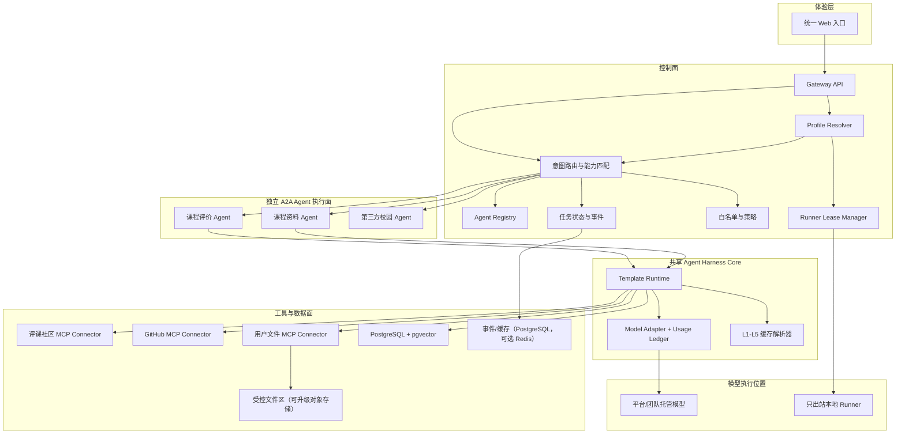
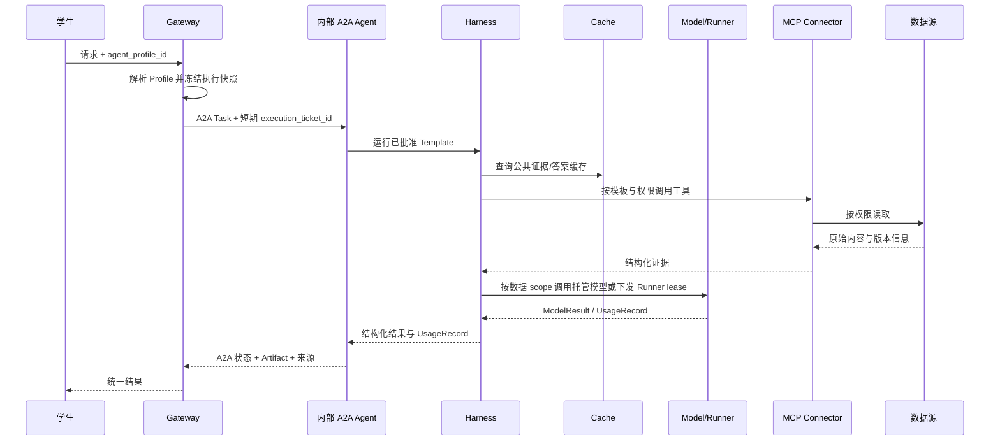

# 校园 Agent 集成平台总体架构

## 1. 项目目标

建设一个标准兼容、可真实接入外部 Agent、也允许每个用户维护个人 Agent 的校园智能体统筹层。学生通过统一入口描述需求，平台完成能力发现、Profile 解析、模型与执行位置选择、Agent 调度和结果聚合；独立业务 Agent 保持独立开发和部署。

比赛版本不追求覆盖全部校园场景，而是用两个课程相关 Agent 证明：

1. 不同 Agent 可以按统一协议注册和被调用；
2. Agent 可以通过标准工具接口访问外部数据；
3. 平台能够处理长任务、追问、失败、取消和来源引用；
4. 第三方开发者可以根据文档在较短时间内完成接入。
5. 同一 Agent 模板可以在不同模型和本地/托管运行时执行，公共证据可复用，私人知识不串用。

平台的创新点不是“把多个聊天机器人放在一个页面”，而是让独立 Agent 在不修改 Gateway 业务代码的情况下，通过标准协议、校园能力契约、权限范围和证据链完成真实接入与治理。比赛必须用固定脚本和代码 diff 证明这一点。

## 2. 设计原则

- **标准优先**：锁定 A2A Protocol 1.0 `HTTP+JSON`、MCP 2025-06-18 授权语义、OpenAPI 3.1 和 JSON Schema 2020-12，不重新发明完整协议。
- **独立边界**：Gateway 不读取业务 Agent 内部状态，业务 Agent 不直接依赖平台数据库结构。
- **最小可用**：比赛版只实现白名单接入、两个 Demo 和一个外部示例 Agent。
- **凭据不转发**：用户或数据源凭据不作为 Agent 任务参数跨服务透传。
- **模板与用户配置分离**：共享 `AgentTemplate` 不包含个人密钥或知识空间，用户 `AgentProfile` 不复制业务代码。
- **数据范围先于模型路由**：先确定 public、course_shared、private 或 local_authenticated，再决定 provider 与执行位置。
- **显式模型切换**：provider、密钥归属和本地/托管执行不允许静默 fallback。
- **来源可追踪**：结论必须关联来源、抓取时间、数据版本和权限空间。
- **渐进增强**：公共数据链路先跑通，再增加登录限定内容和个性化资料。

## 3. 分层结构



## 4. 四个核心子系统

### 4.1 Agent Gateway

Gateway 是平台控制面，负责 Agent Card 拉取与校验、白名单注册、Profile 解析入口、技能索引、意图路由、A2A 任务代理、Runner lease、事件流、取消和超时。两个内部 Demo 与外部示例仍作为独立进程通过 A2A 接入；Gateway 不承担课程评价或 RAG 业务逻辑。

详细设计见[协议调度层设计](../designs/01-agent-gateway.md)。

### 4.2 个人 Agent Harness 与混合模型运行时

Harness Core 是内部 Agent 服务和本地 Runner 复用的运行核心，负责 `AgentTemplate` 运行、`AgentProfile`/`ModelProfile` 执行快照、模型 adapter、MCP 工具调用、缓存、预算和输出校验。课程评价与课程资料 Demo 仍各自发布 Agent Card 和 A2A endpoint，但不重复实现模型、缓存和策略核心。比赛版支持平台/团队受控测试模型与一个 CLI 本地 Runner；普通用户真实 API key 不进入平台服务器。

个人 Agent 与独立 Agent 是不同层次：个人 Agent 是共享模板加用户配置，不发布用户级 Agent Card；内部 Demo 和第三方独立服务按服务粒度通过 A2A 注册。模型 provider 是 Harness 内部 adapter，不是 A2A Agent 或 MCP Tool。

详细设计见[个人 Agent Harness 与混合模型运行时设计](../designs/04-personal-agent-harness.md)。

### 4.3 课程评价 Deep Research Agent

该 Agent 将课程查询转换为带证据的调研任务：完成课程消歧、页面采集、结构化、观点聚合、时效分析、缓存和报告生成。它通过 MCP Connector 访问评课社区，Gateway 不直接抓取课程页面。

详细设计见[课程评价 Agent 设计](../designs/02-course-research-agent.md)。

### 4.4 课程资料与复习 Agent

该 Agent 负责课程资料准入、解析、索引、混合检索和带引用问答。公共、课程共享和个人私有空间使用相同检索接口，但权限过滤在检索前执行。

详细设计见[课程资料 Agent 设计](../designs/03-study-rag-agent.md)。

## 5. 端到端任务流



`execution_ticket_id` 只发给团队控制、嵌入 Harness Core 的内部 Agent；第三方 Agent 仍按最小业务 Data Part 执行，不接收用户 ModelProfile、API key、个人记忆或调度策略。

## 6. 数据与权限边界

| 数据类型 | 默认访问方式 | 存储策略 |
|---|---|---|
| 公开课程元数据 | 服务器公共 Connector | 可缓存结构化字段和版本 |
| 公开点评 | 限速读取，保留来源 | 优先摘要与索引，不公开复制全量正文 |
| 登录限定点评/附件链接 | 获授权后的用户本地 Connector 或官方只读接口 | 未获授权时仅本地处理，不进入服务器或共享索引 |
| 经许可的 GitHub 课程资源 | GitHub Connector | 保存仓库、提交版本和解析索引 |
| 用户个人资料 | 用户上传 Connector | 私有空间、访问控制、可删除；部署支持时启用静态加密 |
| 用户模型 API key | 本地 Runner；生产演进可用独立 Secret Store | MVP 不收集普通用户托管 key，不进入业务数据库、事件或日志 |
| 公共标准答案 | 通过质量门槛的 AnswerArtifact | 记录模型、提示、证据和策略版本，可跨用户复用 |
| 私人生成结果 | 用户私有服务端空间或本地加密缓存 | 不跨用户命中，不自动晋升为公共答案 |

登录凭据属于数据连接器，不属于 A2A 任务载荷。Gateway 不接收原始 Cookie。未获评课社区明确授权时，登录限定证据和附件默认只在用户本地处理，不进入 Gateway 事件、服务器缓存、对象存储或共享 RAG；公开导出必须重新走公开模式。

平台组件通过版本化 `TaskRequest`、`TaskEvent`、`ArtifactEnvelope` 和 `FileRef` 交换业务数据；Profile、Model、Cache 和 Runtime Policy 留在 Gateway/Harness 治理层，不作为第三方 Agent 业务载荷。用户文件先进入受控文件区，A2A 任务只携带限定权限的文件引用；`FileRef` 不构成授权，Gateway 必须按当前身份解析服务端记录。

详细威胁和控制见[平台威胁模型](../security/threat-model.md)。

## 7. 技术选型

- Python、FastAPI、Pydantic 作为 Gateway、Agent 和 Connector 的主要实现栈；
- 官方 A2A Python SDK 实现 Agent Card、任务和流式协议，官方 MCP Python SDK 实现需要跨模块复用的数据工具；
- PostgreSQL 保存注册、任务、事件、权限和文档元数据，pgvector 与 PostgreSQL 全文检索组成混合检索；
- React + Vite 或团队已熟悉的等价方案提供演示入口；
- 开发期使用受控本地文件区，部署确需跨容器共享时再使用 S3/MinIO；
- MVP 先用结构化 JSON 日志和 correlation ID；OpenTelemetry instrumentation 可以预留，Collector 后置；
- Redis 只在 PostgreSQL 事件表和单进程通知不能满足 SSE/缓存时加入；
- LangGraph 只在课程研究两天 spike 证明能简化 checkpoint 和人工确认后加入，不作为 Gateway 硬依赖；
- Docker Compose 提供统一的本地开发环境。
- 模型接入先实现一个 OpenAI-compatible adapter，并按 provider/model 维护能力快照；兼容接口不等于语义完全一致；
- 本地 Runner 只通过出站长轮询/订阅领取短租约，不开放用户电脑入站端口；
- Usage Ledger 独立记录 token、缓存命中和预算，不能只依赖 provider 后台账单。

具体依赖必须在实施阶段通过最小原型验证并锁定版本。

选型证据和竞品比较见[竞品与参考实现技术调研](../research/competitive-landscape.md)，模型与 Runner 依据见[多模型接入、BYOK 与本地 Runner 技术调研](../research/model-provider-byok.md)，MVP 取舍见 [ADR-0002](../decisions/0002-competition-mvp-scope.md) 与 [ADR-0003](../decisions/0003-hybrid-personal-agent-runtime.md)。

## 8. 仓库边界

```text
apps/web                 统一用户入口
services/gateway         Agent 注册、路由和任务代理
services/harness         Template/Profile 运行、模型适配、缓存与预算
agents/course-research   Demo 1
agents/study-rag         Demo 2
runners/local            只出站 CLI 本地 Runner
connectors/icourse       评课社区 MCP Connector
connectors/github        GitHub MCP Connector
connectors/user-files    用户文件 MCP Connector
packages/protocol-sdk    外部 Agent 接入封装和示例
packages/model-adapters  统一模型请求和 provider capability map
packages/schemas         共享 JSON Schema
packages/shared          仅放稳定且确实复用的代码
tests                    协议、集成、评测和端到端测试
```

这些代码目录在实施计划批准后创建。现在仅维护已经有内容的文档目录。

## 9. MVP 验收

- 两个 Demo Agent 以独立进程发布 Agent Card，并通过 A2A 被 Gateway 调用；
- 一个独立部署/独立进程的最小外部示例 Agent 根据接入文档完成白名单注册，无需修改 Gateway，不能用进程内 mock 代替；
- 外部示例 Agent 固定实现 `campus.notice.lookup`，用 10 条公开样例任务证明正常、无结果、追问、取消和不可达；
- 用户能看到任务进度、追问、完成、失败、超时和取消状态；
- 课程评价报告包含来源、时间和样本说明；
- 课程资料回答包含引用，并遵守公共/私有空间隔离；
- 热门课程重复查询能命中缓存，新内容能触发增量更新；
- 日志和 trace 不包含模型密钥、登录 Cookie 或私人文件正文；
- Agent Card SSRF、FileRef 越权、恶意 Artifact、提示注入和恶意文件用例被拒绝；
- 可用演示脚本稳定复现两条核心流程。
- 同一 AgentTemplate 在平台/团队测试模型和本地 Runner 模型上运行，模板业务流程代码不变；
- 公共问题可命中 L4 AnswerArtifact 而不调用用户模型，用户也可显式用自己的模型重新生成；
- Runner 离线、模型能力不匹配、预算超限和 key 撤销均可解释失败，不发生静默 fallback；
- 用户 A 的 ModelProfile、私人记忆和私人生成缓存对用户 B 零可见。

## 10. 明确不做

- 不做开放 Agent 市场、计费结算、复杂租户和自动安全审核；
- 不承诺接入所有校园系统；
- 不绕过数据源登录、权限或反爬限制；
- 不批量复制和公开再分发版权不明确的课程资料；
- 不在比赛版实现复杂多 Agent 自主协商网络，Gateway 只做可解释编排。
- 不收集普通用户真实托管 BYOK，不开放任意 `base_url`，不实现自动模型竞价、自动 failover、多设备 Runner 或开放模板市场。
