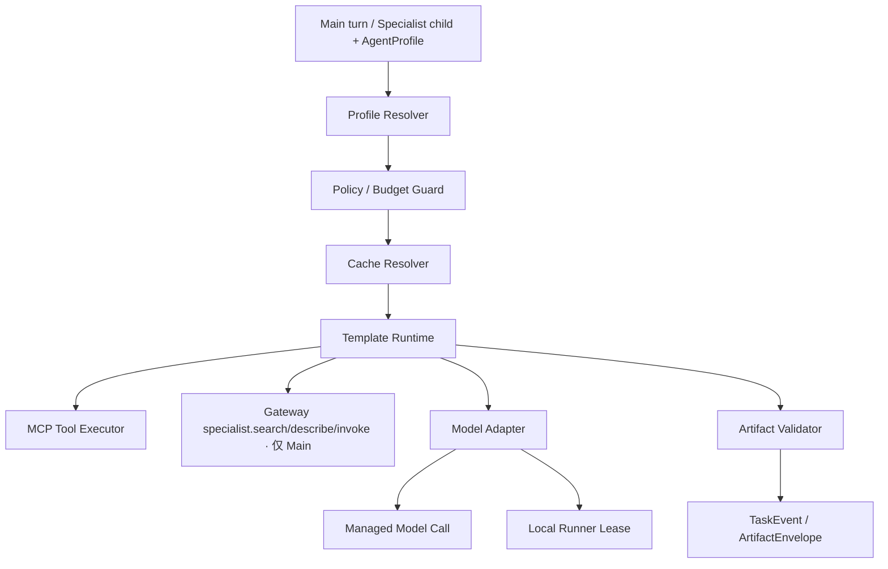

# 04 个人 Agent Harness 与混合模型运行时设计

> 版本：0.4
> 日期：2026-07-19
> 状态：已获队长批准，已纳入 v0.4 三路独立审计并通过；本文是设计契约，不代表代码已经实现。

## 1. 定位

本模块定义 Personal Main Agent 和内置 Specialist 可复用的 Harness、Profile、模型、工具、知识、缓存和混合运行时。用户通过 AgentProfile 养成自己的 Main Agent；Main Agent 的单跳 Specialist 发现与调用由[05 编排设计](./05-personal-main-agent-orchestration.md)负责。

个人 Agent 不是每个用户复制一套代码、开放一个公网 endpoint。它由两部分组成：

- `AgentTemplate`：平台或团队维护的版本化能力模板，定义 skill、流程、工具、输入输出 Schema、安全策略和缓存规则；
- `AgentProfile`：用户私有配置，引用模板、模型、知识空间、记忆、预算和执行模式。

Personal Main Agent 不发布用户级 A2A endpoint；它通过 Gateway 调用已验收 Specialist。两个内置课程 Specialist 按服务粒度发布 Agent Card/A2A endpoint，并与 Main Agent 复用 Harness Core；第三方 Specialist 可以使用自己的内部运行时。MCP 仍负责单个 Agent 内部工具和数据连接，模型提供商不被伪装成 A2A Agent 或 MCP Tool。

## 2. 目标

- 用户可以在同一个 Agent 模板下选择 GPT、DeepSeek、学校模型或其他已批准模型；
- 平台提供统一 Harness，业务流程不包含散落的 provider 条件分支；
- 支持平台托管运行和用户本地 Runner 两种模式；
- 公共知识、解析结果、向量和证据缓存可跨用户复用；
- 用户可以直接使用公共标准答案，也可以调用自己的模型重新生成；
- 私有知识、个人记忆、API key、成本和缓存相互隔离；
- 模型能力不满足、预算不足、Runner 离线和 key 失效时可解释失败，不静默换模型；
- 任务、用量、缓存命中和模型选择可审计，但不记录密钥、完整提示词和私有正文。
- Main Agent 使用用户 ModelProfile 做能力选择和最终综合；Specialist 只获得 ContextGrant 允许的最小上下文；
- 内置 Specialist 共享 ModelAdapter/Policy/Cache/Usage 核心，但保留独特领域 pipeline、工具、知识库和公共 QA namespace。

## 3. 非目标

- 不为每位用户部署独立公网 A2A 服务；
- 不在比赛 MVP 建设开放 Agent 模板市场、付费结算或收益分成；
- 不实现自动竞价、自动选择“最强/最便宜”模型或跨 provider 静默故障转移；
- 不假设所有 OpenAI-compatible API 在工具调用、JSON、thinking、缓存和计费语义上完全等价；
- 不开放任意用户自定义 `base_url` 给平台服务器访问；
- 不把个人 API key 写入 Agent Card、TaskRequest、Artifact、日志或仓库；
- 不把私人回答或个人记忆自动提升为公共缓存。
- 不允许 Main Agent 绕过 Gateway 访问 Specialist，也不允许 Specialist 继续调用 Agent；
- 不把完整个人上下文预加载到 Main Agent prompt 或下发给 Specialist。

## 4. 核心概念

### 4.1 AgentTemplate

模板是共享且版本化的 Agent 能力定义：

```json
{
  "template_id": "course-research",
  "template_version": "1.0.0",
  "display_name": "课程调研助手",
  "skill_ids": ["course.research"],
  "required_model_capabilities": ["streaming", "structured_output"],
  "allowed_tool_ids": ["icourse.public.search", "course.report.render"],
  "input_schema_ref": "schema://course-research-request/1.0",
  "output_schema_ref": "schema://course-report/1.0",
  "prompt_version": "course-research-prompt-1",
  "cache_policy_id": "public-research-v1"
}
```

模板不包含用户密钥、私人知识库 ID、个人提示词或真实模型账号。模板升级必须保留版本，已有 Profile 不自动跨破坏性版本迁移。

### 4.2 AgentProfile

Profile 是用户拥有的 Personal Main Agent 配置：

```json
{
  "agent_profile_id": "profile_example",
  "owner_subject_id": "subject_example",
  "template_id": "course-research",
  "template_version": "1.0.0",
  "model_profile_id": "model_profile_example",
  "knowledge_space_ids": ["public_courses", "private_example"],
  "memory_policy": "private_local_first",
  "cache_preference": "shared_first",
  "fallback_policy": "ask_before_switch",
  "status": "active"
}
```

用户可以创建多个 Profile，例如“省钱选课助手”“高质量论文助手”和“只在本地运行的私人复习助手”。Profile 只能引用当前用户有权访问的 ModelProfile、知识空间和工具授权。

### 4.3 ModelProfile

ModelProfile 描述模型选择和凭据引用：

```json
{
  "model_profile_id": "model_profile_example",
  "owner_subject_id": "subject_example",
  "provider_id": "deepseek",
  "model_id": "provider-model-id",
  "execution_mode": "local_runner",
  "secret_ref": null,
  "capability_snapshot_id": "capability_example",
  "budget_policy_id": "budget_example",
  "status": "active"
}
```

`execution_mode` 只允许：

- `platform_sponsored`：使用比赛或平台统一提供的模型额度；
- `managed_byok`：Harness 在托管环境中通过用户专属 `secret_ref` 调用模型；
- `local_runner`：用户设备上的 Runner 使用本地 API key 调用模型，key 不离开设备。

比赛 MVP 不收集普通用户的真实托管 BYOK。`managed_byok` 只用团队受控测试账号验证 secret lifecycle；真实用户自带 key 的主演示路径是 `local_runner`。

### 4.4 ProviderCatalog 与 CapabilitySnapshot

ProviderCatalog 是管理员维护的允许列表，不让用户向平台提交任意 `base_url`。每个 provider 记录服务地址、适配器类型、数据政策链接和能力探测方式。

CapabilitySnapshot 至少记录：

- streaming；
- tools/function calling；
- structured output/JSON；
- vision；
- reasoning/thinking；
- context window；
- usage 字段和缓存计费字段；
- 探测时间、适配器版本和已知不兼容参数。

能力不足时 Harness 返回 `model_capability_mismatch`，不得伪造能力或静默换模型。

### 4.5 四个核心对象的 JSON Schema 草案

实施时把以下契约分别落到 `packages/schemas/agent-runtime/` 并纳入兼容测试；文档中的 Schema 是 MVP 最小约束，不允许实现阶段退回任意对象。所有对象默认 `additionalProperties=false`，新增字段需要升级 Schema 版本。

AgentTemplate：

```json
{
  "$schema": "https://json-schema.org/draft/2020-12/schema",
  "$id": "https://example.edu/schemas/agent-template-v1.json",
  "type": "object",
  "required": [
    "template_id",
    "template_version",
    "display_name",
    "skill_ids",
    "required_model_capabilities",
    "allowed_tool_ids",
    "input_schema_ref",
    "output_schema_ref",
    "prompt_version",
    "cache_policy_id"
  ],
  "properties": {
    "template_id": {"type": "string", "pattern": "^[a-z][a-z0-9-]{1,63}$"},
    "template_version": {"type": "string", "pattern": "^[0-9]+\\.[0-9]+\\.[0-9]+$"},
    "display_name": {"type": "string", "minLength": 1, "maxLength": 64},
    "skill_ids": {
      "type": "array",
      "items": {"type": "string", "pattern": "^[a-z][a-z0-9_.-]{1,63}$"},
      "minItems": 1,
      "uniqueItems": true
    },
    "required_model_capabilities": {
      "type": "array",
      "items": {"type": "string", "enum": ["streaming", "tools", "structured_output", "vision", "reasoning"]},
      "uniqueItems": true
    },
    "allowed_tool_ids": {
      "type": "array",
      "items": {"type": "string", "pattern": "^[a-z][a-z0-9_.-]{1,127}$"},
      "uniqueItems": true
    },
    "input_schema_ref": {"type": "string", "pattern": "^schema://"},
    "output_schema_ref": {"type": "string", "pattern": "^schema://"},
    "prompt_version": {"type": "string", "minLength": 1, "maxLength": 128},
    "cache_policy_id": {"type": "string", "minLength": 1, "maxLength": 128},
    "status": {"type": "string", "enum": ["draft", "active", "deprecated"], "default": "active"}
  },
  "additionalProperties": false
}
```

AgentProfile：

```json
{
  "$schema": "https://json-schema.org/draft/2020-12/schema",
  "$id": "https://example.edu/schemas/agent-profile-v1.json",
  "type": "object",
  "required": [
    "agent_profile_id",
    "owner_subject_id",
    "template_id",
    "template_version",
    "model_profile_id",
    "knowledge_space_ids",
    "memory_policy",
    "cache_preference",
    "fallback_policy",
    "status"
  ],
  "properties": {
    "agent_profile_id": {"type": "string", "pattern": "^profile_[A-Za-z0-9_]+$"},
    "owner_subject_id": {"type": "string", "pattern": "^subject_[A-Za-z0-9_]+$"},
    "template_id": {"type": "string", "pattern": "^[a-z][a-z0-9-]{1,63}$"},
    "template_version": {"type": "string", "pattern": "^[0-9]+\\.[0-9]+\\.[0-9]+$"},
    "model_profile_id": {"type": "string", "pattern": "^model_profile_[A-Za-z0-9_]+$"},
    "knowledge_space_ids": {
      "type": "array",
      "items": {"type": "string", "pattern": "^[A-Za-z0-9_.-]{2,128}$"},
      "maxItems": 32,
      "uniqueItems": true
    },
    "memory_policy": {"type": "string", "enum": ["disabled", "session_only", "private_local_first"]},
    "cache_preference": {"type": "string", "enum": ["shared_first", "regenerate"]},
    "fallback_policy": {"type": "string", "enum": ["none", "ask_before_switch"]},
    "status": {"type": "string", "enum": ["draft", "active", "disabled"]}
  },
  "additionalProperties": false
}
```

ModelProfile：

```json
{
  "$schema": "https://json-schema.org/draft/2020-12/schema",
  "$id": "https://example.edu/schemas/model-profile-v1.json",
  "type": "object",
  "required": [
    "model_profile_id",
    "owner_subject_id",
    "provider_id",
    "model_id",
    "execution_mode",
    "secret_ref",
    "capability_snapshot_id",
    "budget_policy_id",
    "status"
  ],
  "properties": {
    "model_profile_id": {"type": "string", "pattern": "^model_profile_[A-Za-z0-9_]+$"},
    "owner_subject_id": {"type": "string", "pattern": "^subject_[A-Za-z0-9_]+$"},
    "provider_id": {"type": "string", "pattern": "^[a-z][a-z0-9_-]{1,63}$"},
    "model_id": {"type": "string", "minLength": 1, "maxLength": 128},
    "execution_mode": {"type": "string", "enum": ["platform_sponsored", "managed_byok", "local_runner"]},
    "secret_ref": {"type": ["string", "null"], "pattern": "^secret://users/[A-Za-z0-9_/-]+$"},
    "capability_snapshot_id": {"type": "string", "pattern": "^capability_[A-Za-z0-9_]+$"},
    "budget_policy_id": {"type": "string", "pattern": "^budget_[A-Za-z0-9_]+$"},
    "status": {"type": "string", "enum": ["draft", "active", "revoked", "disabled"]}
  },
  "allOf": [
    {
      "if": {"properties": {"execution_mode": {"const": "local_runner"}}},
      "then": {"properties": {"secret_ref": {"type": "null"}}}
    },
    {
      "if": {"properties": {"execution_mode": {"const": "platform_sponsored"}}},
      "then": {"properties": {"secret_ref": {"type": "null"}}}
    },
    {
      "if": {"properties": {"execution_mode": {"const": "managed_byok"}}},
      "then": {"properties": {"secret_ref": {"type": "string", "pattern": "^secret://users/[A-Za-z0-9_/-]+$"}}}
    }
  ],
  "additionalProperties": false
}
```

CapabilitySnapshot：

```json
{
  "$schema": "https://json-schema.org/draft/2020-12/schema",
  "$id": "https://example.edu/schemas/capability-snapshot-v1.json",
  "type": "object",
  "required": [
    "capability_snapshot_id",
    "provider_id",
    "model_id",
    "supported_capabilities",
    "context_window",
    "usage_fields",
    "adapter_version",
    "probed_at",
    "status"
  ],
  "properties": {
    "capability_snapshot_id": {"type": "string", "pattern": "^capability_[A-Za-z0-9_]+$"},
    "provider_id": {"type": "string", "pattern": "^[a-z][a-z0-9_-]{1,63}$"},
    "model_id": {"type": "string", "minLength": 1, "maxLength": 128},
    "supported_capabilities": {
      "type": "array",
      "items": {"type": "string", "enum": ["streaming", "tools", "structured_output", "vision", "reasoning"]},
      "uniqueItems": true
    },
    "context_window": {"type": ["integer", "null"], "minimum": 1},
    "usage_fields": {
      "type": "array",
      "items": {"type": "string", "enum": ["input_tokens", "output_tokens", "cache_read_tokens", "estimated_cost"]},
      "uniqueItems": true
    },
    "known_unsupported_parameters": {
      "type": "array",
      "items": {"type": "string", "maxLength": 64},
      "uniqueItems": true,
      "default": []
    },
    "adapter_version": {"type": "string", "minLength": 1, "maxLength": 64},
    "probed_at": {"type": "string", "format": "date-time"},
    "status": {"type": "string", "enum": ["verified", "partial", "unavailable"]}
  },
  "additionalProperties": false
}
```

Template 升级规则：同一 major 版本可增加向后兼容的可选能力；删除 skill/tool、收紧输入输出或改变安全/缓存语义必须升级 major。Profile 固定引用精确 `template_version`，不得自动跨 major 迁移。CapabilitySnapshot 是带时间与 adapter 版本的观测结果，不由用户自行声明。

## 5. Harness 组件



组件职责：

- Profile Resolver：读取 Template/Profile/ModelProfile，生成不可变执行快照；
- Policy Guard：校验数据范围、模型 egress、工具授权、预算和 fallback；
- Cache Resolver：按公共证据、公共答案或私人生成策略读取/写入缓存；
- Template Runtime：执行版本化 Agent 流程，不直接保存用户密钥；
- MCP Tool Executor：只执行模板允许且用户获授权的工具；
- Specialist Client：只在 Main Agent 执行票据中可用，经 Gateway 搜索、描述和调用一个 Specialist；不是 MCP Tool，底层仍为 A2A；
- Model Adapter：把统一 ModelRequest 转换为 provider 请求，并规范化 usage；
- Local Runner Client：通过短期租约把模型调用交给已配对设备；
- Artifact Validator：校验 Schema、引用、数据范围、大小和不可信输出；
- Usage Ledger：记录 token、缓存命中、估算费用和预算消耗。

## 6. 模型适配契约

统一 ModelRequest：

```json
{
  "model_profile_ref": "model_profile_example",
  "messages_ref": "ephemeral://task/task_example/messages",
  "tool_schema_refs": ["schema://course-search/1.0"],
  "response_schema_ref": "schema://course-report/1.0",
  "data_scope": "public",
  "max_output_tokens": 2000,
  "stream": true,
  "execution_ticket_id": "ticket_example"
}
```

统一 ModelResult：

```json
{
  "status": "completed",
  "output_ref": "ephemeral://task/task_example/model-output",
  "tool_calls": [],
  "usage": {
    "input_tokens": 1200,
    "output_tokens": 500,
    "cache_read_tokens": 0
  },
  "provider_id": "deepseek",
  "model_id": "provider-model-id",
  "capability_snapshot_id": "capability_example"
}
```

`messages_ref` 和 `output_ref` 是同一执行边界内的短期引用，不进入跨 Agent Artifact。Model Adapter 不能读取 Profile 未授权的知识空间，也不能自行增加工具。

MVP 优先实现一个 OpenAI-compatible adapter，但为 DeepSeek、OpenAI 和学校模型分别维护 capability map。兼容 SDK 只减少 HTTP 客户端差异，不代表参数、工具调用、reasoning 和缓存计费完全一致。

## 7. 混合执行模式

### 7.1 平台托管

1. Gateway 根据 `agent_profile_id` 解析执行快照；
2. Harness 校验数据 scope 和用户对远端 provider 的授权；
3. `platform_sponsored` 使用部署 Secret，`managed_byok` 读取用户专属 `secret_ref`；
4. 密钥只在调用进程内短暂解封装，不进入业务对象；
5. Model Adapter 调用 allowlist provider；
6. Usage Ledger 记录元数据并更新预算；
7. 临时明文和短期引用在任务结束后清理。

平台托管适合随时在线的个人 Agent，但用户必须看到模型提供方和即将发送的数据范围。`private`、`local_authenticated` 和个人记忆默认不允许远端发送；逐次确认后才可例外。

### 7.2 本地 Runner

托管 Gateway 不能直接调用用户电脑上的 `localhost`。本地模式采用只出站的租约协议：

1. 用户用短期配对码绑定一个 Runner；
2. Runner 持有短期设备 token，主动向 Gateway 长轮询或订阅任务；
3. Gateway 创建包含 `runner_id`、`subject_id`、`task_id`、scope、nonce、序号和过期时间的 `RunnerLease`；
4. Runner 原子认领 lease，获取最小执行票据和允许的数据引用；
5. Runner 使用本地 API key 运行相同 Harness core；
6. Runner 上传 TaskEvent、UsageRecord 和 Artifact，不上传 API key；
7. Gateway 把 Runner 结果视为不可信输入，再次做 Schema、权限、大小和渲染校验；
8. lease 完成或过期后不可重放，本地中间数据按策略清理。

若作为条件增强启用，本地 Runner 最多支持一个演示设备、一个并发任务、短期配对码和短 lease，不开放入站端口、通用隧道或多设备同步。

## 8. 数据 egress 与 fallback

数据分级先于模型选择：

| 数据范围 | 默认模型路径 | 允许例外 |
|---|---|---|
| `public` | 平台模型、managed BYOK 或本地 Runner | 用户可选择任一已批准 provider |
| `course_shared` | 本地 Runner；或课程空间明确允许的托管 provider | 必须记录空间授权和 provider |
| `private` | 本地 Runner | 逐次确认后可发往明确显示的托管 provider |
| `local_authenticated` | 本地 Runner | 比赛 MVP 不发送到托管 provider |

模型失败时：

- `fallback_policy=none`：直接失败；
- `fallback_policy=ask_before_switch`：返回 `model_switch_confirmation_required`；
- 不允许从本地 Runner 静默切到云模型；
- 不允许从用户 BYOK 静默切到平台付费 key；
- 用户确认后生成新的执行票据和审计事件，不能复用旧授权。

## 9. 五层缓存

| 层级 | 内容 | 是否跨用户 | 关键版本 |
|---|---|---|---|
| L1 来源快照 | 公开课程字段、公开页面版本 | 是 | source、fetched_at、visibility |
| L2 解析与索引 | chunk、OCR、embedding、全文索引 | 仅公共/获授权共享数据 | parser、embedding、document、policy |
| L3 证据与检索 | 规范化查询到 evidence bundle | 仅公共/相同共享 scope | query、data、retriever、policy |
| L4 公共专业问答 | 经质量门槛验证的公共 QA/SpecialistArtifact | 是 | specialist、skill、evidence、template、prompt、policy |
| L5 私人生成 | 结合个人知识、记忆和模型的回答 | 否 | subject、profile、model、prompt、private data、policy |

关键规则：

- 不同生成模型可以复用 L1-L3；
- L4 必须标明生成模型、提示版本、证据版本和生成时间，用户可以直接使用或选择“用我的模型重新生成”；
- MVP 只有平台赞助模型生成且通过证据/安全校验的公共回答才能进入 L4；用户 BYOK 结果默认不提升为公共答案；
- L5 只存在用户私有服务端空间或本地加密缓存，不跨用户命中；
- `private`、`local_authenticated` 数据不得影响 L1-L4；
- 来源删除、权限变化、Template/Prompt/Policy 版本变化使相关缓存失效；
- MVP 只做规范化精确问题键，不做可能误命中的语义答案缓存。

缓存命中响应必须显示 `cache_level`、`generated_at`、`evidence_version` 和 `generator`。L4 命中时不消耗用户模型额度；重新生成时复用 L1-L3，并把新模型用量记入用户账本。

## 10. 成本与预算

BudgetPolicy 至少包含：

- 每任务最大输入/输出 token；
- 每日 token 或费用上限；
- 最大并发；
- RPM/TPM；
- 最大重试次数；
- 最大工具步数；
- 超限处理：失败或请求确认。

UsageRecord 记录 `task_id`、`subject_id`、`provider_id`、`model_id`、execution mode、token、provider cache hit、估算费用、时间和错误码。价格未知或可能过期时只展示 token，不伪造精确费用。

平台不在 MVP 代收模型费用。BYOK 费用由 provider 直接向用户收取；平台赞助模型受团队/比赛额度约束。

## 11. 凭据生命周期

托管 BYOK 的完整设计要求：

1. 用户提交 key 后立即写入独立加密 Secret Store；
2. 业务数据库只保存随机 `secret_ref`、owner、provider、用途、状态和时间；
3. API 永不回显 key，只返回末尾脱敏标识；
4. 运行时按 subject/provider/purpose 解封装，调用后立即释放；
5. 撤销、轮换或删除后，排队任务、重试和未完成 lease 不能继续用旧 key；
6. DLP 扫描日志、trace、错误、Artifact、数据库导出和前端响应；
7. 加密主密钥不与密文存放在同一数据库或仓库。

比赛硬 MVP 用团队受控测试 key 验证 `secret_ref`、撤销和 DLP，不收集普通参赛者或真实用户的托管 key。条件启用本地 Runner 时，用户 key 仍只保存在本地安全配置中。

## 12. 个人记忆与知识空间

- AgentProfile 只保存知识空间引用，不复制公共知识库；
- 私有记忆属于用户私有空间，检索前按 `owner_subject_id` 过滤；
- Profile 删除不自动删除用户文件，但必须撤销 Profile 对知识空间、模型和工具的授权；
- 用户可单独清除会话记忆、长期记忆、私人答案缓存和 ModelProfile；
- 模板中的提示词不能读取未绑定空间；个人记忆中的提示注入仍按不可信证据处理；
- 第三方 Specialist 默认不能获得用户 ModelProfile、BYOK、完整 Profile、完整会话或私人记忆，只能收到 ContextGrant 允许的最小上下文；
- Main Agent 只能通过 Context Broker 按需读取个人数据，不能把完整个人档案预加载到 prompt；
- Specialist 不能直接写长期记忆，只能返回候选，由 Main Agent 和记忆策略决定是否保存。

## 13. 错误模型

| 错误码 | 含义 | 处理 |
|---|---|---|
| `model_profile_not_found` | Profile 引用不存在或无权访问 | 拒绝任务 |
| `model_capability_mismatch` | 模型缺少模板所需能力 | 显示缺失能力，请用户换模型 |
| `model_secret_invalid` | key 失效或被撤销 | 停止排队/重试，要求重新配置 |
| `model_provider_unavailable` | provider 不可用 | 按 fallback policy 失败或请求确认 |
| `model_budget_exceeded` | 预算、并发或 token 超限 | 拒绝调用，保留缓存可用路径 |
| `model_egress_confirmation_required` | 数据范围需要确认 | 展示 provider 和数据 scope |
| `runner_offline` | 本地 Runner 不在线 | 等待、取消或显式选择其他模式 |
| `runner_lease_expired` | lease 超时/重放 | 拒绝结果，重新创建任务 |
| `cache_stale` | 证据或策略版本已变化 | 失效后重建 |

## 14. MVP 验收

### 功能闭环

- 一个 Personal Main Agent Profile 使用平台/团队测试模型完成直接回答和 Specialist 最终综合；
- Main Agent 每回合最多调用一个 Specialist，Specialist 无法继续调用 Agent；
- Profile A 与 Profile B 可以共享公共知识、解析、embedding 和证据缓存；
- 同一公开问题第二次选择公共标准答案时不产生用户模型调用；
- 用户选择“用我的模型重新生成”时复用公共证据，但生成结果和 usage 进入本人空间；
- 私人笔记只影响本人 Profile，另一用户零命中；
- 条件启用本地 Runner 时，Runner 离线不静默切换模型；
- 模型能力不匹配、预算超限和 key 撤销均返回可解释错误。

### 安全闭环

- 真实 key 在仓库、数据库正文、日志、trace、TaskEvent、Artifact 和前端响应中出现 0 次；
- 条件启用 Runner 时，认领他人任务、重放 lease、重复提交结果和过期提交均被拒绝；
- 平台拒绝任意自定义 `base_url`，只使用 allowlist provider；
- `private` 和 `local_authenticated` 数据未经逐次确认不得发送到托管 provider；
- 用户 A 的 L5 缓存、ModelProfile 和私人记忆对用户 B 零可见；
- 公共缓存投毒、静默 fallback、超大 token、无限重试和递归工具调用测试全部通过。

### 演示脚本

1. 创建一个 Personal Main Agent Profile，显示用户选择的 provider/model 和预算；
2. 普通问题由 Main Agent直接回答，不创建 child；
3. 课程问题触发 search/describe/invoke，创建唯一 Specialist child；
4. Specialist 命中公共证据/QA，Gateway 校验后交回 Main；
5. Main Agent用用户模型提炼并保留引用、限制、cache 和 usage；
6. 私人复习问题只通过 ContextGrant 引用个人空间；
7. 展示第二 child、递归、跨用户记忆和静默 fallback 均被拒绝；
8. Runner 条件启用时再展示本地 key、短 lease 和离线不切云。

## 15. MVP 与后续边界

MVP 必须完成：

- AgentTemplate、AgentProfile、ModelProfile 和 CapabilitySnapshot 最小 Schema；
- 一个 OpenAI-compatible adapter，两个 allowlist provider 配置；
- 平台赞助/团队测试 managed 模式；
- Main Agent 的 specialist.search/describe/invoke 结构化工具面和单跳执行票据；
- Usage Ledger、token 预算、最大并发/重试/工具步数；
- L1-L5 缓存边界，至少演示 L3/L4/L5；
- 显式 egress 与 fallback 确认；
- secret_ref、撤销和安全测试。

条件增强：

- 一个设备、一个并发、短 lease 的 CLI 本地 Runner；
- RunnerLease、配对、重放拒绝和本地 key 安全主演示。

MVP 后：

- 收集和托管真实用户 BYOK；
- 任意自定义 `base_url`；
- 多设备 Runner、后台常驻个人 Agent 和离线同步；
- 社区 Agent 模板发布、评分和市场；
- 自动模型竞价、质量/成本学习路由和自动 failover；
- 跨用户语义答案缓存和用户答案公共晋升工作流；
- 企业级 KMS/HSM、计费结算和多租户运营后台。

## 16. 与 Gateway 和 A2A/MCP 的边界

- Main Agent 负责用户交互、能力选择、query、ContextGrant 请求和最终综合；
- Gateway 负责身份、Profile 解析入口、Catalog 披露、root/child Task、限深、A2A、事件、Runner lease 和策略审计；
- Harness 负责 Main/内置 Specialist 模板运行、模型适配、工具执行、缓存、预算和输出校验；
- A2A 仍只用于 Gateway 与 Specialist 服务之间的标准 child task 互联；
- MCP 仍只用于 Agent 内部工具和数据连接；
- ModelProfile 和 API key 不进入 A2A Agent Card，不传给第三方 Agent；
- 本地 Runner 使用平台 OpenAPI/JSON Schema 定义的出站 worker 契约，不注册任意 localhost Agent endpoint；
- 内部 Harness Agent 可以接收短期 `execution_ticket_id`，不能接收原始 `secret_ref` 或 API key。

## 17. 相关文档

- [总体架构](../architecture/overview.md)
- [协议调度层设计](./01-agent-gateway.md)
- [多模型接入、BYOK 与本地 Runner 技术调研](../research/model-provider-byok.md)
- [平台威胁模型](../security/threat-model.md)
- [ADR-0003：采用模板化个人 Agent 与混合模型运行时](../decisions/0003-hybrid-personal-agent-runtime.md)
- [ADR-0004：采用 Personal Main Agent 与单跳 Specialist 编排](../decisions/0004-personal-main-agent-single-hop-orchestration.md)
- [Personal Main Agent 与 Specialist 单跳编排设计](./05-personal-main-agent-orchestration.md)
- [个人 Agent Harness 正式设计规格](../superpowers/specs/2026-07-19-personal-agent-harness-design.md)
- [v0.3 集成审计（历史）](../audits/2026-07-19-v0.3-personal-agent-audit.md)
- [v0.4 Main Agent 单跳编排审计（当前）](../audits/2026-07-19-v0.4-main-agent-audit.md)
