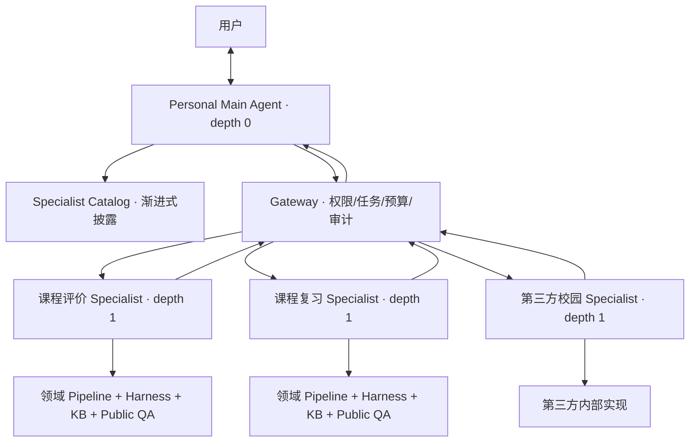
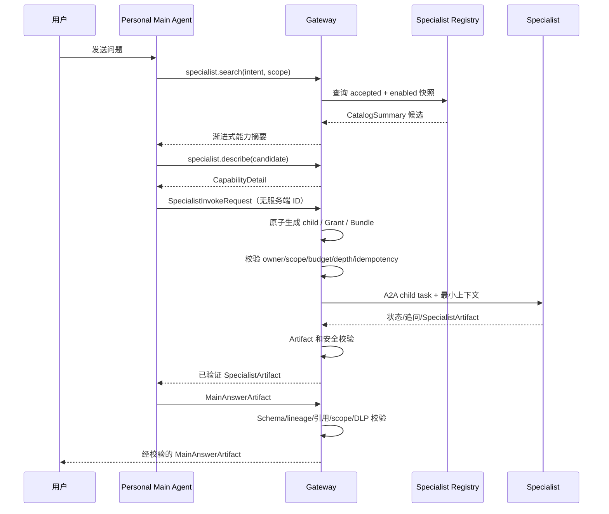

# 05 Personal Main Agent 与 Specialist 单跳编排设计

> 版本：0.4
> 日期：2026-07-19
> 状态：已获队长批准，三路独立审计与修复复审通过；本文是设计契约，不代表代码已经实现。

## 1. 定位

Personal Main Agent 是每个用户在平台中的唯一对话入口和长期交互主体。它负责理解目标、读取获授权的个人上下文、发现专业能力、编写子任务、调用一个 Specialist Sub Agent，并把专业结果提炼成最终回答。

Specialist 是平台注册并验收的专业 Agent，例如课程评价、课程资料与复习、校园通知或校园寻路。它不是 UI 页面，也不直接维持用户主会话；它接收一个明确领域任务，使用自己的领域 pipeline、工具、知识库和公共 QA 缓存完成工作，并返回结构化 Artifact。

Gateway 不是第三个会推理的 Agent，而是确定性控制面：它负责目录披露、授权、父子任务、A2A、预算、超时、取消、限深、审计和输出校验。

## 2. 目标

- 用户始终只和同一个 Personal Main Agent 交互；
- Main Agent 像使用 skills 一样看到已验收 Specialist 的简短摘要；
- 只有当前任务可能需要时才读取某个 Specialist 的完整能力契约；
- 每个用户回合最多调用一个 Specialist，固定两层，禁止递归；
- Main Agent 编写专业 query，但 Gateway 决定调用是否满足权限和治理条件；
- Specialist 获得字段级、短期、目的绑定的个人上下文，而不是完整用户档案；
- Specialist 使用领域 pipeline、Harness、知识库和公共 QA 形成专业结果；
- 最终答复由 Main Agent 生成并保留完整引用、限制和数据范围；
- 内置和第三方 Specialist 使用同一注册、调用、Artifact 和验收边界。

## 3. 非目标

- 不允许 Specialist 再调用 Agent；
- 不在比赛 MVP 支持并行、fan-out、投票、辩论或多跳 planner；
- 不让 Main Agent 直接访问外部 endpoint、认证配置或原始 Agent Card；
- 不把 Specialist 包装成 MCP Tool；对 Main Agent 是结构化能力，底层仍由 Gateway 通过 A2A 调用；
- 不把完整 Profile、ModelProfile、API key、Cookie、私人记忆正文或完整会话发送给 Specialist；
- 不允许 Specialist 直接写个人长期记忆；
- 不把未经平台验收或 Card 发生未复审变化的 Agent 披露给 Main Agent；
- 不做开放市场、收益分成、自动 fallback 或生产级多租户运营。

## 4. 两层架构



硬性层级：

| 层级 | 主体 | 可以做什么 | 不能做什么 |
|---|---|---|---|
| `depth=0` | Personal Main Agent | 与用户交互、搜索/查看 Specialist、创建一个 child task、综合结果 | 直接访问 A2A endpoint、绕过 Gateway 取私人数据 |
| `depth=1` | Specialist Sub Agent | 执行领域任务、调用自己的模型/MCP/KB/cache、返回 Artifact | 创建 child task、调用其他 Agent、直接写用户记忆、直接最终答复用户 |

Gateway 在令牌 audience 和服务端策略两处同时执行层级约束：只有 Main Agent 的执行票据包含 `specialist.invoke`；Specialist 票据明确 `can_delegate=false`。

## 5. 组件职责

### 5.1 Personal Main Agent

- 保存主会话、用户可见对话摘要和 AgentProfile 引用；
- 使用用户选择的 ModelProfile；
- 先判断是否可以直接回答，避免不必要的 Specialist 调用；
- 通过 `specialist.search` 获取候选摘要；
- 通过 `specialist.describe` 获取一个候选的详细契约；
- 生成不含服务端 ID 的 SpecialistInvokeRequest，只提出 query、期望产物和所需字段/引用；
- 接收经过 Gateway 校验的 SpecialistArtifact；
- 保留引用和限制，生成 MainAnswerArtifact；
- 只提出记忆写回候选，按用户策略确认后写入。

### 5.2 Specialist Registry

- 保存 Agent Card 冻结快照、平台整理的能力摘要、Schema、版本、健康、验收和治理状态；
- 只披露 `acceptance_status=accepted` 且 `status=enabled` 的版本；
- Card、endpoint、权限或 Schema 变化后置为 `review_required`，立即停止新任务披露；
- 不向 Main Agent 暴露 endpoint、auth_profile_ref、完整安全配置或内部提示词；
- 使用静态白名单/管理员脚本完成 MVP 注册，不建设开放市场 UI。

### 5.3 Gateway

- 基于用户身份、Main Agent 票据和任务状态过滤目录；
- 重新校验 Main Agent 提交的 Specialist/version/skill、Schema、上下文字段/引用请求、预算和 data scope；
- 创建 root/child task lineage；
- 通过 A2A 调用 Specialist，处理 SSE、轮询、追问、取消和超时；
- 强制 `max_child_tasks=1`、`max_agent_depth=1`、`can_delegate=false`；
- 校验 SpecialistArtifact 并记录最小审计元数据；
- 不负责自由规划、自然语言综合或自动选择 fallback Agent。

### 5.4 Specialist

- 接收明确的 child goal、专业 query、期望输出和短期上下文包；
- 在领域内使用自己的 pipeline 配置、MCP 工具、知识库、模型和缓存；
- 内置 Specialist 复用统一 Harness Core 的 Policy Guard、ModelAdapter、CacheResolver、Usage Ledger 和 Artifact Validator；
- 第三方 Specialist 可以使用自己的运行时，但必须通过 A2A 和注册 Schema 返回结果；
- 不能读取未授权个人空间、Main Agent 完整历史、用户模型 key 或其他 Specialist 状态；
- 不能创建新的 Agent 任务。

## 6. 渐进式能力披露

### 6.1 CatalogSummary

Main Agent 默认只收到任务相关的少量摘要。MVP 只有三个 Specialist，可以全部进入轻量索引；仍应通过 Gateway 过滤健康、权限和验收状态。

```json
{
  "$schema": "https://json-schema.org/draft/2020-12/schema",
  "$id": "https://example.edu/schemas/specialist-catalog-summary-v1.json",
  "type": "object",
  "required": [
    "specialist_id",
    "display_name",
    "one_line_summary",
    "skill_ids",
    "output_artifact_types",
    "data_scopes_supported",
    "requires_user_confirmation",
    "health",
    "accepted_version",
    "last_validated_at"
  ],
  "properties": {
    "specialist_id": {"type": "string", "pattern": "^[a-z][a-z0-9_.-]{1,63}$"},
    "display_name": {"type": "string", "minLength": 1, "maxLength": 64},
    "one_line_summary": {"type": "string", "minLength": 1, "maxLength": 240},
    "skill_ids": {"type": "array", "items": {"type": "string"}, "minItems": 1, "maxItems": 16, "uniqueItems": true},
    "output_artifact_types": {"type": "array", "items": {"type": "string"}, "minItems": 1, "maxItems": 16, "uniqueItems": true},
    "data_scopes_supported": {
      "type": "array",
      "items": {"type": "string", "enum": ["public", "course_shared", "private", "local_authenticated"]},
      "minItems": 1,
      "uniqueItems": true
    },
    "requires_user_confirmation": {"type": "boolean"},
    "health": {"type": "string", "enum": ["healthy", "degraded"]},
    "accepted_version": {"type": "string", "minLength": 1, "maxLength": 64},
    "last_validated_at": {"type": "string", "format": "date-time"}
  },
  "additionalProperties": false
}
```

摘要必须由平台根据已验收快照生成并人工可审阅，不能把第三方提交的长描述原样注入 Main Agent prompt。

### 6.2 CapabilityDetail

Main Agent 准备调用某个 Specialist 时再读取：

- `input_schema_ref`、`output_schema_ref`；
- 适用与不适用场景；
- 允许的 ContextGrant 字段；
- 示例 query 和期望 Artifact；
- 典型错误码；
- 是否支持流式、追问和取消；
- 缓存策略摘要、延迟等级和预算上限；
- data scope 与额外确认要求。

CapabilityDetail 也必须是平台从 accepted 快照生成的受限结构，不能返回任意第三方长文本：

```json
{
  "$schema": "https://json-schema.org/draft/2020-12/schema",
  "$id": "https://example.edu/schemas/specialist-capability-detail-v1.json",
  "type": "object",
  "required": [
    "specialist_id",
    "accepted_version",
    "skill_id",
    "detail_version",
    "source_snapshot_digest",
    "input_schema_ref",
    "output_schema_ref",
    "use_when",
    "do_not_use_when",
    "allowed_context_fields",
    "data_scopes_supported",
    "supports"
  ],
  "properties": {
    "specialist_id": {"type": "string", "pattern": "^[a-z][a-z0-9_.-]{1,63}$"},
    "accepted_version": {"type": "string", "minLength": 1, "maxLength": 64},
    "skill_id": {"type": "string", "pattern": "^[a-z][a-z0-9_.-]{1,63}$"},
    "detail_version": {"type": "integer", "minimum": 1},
    "source_snapshot_digest": {"type": "string", "pattern": "^sha256:[a-f0-9]{64}$"},
    "input_schema_ref": {"type": "string", "pattern": "^schema://"},
    "output_schema_ref": {"type": "string", "pattern": "^schema://"},
    "use_when": {"type": "array", "items": {"type": "string", "maxLength": 240}, "maxItems": 8},
    "do_not_use_when": {"type": "array", "items": {"type": "string", "maxLength": 240}, "maxItems": 8},
    "allowed_context_fields": {
      "type": "array",
      "items": {"type": "string", "enum": ["major", "grade", "campus", "completed_courses", "workload_preference", "learning_goal"]},
      "maxItems": 6,
      "uniqueItems": true
    },
    "data_scopes_supported": {
      "type": "array",
      "items": {"type": "string", "enum": ["public", "course_shared", "private", "local_authenticated"]},
      "minItems": 1,
      "uniqueItems": true
    },
    "example_queries": {"type": "array", "items": {"type": "string", "maxLength": 500}, "maxItems": 6},
    "error_codes": {"type": "array", "items": {"type": "string", "maxLength": 64}, "maxItems": 16},
    "supports": {
      "type": "object",
      "required": ["streaming", "input_required", "cancel"],
      "properties": {
        "streaming": {"type": "boolean"},
        "input_required": {"type": "boolean"},
        "cancel": {"type": "boolean"}
      },
      "additionalProperties": false
    },
    "requires_user_confirmation": {"type": "boolean"},
    "cache_policy_summary": {"type": "string", "maxLength": 240},
    "latency_class": {"type": "string", "enum": ["interactive", "long_running"]},
    "max_budget_units": {"type": "integer", "minimum": 0}
  },
  "additionalProperties": false
}
```

完整 Agent Card、endpoint 指纹、owner、auth_profile_ref、安全审计和评测详情属于 GovernanceDetail，只对管理员和审计脚本开放。

### 6.3 Main Agent 工具面

Main Agent Harness 暴露三个结构化能力：

- `specialist.search(intent, data_scope, output_need)`；
- `specialist.describe(specialist_id, skill_id)`；
- `specialist.invoke(parent_task_id, specialist_invoke_request)`。

这些是 Gateway 控制能力，不是把 Specialist 重新定义为 MCP Tool。`invoke` 的底层传输仍是 A2A。

## 7. 注册与验收生命周期

```text
draft -> validating -> accepted -> enabled
             |             |         |
             v             v         v
          rejected    review_required -> disabled / blocked
```

- `validating`：校验 Agent Card、A2A 版本、Schema、SSRF、认证声明、健康和固定任务；
- `accepted`：某个精确版本通过协议、功能、安全和来源审查；
- `enabled`：允许 Gateway 披露和创建新任务；
- `review_required`：Card、endpoint、Schema、权限、owner 或版本发生变化，停止披露；
- `blocked`：出现安全事件、越权、恶意输出或持续协议失败。

MVP 注册课程评价、课程复习和 `campus.notice.lookup` 三个 Specialist。第三方接入只增加 Card、Schema、验收记录和配置，Gateway 业务代码改动为 0。

## 8. RootTask 与 ChildTask

每个用户回合创建一个 `RootTask`，由 Main Agent 持有。Main Agent 可以直接完成，也可以创建最多一个 `ChildTask`。

Main 调用 `specialist.invoke(parent_task_id, request)` 时只提交语义意图和所需授权，不提交任何服务端拥有的 task/grant/budget ID。请求体使用 `SpecialistInvokeRequest`：

```json
{
  "$schema": "https://json-schema.org/draft/2020-12/schema",
  "$id": "https://example.edu/schemas/specialist-invoke-request-v1.json",
  "type": "object",
  "required": [
    "schema_version",
    "specialist_id",
    "specialist_version",
    "skill_id",
    "child_goal",
    "query",
    "expected_artifact_type",
    "output_schema_ref",
    "context_request",
    "requested_data_scopes",
    "budget_limit",
    "deadline_seconds",
    "idempotency_key"
  ],
  "properties": {
    "schema_version": {"const": "1.0"},
    "specialist_id": {"type": "string", "pattern": "^[a-z][a-z0-9_.-]{1,63}$"},
    "specialist_version": {"type": "string", "minLength": 1, "maxLength": 64},
    "skill_id": {"type": "string", "pattern": "^[a-z][a-z0-9_.-]{1,63}$"},
    "child_goal": {"type": "string", "minLength": 1, "maxLength": 1000},
    "query": {"type": "string", "minLength": 1, "maxLength": 4000},
    "expected_artifact_type": {"type": "string", "minLength": 1, "maxLength": 64},
    "output_schema_ref": {"type": "string", "pattern": "^schema://"},
    "context_request": {
      "type": "object",
      "required": ["purpose", "sensitivity", "requested_profile_fields", "requested_knowledge_refs", "execution_location", "allowed_provider_ids", "confirmation_ref"],
      "properties": {
        "purpose": {"type": "string", "minLength": 1, "maxLength": 240},
        "sensitivity": {"type": "string", "enum": ["public", "internal", "private", "restricted"]},
        "requested_profile_fields": {
          "type": "array",
          "items": {"type": "string", "enum": ["major", "grade", "campus", "completed_courses", "workload_preference", "learning_goal"]},
          "maxItems": 6,
          "uniqueItems": true
        },
        "requested_knowledge_refs": {"type": "array", "items": {"type": "string", "pattern": "^(file_ref|space_ref|memory_ref)_[A-Za-z0-9_]+$"}, "maxItems": 16, "uniqueItems": true},
        "execution_location": {"type": "string", "enum": ["platform", "local_runner", "third_party_specialist"]},
        "allowed_provider_ids": {"type": "array", "items": {"type": "string", "maxLength": 64}, "maxItems": 8, "uniqueItems": true},
        "confirmation_ref": {"type": ["string", "null"]}
      },
      "additionalProperties": false
    },
    "requested_data_scopes": {
      "type": "array",
      "items": {"type": "string", "enum": ["public", "course_shared", "private", "local_authenticated"]},
      "minItems": 1,
      "uniqueItems": true
    },
    "budget_limit": {
      "type": "object",
      "required": ["max_model_tokens", "max_cost_units"],
      "properties": {
        "max_model_tokens": {"type": "integer", "minimum": 0},
        "max_cost_units": {"type": "integer", "minimum": 0}
      },
      "additionalProperties": false
    },
    "deadline_seconds": {"type": "integer", "minimum": 1, "maximum": 900},
    "idempotency_key": {"type": "string", "minLength": 16, "maxLength": 128}
  },
  "additionalProperties": false
}
```

Gateway 服务端规则：

- URL/session 中的 `parent_task_id` 必须是当前 Main turn 的 root，且 root owner 与 Main runtime ticket 一致；
- `specialist_version` 必须等于当前披露的 accepted version；
- root task 的 `child_count` 必须为 0；
- caller ticket 必须属于该用户的 Main Agent 且包含 `specialist.invoke`；
- Specialist 状态必须为 accepted + enabled，版本和 skill 必须匹配披露快照；
- Gateway 生成的 ChildTask 固定 `root_task_id=parent_task_id`、`depth=1`、`caller_role=personal_main_agent`、`can_delegate=false`；
- 同一 parent 只允许一个成功创建的 child；
- 相同 Idempotency-Key 和正文返回原 child，不同正文返回冲突；
- parent 取消或超时会 best-effort 取消 child，并阻止迟到 Artifact 成为最终结果。

Gateway 在同一事务中为有效请求生成 `ChildTaskRecord`、`budget_ticket_ref`、最终 ContextGrant 和 AuthorizedContextBundle。它们不是 Main Agent 可伪造的输入。Gateway 只有在完成版本、预算、Grant 和深度校验后，才生成下面的 `SpecialistTaskEnvelope`；`child_task_id`、attempt、最终 Grant 和 Bundle 均由控制面填充：

```json
{
  "$schema": "https://json-schema.org/draft/2020-12/schema",
  "$id": "https://example.edu/schemas/specialist-task-envelope-v1.json",
  "type": "object",
  "required": [
    "schema_version",
    "child_task_id",
    "root_task_id",
    "parent_task_id",
    "attempt",
    "depth",
    "specialist_id",
    "specialist_version",
    "skill_id",
    "query",
    "expected_artifact_type",
    "output_schema_ref",
    "authorized_context",
    "deadline_at"
  ],
  "properties": {
    "schema_version": {"const": "1.0"},
    "child_task_id": {"type": "string", "pattern": "^task_[A-Za-z0-9_]+$"},
    "root_task_id": {"type": "string", "pattern": "^task_[A-Za-z0-9_]+$"},
    "parent_task_id": {"type": "string", "pattern": "^task_[A-Za-z0-9_]+$"},
    "attempt": {"type": "integer", "minimum": 1},
    "depth": {"const": 1},
    "specialist_id": {"type": "string", "pattern": "^[a-z][a-z0-9_.-]{1,63}$"},
    "specialist_version": {"type": "string", "minLength": 1, "maxLength": 64},
    "skill_id": {"type": "string", "pattern": "^[a-z][a-z0-9_.-]{1,63}$"},
    "query": {"type": "string", "minLength": 1, "maxLength": 4000},
    "expected_artifact_type": {"type": "string", "minLength": 1, "maxLength": 64},
    "output_schema_ref": {"type": "string", "pattern": "^schema://"},
    "authorized_context": {"$ref": "https://example.edu/schemas/authorized-context-bundle-v1.json"},
    "deadline_at": {"type": "string", "format": "date-time"}
  },
  "additionalProperties": false
}
```

## 9. 个人上下文授权

Main Agent 对个人数据拥有逻辑上的最广访问入口，但数据仍物理隔离、按需读取。它不能把完整 Profile 或记忆直接放入模型 prompt，也不能自行声明某字段已获授权。Main 只提出字段、引用和用途；`specialist.invoke` 的控制面事务预分配 `child_task_id` 与 `context_grant_id`，Gateway 校验后生成下面的最终 Grant。模型输出中的任务 ID、Grant ID、owner 或字段值不作为授权依据。

```json
{
  "$schema": "https://json-schema.org/draft/2020-12/schema",
  "$id": "https://example.edu/schemas/context-grant-v1.json",
  "type": "object",
  "required": [
    "context_grant_id",
    "subject_id",
    "root_task_id",
    "parent_task_id",
    "child_task_id",
    "attempt",
    "specialist_id",
    "specialist_version",
    "skill_id",
    "purpose",
    "sensitivity",
    "data_scope",
    "allowed_profile_fields",
    "allowed_knowledge_refs",
    "policy_version",
    "egress_policy",
    "nonce",
    "issued_at",
    "expires_at"
  ],
  "properties": {
    "context_grant_id": {"type": "string", "pattern": "^grant_[A-Za-z0-9_]+$"},
    "subject_id": {"type": "string", "pattern": "^subject_[A-Za-z0-9_]+$"},
    "root_task_id": {"type": "string", "pattern": "^task_[A-Za-z0-9_]+$"},
    "parent_task_id": {"type": "string", "pattern": "^task_[A-Za-z0-9_]+$"},
    "child_task_id": {"type": "string", "pattern": "^task_[A-Za-z0-9_]+$"},
    "attempt": {"type": "integer", "minimum": 1},
    "specialist_id": {"type": "string", "pattern": "^[a-z][a-z0-9_.-]{1,63}$"},
    "specialist_version": {"type": "string", "minLength": 1, "maxLength": 64},
    "skill_id": {"type": "string", "pattern": "^[a-z][a-z0-9_.-]{1,63}$"},
    "purpose": {"type": "string", "minLength": 1, "maxLength": 240},
    "sensitivity": {"type": "string", "enum": ["public", "internal", "private", "restricted"]},
    "data_scope": {
      "type": "array",
      "items": {"type": "string", "enum": ["public", "course_shared", "private", "local_authenticated"]},
      "minItems": 1,
      "uniqueItems": true
    },
    "allowed_profile_fields": {
      "type": "array",
      "items": {
        "type": "string",
        "enum": ["major", "grade", "campus", "completed_courses", "workload_preference", "learning_goal"]
      },
      "maxItems": 6,
      "uniqueItems": true
    },
    "allowed_knowledge_refs": {"type": "array", "items": {"type": "string", "pattern": "^(file_ref|space_ref|memory_ref)_[A-Za-z0-9_]+$"}, "maxItems": 16, "uniqueItems": true},
    "policy_version": {"type": "integer", "minimum": 1},
    "egress_policy": {
      "type": "object",
      "required": ["execution_location", "allowed_provider_ids", "requires_confirmation", "confirmation_ref"],
      "properties": {
        "execution_location": {"type": "string", "enum": ["platform", "local_runner", "third_party_specialist"]},
        "allowed_provider_ids": {"type": "array", "items": {"type": "string", "maxLength": 64}, "maxItems": 8, "uniqueItems": true},
        "requires_confirmation": {"type": "boolean"},
        "confirmation_ref": {"type": ["string", "null"]}
      },
      "additionalProperties": false
    },
    "nonce": {"type": "string", "minLength": 16, "maxLength": 128},
    "issued_at": {"type": "string", "format": "date-time"},
    "expires_at": {"type": "string", "format": "date-time"}
  },
  "additionalProperties": false
}
```

最终 ContextGrant 必须同时绑定 parent、唯一 child、Specialist accepted version 和 skill；在绑定完成前不能读取个人值或投递 A2A 任务。Gateway 根据 ContextGrant 生成短期 `AuthorizedContextBundle`。第三方 Specialist 只收到必要值或短期引用，不收到 `subject_id` 到真实身份的映射、完整 AgentProfile、ModelProfile、API key、Cookie、CSRF、完整会话、完整个人记忆或未选择文件。

```json
{
  "$schema": "https://json-schema.org/draft/2020-12/schema",
  "$id": "https://example.edu/schemas/authorized-context-bundle-v1.json",
  "type": "object",
  "required": [
    "bundle_id",
    "context_grant_id",
    "root_task_id",
    "child_task_id",
    "attempt",
    "specialist_id",
    "specialist_version",
    "skill_id",
    "anonymous_subject_ref",
    "profile_fields",
    "knowledge_refs",
    "data_scope",
    "purpose",
    "egress_policy",
    "policy_version",
    "nonce",
    "issued_at",
    "expires_at"
  ],
  "properties": {
    "bundle_id": {"type": "string", "pattern": "^bundle_[A-Za-z0-9_]+$"},
    "context_grant_id": {"type": "string", "pattern": "^grant_[A-Za-z0-9_]+$"},
    "root_task_id": {"type": "string", "pattern": "^task_[A-Za-z0-9_]+$"},
    "child_task_id": {"type": "string", "pattern": "^task_[A-Za-z0-9_]+$"},
    "attempt": {"type": "integer", "minimum": 1},
    "specialist_id": {"type": "string", "pattern": "^[a-z][a-z0-9_.-]{1,63}$"},
    "specialist_version": {"type": "string", "minLength": 1, "maxLength": 64},
    "skill_id": {"type": "string", "pattern": "^[a-z][a-z0-9_.-]{1,63}$"},
    "anonymous_subject_ref": {"type": "string", "pattern": "^anon_[A-Za-z0-9_]+$"},
    "profile_fields": {
      "type": "object",
      "properties": {
        "major": {"type": "string", "maxLength": 120},
        "grade": {"type": "string", "maxLength": 64},
        "campus": {"type": "string", "maxLength": 64},
        "completed_courses": {"type": "array", "items": {"type": "string", "maxLength": 128}, "maxItems": 64},
        "workload_preference": {"type": "string", "maxLength": 240},
        "learning_goal": {"type": "string", "maxLength": 500}
      },
      "additionalProperties": false
    },
    "knowledge_refs": {"type": "array", "items": {"type": "string", "pattern": "^(file_ref|space_ref|memory_ref)_[A-Za-z0-9_]+$"}, "maxItems": 16, "uniqueItems": true},
    "data_scope": {
      "type": "array",
      "items": {"type": "string", "enum": ["public", "course_shared", "private", "local_authenticated"]},
      "minItems": 1,
      "uniqueItems": true
    },
    "purpose": {"type": "string", "minLength": 1, "maxLength": 240},
    "egress_policy": {
      "type": "object",
      "required": ["execution_location", "allowed_provider_ids", "requires_confirmation", "confirmation_ref"],
      "properties": {
        "execution_location": {"type": "string", "enum": ["platform", "local_runner", "third_party_specialist"]},
        "allowed_provider_ids": {"type": "array", "items": {"type": "string", "maxLength": 64}, "maxItems": 8, "uniqueItems": true},
        "requires_confirmation": {"type": "boolean"},
        "confirmation_ref": {"type": ["string", "null"]}
      },
      "additionalProperties": false
    },
    "policy_version": {"type": "integer", "minimum": 1},
    "nonce": {"type": "string", "minLength": 16, "maxLength": 128},
    "issued_at": {"type": "string", "format": "date-time"},
    "expires_at": {"type": "string", "format": "date-time"}
  },
  "additionalProperties": false
}
```

`private` 默认要求本地 Runner 或逐次远端 egress 确认；`local_authenticated` 在比赛 MVP 不发送到远端 Specialist。用户撤销、policy_version 变化、parent 结束或 TTL 到期后 grant 立即失效。

## 10. Specialist 执行与公共 QA

内置 Specialist 的领域差异放在：

- pipeline 节点与顺序；
- 允许 MCP 工具；
- 领域知识库和检索策略；
- 输入/输出业务 Schema；
- 专属评测集；
- 公共 QA namespace。

安全、模型、预算、缓存分层和 Artifact 校验仍复用 Harness Core。第三方 Specialist 内部实现不受平台强制，但返回边界必须一致。

公共 QA 键至少包含：

```text
specialist_answer:<specialist_id>:<skill_id>:<accepted_version>:<question_hash>:<evidence_version>:<prompt_version>:<policy_version>
```

只有完全使用 public 证据、通过引用和安全校验的答案才能进入公共 QA。私人字段、私人文件、登录证据和个人记忆参与过的结果只能进入用户 L5，不能提升为公共缓存。

## 11. SpecialistArtifact

```json
{
  "$schema": "https://json-schema.org/draft/2020-12/schema",
  "$id": "https://example.edu/schemas/specialist-artifact-v1.json",
  "type": "object",
  "required": [
    "artifact_id",
    "artifact_type",
    "schema_version",
    "specialist_id",
    "specialist_version",
    "skill_id",
    "child_task_id",
    "status",
    "answer",
    "evidence",
    "citations",
    "confidence",
    "limitations",
    "data_scope",
    "cache_level",
    "usage",
    "generated_at"
  ],
  "properties": {
    "artifact_id": {"type": "string", "pattern": "^artifact_[A-Za-z0-9_]+$"},
    "artifact_type": {"type": "string", "minLength": 1, "maxLength": 64},
    "schema_version": {"const": "1.0"},
    "specialist_id": {"type": "string", "pattern": "^[a-z][a-z0-9_.-]{1,63}$"},
    "specialist_version": {"type": "string", "minLength": 1, "maxLength": 64},
    "skill_id": {"type": "string", "pattern": "^[a-z][a-z0-9_.-]{1,63}$"},
    "child_task_id": {"type": "string", "pattern": "^task_[A-Za-z0-9_]+$"},
    "status": {"type": "string", "enum": ["succeeded", "input_required", "failed", "cancelled"]},
    "answer": {
      "oneOf": [
        {"type": "string", "minLength": 1, "maxLength": 20000},
        {"type": "object", "minProperties": 1},
        {"type": "null"}
      ]
    },
    "evidence": {"type": "array", "items": {"type": "object"}, "maxItems": 128},
    "citations": {"type": "array", "items": {"type": "object"}, "maxItems": 64},
    "confidence": {"type": "string", "enum": ["low", "medium", "high"]},
    "limitations": {"type": "array", "items": {"type": "string", "maxLength": 500}, "maxItems": 16},
    "data_scope": {
      "type": "array",
      "items": {"type": "string", "enum": ["public", "course_shared", "private", "local_authenticated"]},
      "minItems": 1,
      "uniqueItems": true
    },
    "cache_level": {"type": ["string", "null"], "enum": ["L1", "L2", "L3", "L4", "L5", null]},
    "usage": {
      "type": "object",
      "required": ["model_input_tokens", "model_output_tokens", "mcp_calls", "cache_hits"],
      "properties": {
        "model_input_tokens": {"type": "integer", "minimum": 0},
        "model_output_tokens": {"type": "integer", "minimum": 0},
        "mcp_calls": {"type": "integer", "minimum": 0},
        "cache_hits": {"type": "integer", "minimum": 0}
      },
      "additionalProperties": false
    },
    "questions": {"type": "array", "items": {"type": "string", "maxLength": 500}, "maxItems": 8},
    "safety_notes": {"type": "array", "items": {"type": "string", "maxLength": 500}, "maxItems": 16},
    "generated_at": {"type": "string", "format": "date-time"}
  },
  "allOf": [
    {
      "if": {"properties": {"status": {"const": "succeeded"}}},
      "then": {"properties": {"answer": {"not": {"type": "null"}}}}
    },
    {
      "if": {"properties": {"status": {"const": "input_required"}}},
      "then": {
        "required": ["questions"],
        "properties": {"questions": {"minItems": 1}}
      }
    }
  ],
  "additionalProperties": false
}
```

`status=succeeded` 时 `answer` 必须非空，且 `answer`、`evidence`、`citations` 还要通过该 skill accepted 快照中的 `output_schema_ref`；`status=input_required` 时至少有一个 `questions`，Gateway 将其作为 `TASK_STATE_INPUT_REQUIRED` 事件交给 Main，用户补充信息后继续同一 child；`failed/cancelled` 的部分答案不得进入最终综合或缓存。Gateway 把 Artifact 视为不可信输入：校验 agent/version/skill/task 绑定、Schema、大小、引用、data scope、URL、Markdown 渲染、DLP、缓存资格和事件序号。未通过校验的 Artifact 不进入 Main Agent prompt。

## 12. MainAnswerArtifact

Main Agent 不能把 Specialist 自由文本简单转发。最终回答也必须结构化并保留证据 lineage：

```json
{
  "$schema": "https://json-schema.org/draft/2020-12/schema",
  "$id": "https://example.edu/schemas/main-answer-artifact-v1.json",
  "type": "object",
  "required": [
    "artifact_id",
    "root_task_id",
    "answer",
    "citations",
    "limitations",
    "data_scope",
    "specialist_calls",
    "cache_level",
    "generated_at"
  ],
  "properties": {
    "artifact_id": {"type": "string", "pattern": "^artifact_[A-Za-z0-9_]+$"},
    "root_task_id": {"type": "string", "pattern": "^task_[A-Za-z0-9_]+$"},
    "answer": {"type": "string", "maxLength": 20000},
    "citations": {"type": "array", "items": {"type": "object"}, "maxItems": 64},
    "limitations": {"type": "array", "items": {"type": "string", "maxLength": 500}, "maxItems": 16},
    "data_scope": {
      "type": "array",
      "items": {"type": "string", "enum": ["public", "course_shared", "private", "local_authenticated"]},
      "minItems": 1,
      "uniqueItems": true
    },
    "specialist_calls": {
      "type": "array",
      "items": {
        "type": "object",
        "required": ["specialist_id", "specialist_version", "skill_id", "child_task_id", "artifact_id"],
        "properties": {
          "specialist_id": {"type": "string", "pattern": "^[a-z][a-z0-9_.-]{1,63}$"},
          "specialist_version": {"type": "string", "minLength": 1, "maxLength": 64},
          "skill_id": {"type": "string", "pattern": "^[a-z][a-z0-9_.-]{1,63}$"},
          "child_task_id": {"type": "string", "pattern": "^task_[A-Za-z0-9_]+$"},
          "artifact_id": {"type": "string", "pattern": "^artifact_[A-Za-z0-9_]+$"}
        },
        "additionalProperties": false
      },
      "maxItems": 1
    },
    "cache_level": {"type": ["string", "null"], "enum": ["L4", "L5", null]},
    "generated_at": {"type": "string", "format": "date-time"}
  },
  "additionalProperties": false
}
```

Main Agent 可以重组和解释，但不能丢弃关键反例、限制或把 Specialist 的低置信结论改写成确定事实。引用必须继续指向原始证据，不能只引用 Specialist 自己。Main 生成后把 MainAnswerArtifact 交回 Gateway；Gateway 只做 Schema、root/subject/child lineage、引用、data scope、大小、DLP 和安全渲染校验，不改写语义。校验通过后才返回用户。

## 13. 端到端调用序列



若 Main Agent 可以直接回答，则 `specialist_calls=[]`，不创建 child task。

## 14. 状态、追问和失败

- child 沿用 Gateway 现有 submitted/working/input_required/auth_required/completed/failed/timeout/cancelled 状态；
- Specialist 需要更多输入时进入 `input_required`，问题先返回 Main Agent，再由 Main Agent 用统一身份询问用户；回复继续同一个 child，不算第二次调用；
- parent 取消、超时或用户撤销权限时，Gateway 取消 child 并失效 ContextGrant；
- Specialist 不可达或失败时，Main Agent 解释失败和已有部分结果；未经用户确认不得换另一个 Specialist；
- child 返回 unsafe Artifact 时，Gateway 拒绝内容，Main Agent 只得到结构化安全错误；
- Main Agent 模型失败时不影响已验证 child Artifact 的保留，但不得静默切 provider。

新增错误码：

| 错误码 | 含义 |
|---|---|
| `specialist_not_disclosed` | Agent 未验收、未启用或不在当前用户可见范围 |
| `specialist_capability_mismatch` | skill、输入、输出或 data scope 不匹配 |
| `child_task_limit_exceeded` | 当前 root 已创建一个 child |
| `agent_depth_exceeded` | 请求深度不是 1 或 Specialist 尝试继续委派 |
| `context_grant_denied` | 字段、空间、purpose 或 egress 未获授权 |
| `specialist_artifact_unsafe` | 输出未通过 Schema、安全或 DLP 校验 |
| `parent_task_closed` | parent 已结束、取消或超时，拒绝迟到结果 |

## 15. 模型、预算与记忆

- Main Agent 使用用户 ModelProfile，承担能力选择和最终综合的 token；
- 内置 Specialist 可按模板使用平台受控模型或批准的运行模式；
- 第三方 Specialist 的模型是其内部实现，平台不注入用户 key；
- root budget 包含 Main Agent 和一个 child 的上限，Gateway 为 child 签发子预算票据；
- Main Agent 不得通过反复 search/describe 绕过最大工具步数；
- Specialist 提出的个人偏好、事实或长期记忆只作为 `memory_candidate`，比赛 MVP 默认不自动写回；
- 用户明确保存或规则允许后，Main Agent 才写入本人私有记忆，并记录来源 child/artifact。

## 16. Gateway API 与工具契约

新增或调整的核心接口：

| 方法 | 路径 | 用途 |
|---|---|---|
| `POST` | `/v1/main/sessions` | 创建 Personal Main Agent 会话 |
| `POST` | `/v1/main/sessions/{session_id}/messages` | 用户唯一消息入口，创建 root task |
| `POST` | `/v1/main/sessions/{session_id}/answers` | 仅 Main runtime 提交 MainAnswerArtifact，Gateway 校验后返回用户 |
| `GET` | `/v1/agent-catalog` | 按 intent/scope 返回 CatalogSummary |
| `GET` | `/v1/agent-catalog/{specialist_id}/capability` | 返回某个 accepted version 的 CapabilityDetail |
| `POST` | `/v1/tasks/{parent_task_id}/children` | 仅 Main runtime 提交 SpecialistInvokeRequest；Gateway 创建唯一 child/Grant/Bundle |
| `GET` | `/v1/tasks/{child_task_id}` | 查询 child 状态和已验证 Artifact |
| `GET` | `/v1/tasks/{child_task_id}/events` | SSE/轮询读取 child 事件 |

通用任务接口只保留为 `/v1/internal/tasks`，且只接受内部测试/接入验证服务账号；普通用户产品入口只调用 Main session API，不直接选择 Specialist。

## 17. 安全与审计

每次调用至少记录：

- root_task_id、parent_task_id、child_task_id；
- Main Agent profile ID、specialist_id、skill_id、accepted version；
- disclosure snapshot、选择理由的短枚举、data scope；
- ContextGrant ID、允许字段名和引用数量，不记录私人值；
- budget、usage、cache level、状态、耗时和错误码；
- Artifact ID、引用数量、DLP/Schema 校验结果。

不记录完整 prompt、专业 query 私人正文、个人字段值、私人 chunk、API key、Cookie、受限 URL、ModelProfile 或第三方凭据。

固定攻击用例：

- 未验收/disabled/review_required Agent 不得出现在 Catalog；
- 恶意 Card 描述不能注入 Main Agent；
- Specialist 使用自己的 token 创建 child 必须拒绝；
- self-route、depth=2、fan-out 和第二个 child 100% 拒绝；
- ContextGrant 添加未允许字段、他人 FileRef、过期引用或扩大 purpose 必须拒绝；
- 恶意 SpecialistArtifact 不能进入 Main prompt 或前端；
- private 结果不能污染公共 QA；
- parent 取消后迟到结果不能成为最终答案；
- Specialist 不能直接写长期记忆；
- 日志、trace、Artifact 和浏览器响应中密钥/Cookie/私人值为零。

## 18. 评测与验收

### 功能验收

- 用户所有普通交互都进入 Personal Main Agent；
- 10 条通用问题中，不需要专业能力的问题不创建 child；
- 课程评价、课程复习和校园通知各有固定意图能选择正确 Specialist；
- Catalog 只返回 accepted + enabled 版本，Card 变化后立即停止披露；
- Main Agent 每回合最多创建一个 child，Specialist 继续委派为零成功；
- SpecialistArtifact 经过 Gateway 后由 Main Agent生成最终回答；
- 引用、data scope、cache level 和限制从 Specialist 保留到 MainAnswerArtifact；
- 第三方 `campus.notice.lookup` 接入只改配置/Card/Schema，Gateway 业务代码改动为 0。

### 建议阈值

| 指标 | MVP 阈值 |
|---|---:|
| 固定意图集 Specialist 选择准确率 | 不低于 90% |
| 不必要 Specialist 调用率 | 不高于 10% |
| depth/fan-out/第二 child 拒绝率 | 100% |
| 未验收 Agent 披露 | 0 次 |
| 跨用户 ContextGrant/私有缓存命中 | 0 次 |
| Specialist 关键结论引用保留率 | 100% |
| Main 最终答案忠实度 | 不低于 90% |
| 密钥、Cookie、私人值泄露 | 0 次 |

## 19. MVP 演示

1. 用户进入个人 Main Agent，不出现“选择 Demo”页面；
2. 提一个普通问题，Main Agent直接回答，调用轨迹显示 0 个 Specialist；
3. 提一个选课问题，Main Agent看到课程评价摘要，读取详情并创建一个 child；
4. 展示 ContextGrant 只包含专业、年级和工作量偏好字段名；
5. 课程评价 Specialist 命中公共证据/QA，返回带来源 Artifact；
6. Main Agent结合用户偏好提炼最终回答，同时保留引用和限制；
7. 下一回合提复习问题，Main Agent调用课程复习 Specialist，并证明私有资料只通过授权 FileRef 使用；
8. 提校园通知问题，调用独立第三方 Specialist，证明 Gateway 零业务改动接入；
9. 展示 Specialist 尝试调用 Agent、第二 child 和未验收 Agent 均被拒绝；
10. 展示 parent/child trace、usage、cache 和 DLP 结果。

## 20. MVP 与后续

MVP 必须完成：

- 一个 Personal Main Agent 模板和主会话入口；
- 三个 Specialist 的静态白名单、CatalogSummary 和 CapabilityDetail；
- 每回合一个 child、depth=1、无递归；
- ContextGrant、SpecialistArtifact、MainAnswerArtifact；
- 两个内置 Specialist 和一个极简外部 Specialist；
- A2A task、SSE/轮询、取消、追问、超时、幂等和审计；
- L3 公共证据、Specialist L4 公共 QA、Main L5 私人结果；
- 固定意图、引用、权限、递归、缓存和安全评测。

条件增强：

- 一个设备、一个并发的 CLI 本地 Runner；
- 更完整的个人档案 UI；
- Catalog 的 embedding 检索；
- 自动记忆候选确认界面。

MVP 后：

- 每回合多个 Specialist、并行、planner 和多跳；
- Specialist 相互调用；
- 开放市场、自助注册和自动安全审核；
- 多设备 Runner、真实用户 managed BYOK、费用结算；
- 自动 Agent/model fallback、竞价和学习型路由；
- 自动长期记忆学习和跨设备同步。

## 21. 与现有设计的关系

- [Gateway](./01-agent-gateway.md) 负责目录、控制面和 A2A child task；
- [个人 Agent Harness](./04-personal-agent-harness.md) 负责 Main Agent 的 Profile、模型、记忆和混合运行时；
- [课程评价](./02-course-research-agent.md) 与 [课程资料](./03-study-rag-agent.md) 是内置 Specialist；
- [ADR-0004](../decisions/0004-personal-main-agent-single-hop-orchestration.md) 冻结层级和范围；
- [威胁模型](../security/threat-model.md) 定义父子任务与上下文披露的安全验收。
