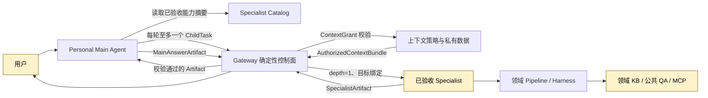

# 校园 Agent 平台威胁模型

> 版本：v0.4
>
> 日期：2026-07-19
> 状态：发布前审计基线。实施阶段必须把“安全验收”转化为自动化测试、部署配置和可复查证据。

## 1. v0.4 安全边界

v0.4 固定采用“个人 Main Agent 到单个 Specialist 的一跳闭环”：

1. `Personal Main Agent` 是唯一用户入口，也是唯一语义决策者；它负责理解用户意图、从已披露的能力摘要中选择一个 Specialist，并生成最终 `MainAnswerArtifact`。
2. `Gateway` 是确定性控制面；它只做目录过滤、身份与权限校验、父子任务状态机、预算/超时、上下文授权、协议代理和 Artifact 校验，不使用模型决定意图、选择 Specialist 或改写答案。
3. 平台只向 Main 渐进披露 `accepted + enabled` Specialist 的版本化 `CatalogSummary`，选定候选后再披露 `CapabilityDetail`；原始 Agent Card 和 `GovernanceDetail` 仅供管理员验收，不进入 Main 的系统提示或用户可见结果。Card、endpoint、Schema 或权限变化后版本进入 `review_required` 并停止披露。
4. 每个用户轮次最多创建一个 `depth=1` 的 `ChildTask`。只有 Main 的运行身份拥有 `create_child_task`；Specialist 不拥有该能力，不得递归、自调用或再委派。
5. Main 只能提出所需字段与用途；Gateway 根据 `ContextGrant` 生成绑定目标、任务、字段和时限的 `AuthorizedContextBundle`。Main 不直接复制整份 Profile、记忆、私有文档或凭据给 Specialist。
6. Specialist 只能在被授予的领域 pipeline、Harness、知识库和公共 QA 范围内工作，并返回 `SpecialistArtifact`；内置 Specialist 共享 Harness Core 的策略、模型适配、缓存、预算与输出校验，第三方 Specialist 可使用自己的运行时但必须遵守同一 A2A/Artifact 边界。该产物不是最终用户回答，也不能直接触发工具、记忆写回或新任务。
7. Gateway 校验 `SpecialistArtifact` 后才交给 Main。Main 结合当前用户问题和获准上下文生成最终 `MainAnswerArtifact`；Specialist 不能绕过 Main 直接面向用户作答。

任何实现若允许 Specialist 继续创建子任务、Gateway 用模型替 Main 做语义路由，或把完整个人上下文直接下发，都不属于 v0.4。

## 2. 保护目标

- 用户身份、对话、`AgentProfile`、`ModelProfile`、私人记忆、私有文件、预算和使用记录；
- 评课社区 Cookie、CSRF token、模型 API key、Runner 凭据和外部 Specialist 凭据；
- Specialist Catalog、已验收能力摘要、Agent Card 快照、公共 QA 和知识库版本的完整性；
- `ContextGrant`、`AuthorizedContextBundle`、字段级授权、数据用途和接收方绑定的机密性与完整性；
- Main/ChildTask 父子关系、取消/超时状态、幂等键、事件序号和预算计数的完整性；
- `SpecialistArtifact`、`MainAnswerArtifact`、来源引用、评测结果和记忆写回记录的完整性；
- 评课社区及其他第三方数据源的可用性、许可边界与合法权益；
- 比赛演示环境、三名队员的设备和 GitHub 私有仓库。

## 3. 信任边界与数据流

信任边界遵循以下原则：

- 即使 Specialist 已进入白名单，其 Agent Card、事件和 `SpecialistArtifact` 仍是不可信输入；“已验收”只表示允许接入，不表示可跳过运行时校验。
- 能力摘要是经过平台规范化、审查、版本固定和签名/哈希校验的目录数据，不是可执行提示词；Main 不读取原始 Card 的任意描述字段。
- `AuthorizedContextBundle` 是最小化、一次性、面向特定 Specialist 的数据能力，不是用户数据副本或通用访问令牌。
- 网页、点评、公共 QA、知识库文档、用户文件、模型输出和 Specialist 输出都属于不可信内容，不能改变系统指令、权限、任务深度或工具列表。
- 用户 Profile 与 Main 的语义判断只能缩小或选择已允许范围，不能越过服务端 scope、预算、provider allowlist 和数据许可。

## 4. v0.4 核心威胁与控制

| 风险 | 攻击或故障路径 | MVP 必须控制 |
| --- | --- | --- |
| 能力摘要 / Agent Card 注入 | Specialist 在名称、说明、示例或 skill 中嵌入“忽略规则”、伪造高权限能力或超长内容，诱导 Main 选择它或泄露上下文 | 原始 Card 仅供注册校验；平台生成字段白名单化的 `CatalogSummary`/`CapabilityDetail`；审核后固定版本与摘要哈希；长度、字符、URL 和 Schema 限制；描述按数据而非指令注入；只披露 `accepted + enabled` 版本；Card/endpoint/Schema/权限变化进入 `review_required` 并重新验收 |
| ChildTask 越权创建 | 客户端、Specialist 或被注入内容伪造 Main 身份、`parent_turn_id`、`depth`、目标或授权，创建额外任务 | `create_child_task` 仅授予 Main 运行身份；Gateway 从服务端会话重建父任务、用户与深度，不信任客户端字段；每个 Main turn 至多接受一个 ChildTask，相同幂等键和正文重试返回原任务，第二个不同任务拒绝；固定 `depth=1`；目标必须来自该轮已披露且已验收的 Specialist 集合 |
| 递归、自调用与成本放大 | Specialist 调用自身、Main、另一 Specialist 或把嵌套任务藏进 Artifact/MCP 参数；重试形成调用环并消耗模型额度 | Specialist principal 无 `create_child_task`；Gateway 拒绝任何 `depth>1`、目标为 Main、Specialist 发起的新任务及嵌套 A2A 委派；单轮一个 ChildTask、固定工具步数/重试/并发/token/费用/超时；父子调用图必须无环；超限硬失败，不自动换 provider 或继续递归 |
| 个人上下文过度披露 | Main 请求整份 Profile/记忆/文件，Gateway 把无关字段、密钥、其他用户数据或登录内容交给 Specialist | `ContextGrant` 必须声明字段路径、用途、目标 Specialist、父任务、敏感级别和 TTL；Gateway 以 deny-by-default 字段策略物化 `AuthorizedContextBundle`；未知字段、通配符和高风险凭据拒绝；Bundle 绑定接收方/任务/nonce/版本并带字段清单；私有远端发送逐次确认；日志只记字段名与摘要，不记正文 |
| 恶意 `SpecialistArtifact` | 产物携带脚本 Markdown、提示注入、伪造引用、任意 URL、工具指令、记忆写回指令、超大/乱序事件或伪造最终答案 | Gateway 校验 Schema、MIME、大小、事件序号、任务/目标/Artifact 版本和引用；只接受允许的结构化字段；URL 与 `FileRef` 重新鉴权；安全渲染；产物明确标记为不可信证据；它不能调用工具、创建任务、写记忆或冒充 `MainAnswerArtifact` |
| 父子取消、超时与重放 | 父任务取消后 ChildTask 继续执行；旧结果晚到污染新轮次；重复取消/提交产生第二份结果；攻击者重放旧 Bundle 或 Artifact | 持久化唯一父子映射；父取消/超时原子地吊销 ChildTask、`ContextGrant` 和 Bundle；`task_id + attempt + nonce + seq + artifact_digest` 幂等校验；只接受活动父轮次当前 attempt 的结果；迟到产物隔离并记录，不交给 Main；重复取消和提交无副作用 |
| 公共 QA 污染 | 恶意或错误问答被纳入公共 QA，夹带私人信息、提示注入、错误引用，随后影响所有 Specialist | 公共 QA 仅接受记录来源、许可、审核人、版本和适用范围的条目；发布前 Schema/DLP/提示注入扫描与固定评测；内容哈希和只读发布快照；生产更新需双人复核；撤回/更正提高版本并使 KB、缓存和 Artifact 级联失效；用户私有问答不得自动晋升公共 QA |
| 记忆写回污染 | SpecialistArtifact 或受污染证据要求 Main 把错误事实、越权字段或攻击指令写入长期记忆；同一内容反复写入放大影响 | Specialist 无记忆写权限；Artifact 中任何写回指令都按普通不可信文本处理；只有 Main 可产生结构化 `MemoryWriteProposal`，Gateway 再按用户、字段、来源、敏感级别、TTL 和去重规则校验；长期或敏感写回需用户显式确认；写回保留来源链、可见性、撤销和删除能力；公共 QA/第三方内容默认不得成为个人事实 |

## 5. 保留的基础威胁与控制

| 风险 | 攻击或故障路径 | MVP 必须控制 |
| --- | --- | --- |
| Agent Card SSRF / DNS rebinding | 管理员提交恶意 `card_url`，Gateway 访问内网或云元数据 | 仅管理员注册；解析后阻止 loopback、私网、链路本地和保留地址；限制重定向；连接前后复核 DNS；生产只允许 HTTPS |
| 间接提示注入 | 点评、网页、PDF、OCR、公共 QA 或 Specialist 输出要求模型泄密或调用工具 | 所有来源内容标记为不可信证据；内容不能改变系统指令、授权范围、任务深度或工具列表；工具调用由应用策略允许 |
| 恶意文件 | PDF JavaScript、宏、压缩炸弹、解析器漏洞、外链与超大 OCR | 隔离区；真实 MIME 检测；大小/页数/CPU/内存/超时限制；无网络沙箱解析；成功后才入索引 |
| FileRef 越权 | Main 或 Specialist 伪造 `owner_scope`、复用他人 `file_id` | `FileRef` 为不透明引用；Gateway 按当前用户、ContextGrant 和接收方查询服务端记录；客户端与 Artifact 字段不构成授权依据 |
| 登录凭据泄露 | Cookie/CSRF/API key 被发送到 Main、Specialist、日志、trace 或报告 | 本地 Connector 不导出请求头、Cookie、隐藏字段和受限 URL；密钥使用 `secret_ref`；全链路 DLP；测试凭据只存在受控本地配置 |
| 权限后过滤 | 私有 chunk 先交给模型或 Specialist，再从答案删除 | 检索和 Bundle 物化前按用户、课程空间、可见性、目标与授权过滤；禁止“先发送后脱敏” |
| 凭据混淆代理 | Gateway 把用户 token、Main token 或某 Specialist token 转发给另一资源 | 用户、Main、Specialist、MCP 和 Runner 身份分离；token 绑定受众、任务与资源；禁止 token passthrough |
| 数据残留 | 删除后仍可从向量、缓存、Bundle、Artifact、事件或备份检索 | tombstone 立即阻断检索；撤销 Grant；级联清理索引、缓存、对象和个人生成；记录删除回执与 SLA |
| 第三方模型数据外发 | 私有 chunk、个人记忆或登录证据被发送到未确认 provider | 数据 scope 先于模型路由；`private`/`local_authenticated` 默认本地；例外逐次展示 provider、字段、用途并确认 |
| 静默 fallback | Specialist、Runner 或用户 key 失败后自动切换 provider/runtime | 只允许 `none` 或 `ask_before_switch`；切换创建新执行票据和审计事件，不复用旧 Bundle 或授权 |
| 缓存跨用户泄漏或投毒 | 用户 A 的私人答案被 B 命中，或私有结果污染公共 Artifact/QA | 公共证据、公共 Artifact、私人生成分层；私人缓存按用户/策略/provider 隔离；私有结果不得自动晋升公共层 |
| 供应链与版本漂移 | SDK、Agent Card、Specialist pipeline 或解析器升级改变行为 | 原型后锁版本和哈希；记录来源许可；依赖扫描；Card、Artifact、父子状态和 ContextGrant 兼容回归 |
| Runner 冒领与重放 | 恶意设备认领他人任务、重放 lease 或过期提交 | 若启用 Runner，lease 绑定用户/设备/任务/scope/nonce/seq/过期；短期设备 token、原子认领和幂等提交；Runner 返回仍走 Artifact 校验 |

## 6. ContextGrant 最小授权模型

`ContextGrant` 至少包含：

- `context_grant_id`、`subject_id`、`root_task_id`、`parent_task_id`、`child_task_id`、`attempt`；
- `specialist_id`、`specialist_version` 与 `skill_id`；
- 明确字段路径或受控 `FileRef` 列表，不允许 `*`、整对象和客户端自报 owner；
- `purpose`、`sensitivity`、允许的处理位置/provider、`issued_at`、`expires_at`；
- `policy_version`、用户确认记录（需要时）和一次性 nonce。

Gateway 根据 Grant 生成 `AuthorizedContextBundle` 时必须：

1. 重新查询当前用户、任务和数据可见性，不信任 Main 提交的值或 owner 字段；
2. 按字段 allowlist 提取最少内容，并生成字段清单、来源版本和内容摘要；
3. 永久排除 Cookie、CSRF、API key 明文、下载凭据、内部系统提示、其他用户标识与未授权登录内容；
4. 将 Bundle 绑定到一个 ChildTask、一个 Specialist、一次 attempt 和短 TTL，不提供通用查询能力；
5. 父任务取消、超时、授权撤回、数据删除或策略版本变化时立即失效；
6. 审计只记录字段路径、字节数、敏感级别、接收方、目的和结果，不记录私人正文；
7. Specialist 完成、失败或取消后清除临时 Bundle 和中间数据。

比赛 MVP 的 Profile 字段 allowlist 固定为专业、年级、校区、已修课程、工作量偏好和学习目标；此外只允许目的相关的短期记忆片段与已授权 `FileRef`。整份 Profile、整段聊天历史、原始记忆库和凭据均不下发。

## 7. Artifact 与记忆写回规则

`SpecialistArtifact` 只能表达领域结果，不是命令。最小允许内容包括任务与 Specialist 版本、结构化结论、证据引用、置信/限制说明、公共 QA/KB 版本、用量计数和错误码。不得包含可执行 HTML、任意下载指令、工具授权、子任务请求、记忆写回操作或 `MainAnswerArtifact` 类型声明。

Main 收到 Gateway 验证通过的产物后：

1. 把它作为不可信领域证据，而不是更高优先级指令；
2. 结合当前用户请求进行语义综合，并明确处理产物的限制与引用；
3. 生成 `MainAnswerArtifact`，保留 `root_task_id`、唯一 child lineage、所用 `SpecialistArtifact`、原始证据引用、data scope、cache level、限制、来源和版本；
4. 如需记忆写回，单独产生 `MemoryWriteProposal`，不能把回答生成等同于持久化；
5. Gateway 对最终 Artifact 做 Schema、引用、用户/任务绑定和安全渲染校验后再返回用户。

## 8. 数据保留基线

| 数据 | 无额外授权的默认策略 |
| --- | --- |
| 已验收 Agent Card / CatalogSummary / CapabilityDetail | 保留版本、审核记录与摘要哈希；新版本重新验收，旧版本只读归档 |
| ChildTask / 父子状态 | 公共演示可保留 7 天；私有任务元数据 24 小时；不保存私人正文 |
| ContextGrant / Bundle | Grant 元数据最长 24 小时；Bundle 内容只存内存或短期加密区，任务完成/取消/超时立即清除 |
| 公共 QA / KB 快照 | 版本化保留来源、许可、审核与撤回记录；撤回版本立即停止服务并级联失效 |
| SpecialistArtifact | 公共样例最长 7 天；私有产物 24 小时；只保必要字段和受控引用 |
| MainAnswerArtifact | 公共演示答案可短期保留；私人答案 24 小时或主动删除，以更早者为准 |
| MemoryWriteProposal / 个人记忆 | 未确认提案短 TTL；确认写回按用户可见保留策略，可查询来源并随时撤销/删除 |
| trace / log | 不记录正文、提示词、密钥和下载 URL；只保 ID、字段名、阶段、耗时、计数和错误码，比赛环境最长 7 天 |
| 用户私有文件 | 用户可见保留策略；删除后立即阻断检索，异步清理对象、向量、Bundle 与引用 |
| Runner lease（若启用） | 短 TTL；完成、过期、撤销或 credential version 变化后立即不可重放 |

清理任务每 15 分钟运行一次，失败必须告警并重试。删除回执至少包含 `requested_at`、`search_blocked_at`、`grant_revoked_at`、`physical_cleanup_status` 和 `completed_at`。这些值只面向比赛演示，不自动成为未来生产策略；实施可缩短但不能静默延长。

## 9. 安全验收

### 9.1 v0.4 硬验收

| 验收项 | 通过标准 |
| --- | --- |
| 能力目录与 Card 注入 | 非 `accepted + enabled` Specialist 对 Main 零可见；包含提示注入、越权能力、超长描述、恶意 URL 或摘要哈希不匹配的 Card/摘要 100% 被拒绝或隔离；原始描述不进入 Main 系统指令；Card/endpoint/Schema/权限变化后立即停止披露，直至复审通过 |
| 单 ChildTask 与深度限制 | 同一 Main turn 第一个合法 ChildTask 成功；相同幂等键重试只返回原任务；第二个不同任务、`depth=0/2`、伪造父任务、目标未披露或目标未验收全部被拒绝 |
| Specialist 不可递归 | 使用 Specialist 身份调用 `create_child_task`、调用自身/Main/另一 Specialist、在 Artifact 或 MCP 参数中夹带嵌套委派，成功创建任务数均为 0 |
| 预算与成本上限 | token、费用、工具步数、重试、并发或超时任一达到上限即确定性终止；不会自动创建新 ChildTask、切换 provider/runtime 或继续后台执行 |
| 字段级上下文 | 对每个测试 Grant，Bundle 字段集合与批准集合完全相等；通配符、未知字段、其他用户字段、过期/错目标 Bundle 全部拒绝；Cookie、CSRF、key、系统提示和未授权登录内容出现 0 次 |
| 恶意 Artifact | 错 Schema/MIME/大小/seq/task/version、脚本 Markdown、伪造 FileRef/URL、工具/记忆/子任务指令和伪造 `MainAnswerArtifact` 均不能进入 Main 可用输入或用户界面 |
| 父子取消与重放 | 父任务取消/超时后 ChildTask、Grant 与 Bundle 全部失效；迟到或重放提交产生 0 个新状态变化、0 个 MainAnswerArtifact、0 次记忆写回 |
| 公共 QA 完整性 | 未记录来源/许可/审核人、包含私人信息/注入、哈希不匹配或已撤回 QA 条目均不能进入活动快照；版本撤回后相关检索、缓存和 Artifact 在 60 秒内零命中 |
| 记忆写回 | Specialist 身份和 SpecialistArtifact 直接写记忆成功数为 0；未经用户确认的敏感/长期提案写入数为 0；批准记忆可追溯到 Main turn、来源、字段和确认记录，并可撤销删除 |
| 最终回答归属 | 所有用户可见答案均由 Main 生成且标记为 `MainAnswerArtifact`；Specialist 直接返回用户、Gateway 语义改写或非法 Artifact 冒充最终答案的成功数为 0；有 Specialist 调用时，其引用、data scope、cache level、限制与唯一 child lineage 100% 保留 |

### 9.2 基础回归验收

- Agent Card SSRF、重定向、私网地址、云 metadata 和 DNS rebinding 用例 100% 被拒绝；
- 恶意点评、HTML、PDF、OCR、公共 QA 和 Specialist 输出不能触发未授权工具调用或改变权限；
- 文件解析无网络且受资源限制，失败文件不进入检索；
- 两个演示用户互相检索私有资料、Profile、记忆和私人 Artifact 为零命中；
- 伪造 `owner_scope`、复用他人 `file_id` 和过期 `FileRef` 均被拒绝；
- 仓库、日志、trace、事件、数据库导出、Artifact 和浏览器响应中的 API key、Cookie、CSRF 与受限 URL 出现 0 次；
- 删除私有资料后 60 秒内检索零命中，相关 Grant 立即撤销并生成删除回执；
- `private` 数据未经逐次确认不能发送到远端 provider，`local_authenticated` 在比赛 MVP 不远端发送；
- 模型或 Specialist 失败不发生静默 provider/key/runtime 切换；
- 若启用 Runner，跨用户认领、旧 lease 重放、重复/过期提交和离线补交全部被拒绝。

## 10. 不在比赛 MVP 内承诺

- 一轮调用多个 Specialist、并行协作、递归委派或多 Agent 自主规划；
- 面向公网未知 Agent 的自动安全审核和动态信任评分；
- 把 Gateway 做成模型路由器、回答生成器或第二个语义 Agent；
- 面向普通用户开放任意 Agent Card、任意模型 `base_url` 或真实托管 BYOK；
- 企业级 DLP、SIEM、HSM、完整零信任平台和生产级恶意文件隔离；
- 评课社区登录内容的服务端长期同步、未获授权附件的云端解析与共享检索；
- 自动把用户对话、Specialist 输出或私人问答晋升为公共 QA；
- 完整多设备 CLI Runner 运维、自动 provider failover、模型费用代收和开放模板市场。

比赛版必须把 v0.4 的一跳权限边界做成可解释、可测试的最小控制，不能用“模型会遵守提示”代替 Gateway 的确定性校验，也不能宣称达到生产安全等级。
