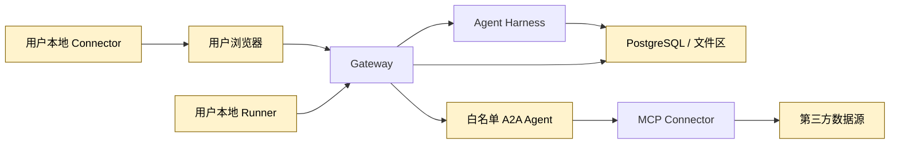

# 校园 Agent 平台威胁模型

> 版本：0.3
> 日期：2026-07-19  
> 状态：发布前审计基线，实施阶段必须转化为自动化测试和部署配置。

## 1. 保护目标

- 评课社区 Cookie、CSRF token、模型 API key、外部 Agent 凭据；
- 用户身份、私有文件、登录可见点评和受限附件；
- Gateway 路由、任务状态、Artifact、来源引用和评测结果的完整性；
- 评课社区和其他第三方数据源的可用性与合法权益；
- 比赛演示环境、团队设备和 GitHub 私有仓库。
- 用户 AgentProfile、ModelProfile、私人记忆、预算和五层缓存的隔离与完整性；
- 本地 Runner 配对身份、任务租约、用量记录与模型调用结果。

## 2. 信任边界

即使 Agent 已进入白名单，其 Agent Card、端点、事件和 Artifact 仍属于不可信网络输入；即使文件由登录用户上传，其二进制和解析文本仍属于不可信内容。
模型 provider 与本地 Runner 返回的结果同样不可信。用户 Profile 只能表达偏好，不能越过服务端数据 scope、工具授权、预算或 provider allowlist。

## 3. 主要威胁与控制

| 风险 | 攻击或故障路径 | MVP 必须控制 |
|---|---|---|
| Agent Card SSRF / DNS rebinding | 管理员提交恶意 `card_url`，Gateway 访问内网或云元数据 | 仅管理员注册；解析后阻止 loopback、私网、链路本地和保留地址；限制重定向；连接前后复核 DNS；生产只允许 HTTPS |
| Agent 输出注入 | 外部 Agent 返回脚本、恶意 Markdown、超大事件或伪造 URL | Schema、MIME、大小和事件序号校验；前端安全渲染；不自动下载任意 URL；Artifact 只接受允许类型 |
| 间接提示注入 | 点评、网页、PDF、PPTX 或 OCR 文本要求模型泄密或调用工具 | 所有来源内容标记为“不可信证据”；材料不能改变系统指令、授权范围或工具列表；工具调用只由应用策略允许 |
| 恶意文件 | PDF JavaScript、宏、压缩炸弹、解析器漏洞、外链与超大 OCR | 隔离区；真实 MIME 检测；大小/页数/CPU/内存/超时限制；无网络沙箱解析；禁用主动内容和外链；成功后才入索引 |
| FileRef 越权 | 客户端伪造 `owner_scope` 或复用他人 `file_id` | `FileRef` 是不透明引用；Gateway 按当前身份查询服务端记录；客户端字段不构成授权依据；读取授权短期、单对象、单 Agent |
| 登录凭据泄露 | Cookie/CSRF 被发送到 Gateway、日志、trace 或报告 | 本地 Connector 不导出请求头、Cookie、隐藏字段和受限下载 URL；日志 DLP 扫描；测试凭据只存在本地浏览器配置 |
| 登录内容越界 | 登录可见点评或附件进入公共缓存、共享 RAG 或公开报告 | `local_authenticated` 与 `public` 强隔离；默认只在本地生成增强报告；导出时重新走公开模式；无授权不入共享索引 |
| 权限后过滤 | 私有 chunk 先交给模型，再从回答删除 | SQL 检索前按用户、课程空间和状态过滤；两个模拟用户做零泄漏测试 |
| 重放与重复任务 | 客户端重试导致重复 A2A task、重复导入或重复 Artifact | 创建任务和文件导入支持幂等键；持久化外部 task 映射；最终 Artifact 以任务和版本去重 |
| 凭据混淆代理 | Gateway 把用户 token 或某 Agent token 转发给另一资源 | 用户、Agent、MCP 工具凭据分离；token 绑定受众和资源；禁止 token passthrough |
| 数据残留 | 删除后仍可从向量、缓存、对象、事件或备份检索 | tombstone 立即阻断检索；级联清理索引、缓存和对象；记录删除回执；明确保留期和清理 SLA |
| 供应链与版本漂移 | SDK 最新版改变 A2A/MCP 行为或解析器出现漏洞 | 原型验证后锁版本和哈希；记录来源许可；依赖扫描；协议兼容回归测试 |
| BYOK 密钥泄露 | key 进入业务数据库、日志、trace、错误、Artifact、浏览器响应或导出 | 业务层只保存用户拥有的加密 `secret_ref`；比赛 MVP 普通用户 key 只在本地 Runner；运行时短暂解封装；全链路 DLP |
| 恶意模型 `base_url` / SSRF | 用户令平台访问 metadata、内网、localhost、重定向链或 DNS rebinding 地址 | MVP 只使用管理员 provider allowlist；禁止任意 URL；未来开放前必须 canonicalize、HTTPS、重定向/DNS 复核和私网阻断 |
| 第三方模型数据外发 | 私有 chunk、个人记忆或登录证据被发送到用户未理解的 provider | 数据 scope 先于模型路由；`private`/`local_authenticated` 默认本地；例外逐次显示 provider 与字段并确认 |
| 静默模型 fallback | Runner/用户 key 失败后自动切到平台 key 或另一 provider | 只允许 `none` 或 `ask_before_switch`；切换创建新执行票据和审计事件，不复用旧授权 |
| 缓存跨用户泄漏或投毒 | 用户 A 私人回答被 B 命中，或用户 BYOK 结果污染公共答案 | L1-L5 分层；L5 按 subject/profile/provider/model/private-data/policy 隔离；BYOK 默认不能晋升 L4；删除和策略变更级联失效 |
| 成本与资源滥用 | 超大 token、无限重试、递归工具调用或高并发消耗他人/平台额度 | 每用户/provider/key 限制 token、费用、RPM/TPM、并发、重试和工具步数；独立 Usage Ledger；异常熔断 |
| Runner 冒领与重放 | 恶意设备认领他人任务、重放 lease、重复或过期提交 | 短期设备 token；lease 绑定 subject/runner/task/scope；nonce、seq、过期、原子认领和幂等校验 |
| key 撤销不彻底 | 撤销/轮换后排队、重试或已领取任务继续使用旧 key | 撤销提升 credential version，立即取消旧执行票据、重试和 lease；提交结果时复核版本 |
| 模型能力伪装 | 兼容 API 接受请求但忽略工具、JSON、reasoning 或 usage 语义 | 管理员 capability snapshot + 固定探测；模板声明必需能力；不匹配则拒绝，不自动换模型 |

## 4. 本地 Connector 最小授权模型

允许的 scope：

- `public_read`：服务端低频读取公开页面；
- `local_dom_read`：本地只读当前 `https://icourse.club/` 页面 DOM；
- `local_attachment_parse`：用户逐次确认后在本地解析当前可见附件；
- `user_file_private_ingest`：用户自有文件进入本人私有空间；
- `course_shared_ingest`：经明确许可进入指定课程共享空间；
- `public_ingest`：有公开许可或书面授权的材料进入公共库。
- `model_public_infer`：允许已批准 provider 处理公开证据；
- `model_private_infer_explicit`：一次性允许明确 provider 处理已展示范围的私人数据；
- `model_local_runner`：允许绑定用户的 Runner 处理短期任务；
- `byok_store`：生产演进中创建或轮换本人托管 `secret_ref`，比赛普通用户不开启；
- `byok_use`：只允许本人 Profile 在批准 provider 与用途下使用对应引用。

默认拒绝未声明 scope。授权变更、来源撤回或可见性变化必须提高 `policy_version`，使相关缓存立即失效。

本地 Connector 必须：

1. 固定允许的 origin，不跟随跨站跳转；
2. 只读 DOM，不提交表单、不点赞、不发点评、不更改站点状态；
3. 读取前显示页面、字段、附件和输出范围并获得确认；
4. 剥离请求头、Cookie、CSRF、隐藏字段、用户名和受限下载 URL；
5. 登录增强证据标记 `visibility=local_authenticated`；
6. 默认在本地完成报告，公开导出重新走公共连接器；
7. 使用独立浏览器配置和短期本地日志，提供“一键清除本地数据”。

本地 Runner 还必须：

1. 使用短期配对码和设备 token，不共享普通用户会话或管理员 token；
2. 只主动出站连接 Gateway，不开放公网入站端口；
3. lease 绑定用户、设备、任务、scope、nonce、序号和过期时间；
4. key 只保存在本地安全配置，不上传到 Gateway；
5. 只读取执行票据允许的数据引用，结果按不可信输入重新校验；
6. lease 完成、过期或 key 撤销后清除短期中间数据。

## 5. 数据保留基线

| 数据 | 无额外授权的默认策略 |
|---|---|
| 公开课程元数据 | 最长缓存 24 小时，保留来源和采集时间 |
| 公开点评 | 不保存原始 HTML或长正文；短证据片段和摘要最长 24 小时，来源消失即删除 |
| 搜索 token | 仅内存使用，不进入缓存键、日志、事件或数据库 |
| 登录增强结构化证据 | 默认仅本地、会话结束删除，不进入服务器公共缓存 |
| 受限附件和下载地址 | 不进入服务器对象存储、哈希库、Artifact、日志或共享 RAG |
| 用户私有文件 | 用户可见保留策略，删除后立即阻断检索并异步清理对象和向量 |
| task/event | 公共演示数据可短期保留；私有任务只存状态、计数和引用 ID，不存正文 |
| trace/log | 不记录正文、提示词、密钥和下载 URL；只保 ID、阶段、耗时、计数和错误码 |
| ModelProfile | 保存 provider、model、模式、状态和随机 `secret_ref`；不保存/回显 key 明文 |
| 模型请求与 UsageRecord | 保存任务、用户、provider、model、token、缓存命中、估算费用与错误码；不保存完整 prompt、私人 chunk 或记忆正文 |
| L4 公共 AnswerArtifact | 保存公开答案、短证据、generator、prompt/evidence/policy 版本和时间；来源撤回时立即失效 |
| L5 私人生成与记忆 | 仅本人私有空间或本地加密缓存；比赛环境 24 小时或主动删除，以更早者为准 |
| RunnerLease / 执行票据 | 短 TTL；完成、过期、撤销或 credential version 变化后立即不可重放 |

以上 TTL 是无平台明确授权时的保守工程基线，不代表评课社区已授予缓存许可。若维护者给出不同要求，以书面授权和新的 ADR 为准。

比赛演示环境的可测试默认值：

- 未完成入库的临时文件：1 小时；
- 已入库的模拟用户私有文件：24 小时或用户主动删除，以更早者为准；
- 公共 task/event：7 天；`private` task/event 元数据：24 小时；
- 结构化应用日志：7 天；私有任务 trace：24 小时；
- 清理任务每 15 分钟运行一次，失败必须告警并重试；
- 删除回执至少包含 `requested_at`、`search_blocked_at`、`physical_cleanup_status` 和 `completed_at`。

这些值只面向比赛演示，不自动成为未来生产策略。实施配置可以缩短但不能静默延长；延长需要新的风险评审。

## 6. 安全验收

- Agent Card SSRF、重定向和私网地址用例 100% 被拒绝；
- 恶意 Agent Artifact、脚本 Markdown、超大事件和乱序事件不能污染前端或任务状态；
- 恶意点评、HTML、PDF 和 OCR 提示注入不能触发工具调用或改变权限；
- 文件解析无网络、受资源限制，失败文件不进入检索；
- 两个演示用户互相检索私有资料为零命中；
- 伪造 `owner_scope`、复用他人 `file_id` 和过期 FileRef 均被拒绝；
- 日志、trace、事件、数据库抽样扫描中密钥、Cookie、CSRF 和受限 URL 为零；
- 删除私有资料后 60 秒内检索零命中，并生成删除回执；
- 登录增强报告不能直接导出为公开报告。
- provider/base URL allowlist 拒绝任意 URL、localhost、私网、云 metadata、重定向和 DNS rebinding 样例；
- API key 在仓库、日志、trace、错误、事件、Artifact、数据库导出和浏览器响应中出现 0 次；
- 用户 A 的 ModelProfile、私人记忆与 L5 缓存对用户 B 零可见；
- `private` 数据未经逐次确认不能发送到远端 provider，`local_authenticated` 在比赛 MVP 不远端发送；
- Runner 跨用户认领、重放旧 lease、重复/过期提交与离线补交全部被拒绝；
- key 撤销或轮换后，排队、重试和已领取任务不能继续使用旧版本；
- 模型失败不发生静默 provider/key/runtime 切换；预算、并发、token、重试和工具步数上限可触发拒绝；
- 用户 BYOK 结果和私人数据不能污染 L4 公共 AnswerArtifact。

## 7. 不在比赛 MVP 内承诺

- 面向公网未知 Agent 的自动安全审核；
- 企业级 DLP、SIEM、HSM 或完整零信任平台；
- 评课社区登录内容的服务端长期同步；
- 未获授权附件的云端解析和共享检索；
- 对恶意文件解析器达到生产级完全隔离。
- 收集普通用户真实托管 BYOK、企业级 KMS/HSM 和完整 secret 管理后台；
- 任意用户自定义模型 `base_url`；
- 自动模型竞价、自动 provider failover、多设备 Runner、模型费用代收和开放模板市场。

比赛版需要把上述风险做成可解释、可测试的最小控制，而不是宣称已经达到生产安全等级。
