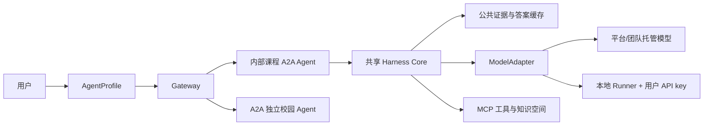

# 个人 Agent Harness 与混合模型运行时设计规格

## 1. 状态

- 状态：已批准，三路独立审计和修复复审通过，待团队审阅后进入实施计划
- 日期：2026-07-19
- 所属版本：`v0.3`
- 详细设计：[个人 Agent Harness 与混合模型运行时设计](../../designs/04-personal-agent-harness.md)
- 决策记录：[ADR-0003](../../decisions/0003-hybrid-personal-agent-runtime.md)

## 2. 产品命题

平台提供一套面向科大校园生活的共享 Agent Harness、模板、工具、知识资源、缓存和调度能力。用户不需要复制整套代码或部署公网服务，只需创建个人 `AgentProfile`，选择自己能承担的模型 API、知识空间、记忆、预算和执行位置。

平台同时保留两类能力：

- 个人 Agent：由平台模板和用户 Profile 组合，使用平台托管或本地 Runner；
- 独立 Agent：由其他团队独立开发和部署，通过 A2A 接入 Gateway。

## 3. 已批准架构

关键对象：

- `AgentTemplate`：共享且版本化的能力、流程、工具、Schema、prompt 和策略；
- `AgentProfile`：用户拥有的模板、模型、知识空间、记忆和偏好绑定；
- `ModelProfile`：provider、model、执行模式、secret 引用、能力快照和预算；
- `CapabilitySnapshot`：模型实际支持的 streaming、tools、JSON、vision、reasoning、context 和 usage；
- `ExecutionTicket`：一次任务冻结后的最小授权与执行快照；
- `RunnerLease`：本地 Runner 认领任务的短期、单用户、单任务租约；
- `UsageRecord`：模型 token、缓存命中、费用估计与错误元数据；
- `AnswerArtifact`：可追溯证据、模型和提示版本的公共标准答案。

## 4. 协议边界

- Gateway REST 使用 OpenAPI 3.1 与 JSON Schema 2020-12；
- 外部独立 Agent 使用 A2A 1.0；
- 两个内部课程 Demo 也按服务粒度发布 Agent Card 和 A2A endpoint，但内部复用同一 Harness Core；
- Agent 内部工具和数据连接使用 MCP；
- 模型 provider 通过 Harness 内部 adapter 调用；
- ModelProfile、API key、个人记忆和调度策略不进入第三方 A2A payload；
- 本地 Runner 使用出站 worker 契约，不注册用户 `localhost` endpoint。
- 个人用户/Profile 不发布独立 Agent Card；`execution_ticket_id` 只交给团队控制的内部 Harness Agent，第三方 Agent 不接收 Profile、模型或密钥治理字段。

## 5. 执行模式

| 模式 | 凭据归属 | 主要用途 | MVP 边界 |
|---|---|---|---|
| `platform_sponsored` | 平台/比赛 | 公共任务和公共答案 | 真实演示 |
| `managed_byok` | 用户 | 未来随时在线个人 Agent | 仅团队测试凭据验证生命周期 |
| `local_runner` | 用户设备 | 真实 BYOK、私人或登录数据 | 真实个人 BYOK 主演示路径 |

数据 scope 必须先于模型路由。`private` 和 `local_authenticated` 默认只走本地 Runner。任何切换 provider、密钥归属或执行位置都不得静默发生。

## 6. 缓存契约

1. L1 公开来源快照；
2. L2 解析、OCR、索引和 embedding；
3. L3 证据与检索结果；
4. L4 经平台质量门槛验证的公共 `AnswerArtifact`；
5. L5 用户私人生成。

不同模型可以共享 L1-L3。L4 显示 generator、model、prompt、evidence 和时间，用户可直接使用或主动选择自己的模型重写。L5 必须按用户、Profile、provider、model、提示、私人数据和权限版本隔离，不得跨用户命中或自动提升为公共答案。

## 7. 安全要求

- API key 不进入仓库、TaskRequest、A2A、Artifact、日志、trace、错误、数据库正文和前端响应；
- `base_url` 只来自管理员白名单；
- secret 撤销或轮换后，排队、重试和已租赁任务不能继续使用旧 key；
- Runner 配对使用短期 token，lease 包含 owner、task、nonce、序号和过期时间；
- Runner 结果按不可信输入重新校验；
- 每用户/provider 设置 token、费用、并发、RPM/TPM、重试和工具步数上限；
- 私人数据远端 egress 必须逐次显示 provider 和数据范围并确认；
- 日志只记录脱敏元数据，不记录完整提示、私人 chunk 或记忆正文。

## 8. 功能验收

1. 同一课程模板可创建两个 AgentProfile，分别选择平台模型和本地 Runner 模型，模板流程代码不变；
2. 两个 Profile 共享 L3 公共证据；
3. 第二次公共问题可命中 L4，用户模型调用次数为 0；
4. 用户可主动“用我的模型重新生成”，复用 L3 但写入本人 L5 和 Usage Ledger；
5. 私人笔记只影响本人 Profile，另一演示用户零命中；
6. Runner 离线、预算超限、能力不匹配和 key 撤销都返回明确错误；
7. 模型失败不静默切换。

## 9. 安全验收

- secret DLP 覆盖仓库、日志、trace、事件、Artifact、数据库导出和浏览器响应，真实密钥出现 0 次；
- 用户 A 的 ModelProfile、记忆和 L5 缓存对用户 B 零可见；
- 任意 `base_url`、私网/metadata URL 和未批准 provider 被拒绝；
- Runner 跨用户认领、过期 lease、重放、重复提交被拒绝；
- 私人数据未经确认不能送往远端模型；
- 公共缓存不能被用户 BYOK 结果或私人数据污染；
- 超大 token、无限重试、递归工具调用和并发滥用被限额。

## 10. MVP 范围

必须实现：

- 四个最小 Schema：AgentTemplate、AgentProfile、ModelProfile、CapabilitySnapshot；
- 一个 OpenAI-compatible adapter 和两个白名单 provider 配置；
- 一种平台/团队托管测试调用；
- 一个 CLI 本地 Runner、一个演示设备、一个并发任务；
- Usage Ledger、预算、显式 fallback 与 egress；
- L3/L4/L5 演示和安全回归。

明确后置：

- 普通用户真实托管 BYOK；
- 任意自定义 provider/base URL；
- 自动质量/成本路由与自动 failover；
- 多设备同步、常驻个人 Agent 和开放模板市场；
- 收益分成、模型费用代收和企业级多租户密钥后台。

## 11. 降级条件

若 2026-07-27 前最小 spike 不能稳定证明两种执行模式、租约和缓存隔离，则不让新能力拖垮原有三条主线：

- 保留 Profile/Adapter/Runner 的完整接口规格和安全测试夹具；
- 演示缩减为平台模型 + 本地 mock provider 的接口级验证；
- Gateway、课程评价、课程 RAG 和外部通知 Agent 仍按 ADR-0002 交付；
- 不以收集真实用户 key 的方式“临时解决”进度问题。

## 12. 文档验收

- README、总体架构、Gateway、课程评价、RAG、威胁模型、路线图和 ADR 对个人 Agent 的表述一致；
- 研究事实、团队决策、MVP 已承诺项和生产后续项清楚分离；
- 所有 JSON 示例可解析，所有本地 Markdown 链接可达；
- 仓库不存在真实 API key、Cookie、CSRF 或受限附件 URL；
- 独立 reviewer 审核通过后才能标记为发布版。
