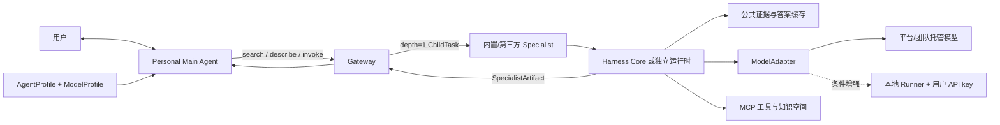

# 个人 Agent Harness 与混合模型运行时设计规格

## 1. 状态

- 状态：已批准的 v0.3 基线，已按 ADR-0004 纳入 v0.4，三路独立审计与修复复审通过
- 日期：2026-07-19
- 所属版本：`v0.4`
- 详细设计：[个人 Agent Harness 与混合模型运行时设计](../../designs/04-personal-agent-harness.md)
- 决策记录：[ADR-0003](../../decisions/0003-hybrid-personal-agent-runtime.md)
- 编排补充：[ADR-0004](../../decisions/0004-personal-main-agent-single-hop-orchestration.md)

## 2. 产品命题

平台提供一套面向科大校园生活的共享 Agent Harness、模板、工具、知识资源、缓存和执行能力。用户不需要复制整套代码或部署公网服务，只需创建个人 `AgentProfile`，选择自己能承担的模型 API、知识空间、记忆、预算和执行位置。该 Profile 配置的是用户唯一对话入口 Personal Main Agent。

平台同时保留两类能力：

- Personal Main Agent：由平台模板和用户 Profile 组合，负责通用对话、Specialist 选择和最终综合；
- Specialist Sub Agent：内置 Specialist 可复用 Harness Core，第三方 Specialist 可独立开发和部署并通过 A2A 接入 Gateway。

## 3. 已批准架构

关键对象：

- `AgentTemplate`：共享且版本化的能力、流程、工具、Schema、prompt 和策略；
- `AgentProfile`：用户拥有的模板、模型、知识空间、记忆和偏好绑定；
- `ModelProfile`：provider、model、执行模式、secret 引用、能力快照和预算；
- `CapabilitySnapshot`：模型实际支持的 streaming、tools、JSON、vision、reasoning、context 和 usage；
- `ExecutionTicket`：一次任务冻结后的最小授权与执行快照；
- `ContextGrant`：Main Agent 提出字段/引用需求后，由 Gateway 为单个 ChildTask 生成的字段级、目的绑定、短期上下文授权；
- `RunnerLease`：本地 Runner 认领任务的短期、单用户、单任务租约；
- `UsageRecord`：模型 token、缓存命中、费用估计与错误元数据；
- `SpecialistArtifact`：Specialist 返回、经 Gateway 校验的专业证据和结论；
- `MainAnswerArtifact`：Main Agent 面向用户生成并保留来源、限制和 child lineage 的最终结果。

## 4. 协议边界

- Gateway REST 使用 OpenAPI 3.1 与 JSON Schema 2020-12；
- Main Agent 只能经 Gateway 的 `specialist.search`、`specialist.describe` 和 `specialist.invoke` 访问已披露能力；
- 外部独立 Specialist 使用 A2A 1.0；
- 两个内部课程 Specialist 也按服务粒度发布 Agent Card 和 A2A endpoint，但内部复用同一 Harness Core；
- Agent 内部工具和数据连接使用 MCP；
- 模型 provider 通过 Harness 内部 adapter 调用；
- ModelProfile、API key、个人记忆和调度策略不进入第三方 A2A payload；
- 本地 Runner 使用出站 worker 契约，不注册用户 `localhost` endpoint。
- 个人用户/Profile 不发布独立 Agent Card；第三方 Specialist 只接收 Gateway 签发的 ChildTask 与 AuthorizedContextBundle，不接收完整 Profile、模型或密钥治理字段；
- Main Agent 是 `depth=0`，Specialist 是 `depth=1` 且 `can_delegate=false`，不能创建任务或调用其他 Agent。

## 5. 执行模式

| 模式 | 凭据归属 | 主要用途 | MVP 边界 |
|---|---|---|---|
| `platform_sponsored` | 平台/比赛 | Main 与内置 Specialist 的比赛闭环 | 硬 MVP |
| `managed_byok` | 用户 | 未来随时在线个人 Agent | 仅保留契约与团队凭据测试 |
| `local_runner` | 用户设备 | 真实 BYOK、私人或登录数据 | 满足路线图前置条件后才做条件增强 |

数据 scope 必须先于模型路由。`private` 和 `local_authenticated` 默认不允许远端发送；未启用合规本地 Runner 时应拒绝或降级为公开模式。任何切换 provider、密钥归属或执行位置都不得静默发生。

## 6. 缓存契约

1. L1 公开来源快照；
2. L2 解析、OCR、索引和 embedding；
3. L3 证据与检索结果；
4. L4 经平台质量门槛验证的公共 QA/专业 `SpecialistArtifact`；
5. L5 用户私有 `MainAnswerArtifact` 与生成结果。

不同模型可以共享 L1-L3。L4 显示 generator、model、prompt、evidence 和时间，用户可直接使用或主动选择自己的模型重写。L5 必须按用户、Profile、provider、model、提示、私人数据和权限版本隔离，不得跨用户命中或自动提升为公共答案。

## 7. 安全要求

- API key 不进入仓库、TaskRequest、A2A、Artifact、日志、trace、错误、数据库正文和前端响应；
- `base_url` 只来自管理员白名单；
- secret 撤销或轮换后，排队、重试和已租赁任务不能继续使用旧 key；
- Runner 配对使用短期 token，lease 包含 owner、task、nonce、序号和过期时间；
- Runner 结果按不可信输入重新校验；
- 每用户/provider 设置 token、费用、并发、RPM/TPM、重试和工具步数上限；
- 私人数据远端 egress 必须逐次显示 provider 和数据范围并确认；
- 日志只记录脱敏元数据，不记录完整提示、私人 chunk 或记忆正文。

## 8. 功能验收

1. 一个 AgentProfile 对应一个 Personal Main Agent，所有普通用户消息和最终答案都只经过该 Main Agent；
2. Main Agent 可用用户 ModelProfile 直接回答，或经 Gateway 单跳调用一个 Specialist；
3. 两个内置 Specialist 复用 Harness Core，但领域 pipeline、工具、知识库、Schema、评测和公共 QA namespace 相互独立；
4. 不同 Profile 可以共享 L3 公共证据，第二次公共问题可命中 L4；
5. 个性化最终回答只写本人 L5 和 Usage Ledger，私人笔记对其他用户零命中；
6. ContextGrant 只向 Specialist 下发本任务白名单字段或受控引用；
7. 预算超限、能力不匹配和 key 撤销都返回明确错误，模型或 Specialist 失败不静默切换；
8. 启用条件增强时，同一模板可在平台模型和单设备本地 Runner 上运行，Runner 离线可解释失败。

## 9. 安全验收

- secret DLP 覆盖仓库、日志、trace、事件、Artifact、数据库导出和浏览器响应，真实密钥出现 0 次；
- 用户 A 的 ModelProfile、记忆和 L5 缓存对用户 B 零可见；
- 任意 `base_url`、私网/metadata URL 和未批准 provider 被拒绝；
- 条件增强启用时，Runner 跨用户认领、过期 lease、重放、重复提交被拒绝；
- 私人数据未经确认不能送往远端模型；
- 公共缓存不能被用户 BYOK 结果或私人数据污染；
- 超大 token、无限重试、递归工具调用和并发滥用被限额。

## 10. MVP 范围

硬 MVP 必须实现：

- 四个最小 Schema：AgentTemplate、AgentProfile、ModelProfile、CapabilitySnapshot；
- 一个 OpenAI-compatible adapter 和至少一个白名单 provider 配置；
- 一种平台/团队托管测试调用；
- Main Agent 与内置 Specialist 复用 Harness Core 的受控执行；
- Usage Ledger、预算、禁止静默 fallback 与 egress；
- L3/L4/L5 演示和安全回归。

条件增强：

- 一个只出站 CLI 本地 Runner、一个演示设备、一个并发任务；
- 只有 Main 到 Specialist 闭环、固定安全测试和团队排期都满足路线图前置条件时，才做最多两天 spike。

明确后置：

- 普通用户真实托管 BYOK；
- 任意自定义 provider/base URL；
- 自动质量/成本路由与自动 failover；
- 多设备同步、常驻个人 Agent 和开放模板市场；
- 收益分成、模型费用代收和企业级多租户密钥后台。

## 11. 降级条件

若 2026-07-27 前 Main 到 Specialist 闭环、Profile 解析和缓存隔离仍不稳定，则不让 Runner 扩大范围：

- 保留 Profile/Adapter/Runner 的完整接口规格和安全测试夹具；
- Runner 演示缩减为本地 mock provider 的接口级验证；
- 优先交付 Main Agent + 课程评价 Specialist，再接课程 RAG 与外部通知 Specialist；
- 不以收集真实用户 key 的方式“临时解决”进度问题。

## 12. 文档验收

- README、总体架构、Gateway、Main Agent 编排、课程评价、RAG、威胁模型、路线图和 ADR 对 Personal Main Agent 与 Specialist 的表述一致；
- 研究事实、团队决策、MVP 已承诺项和生产后续项清楚分离；
- 所有 JSON 示例可解析，所有本地 Markdown 链接可达；
- 仓库不存在真实 API key、Cookie、CSRF 或受限附件 URL；
- 独立 reviewer 审核通过后才能标记为发布版。

单跳编排的 RootTask/ChildTask、渐进披露、ContextGrant、SpecialistArtifact 与 MainAnswerArtifact 细节，以[Personal Main Agent 与 Specialist 单跳编排规格](./2026-07-19-personal-main-agent-orchestration-design.md)为准。
