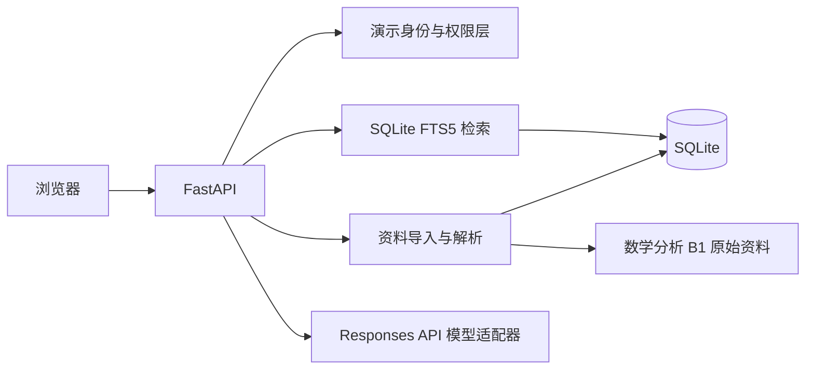

# 数学分析 B1 课程复习 Agent Demo 设计

> 状态：已由队长确认，进入实现前审计
>
> 日期：2026 年 7 月 23 日
>
> 适用版本：`v0.1 课程 Agent`

## 1. 目标

本轮迭代交付一个可运行、可演示、可测试的“数学分析 B1 课程复习 Agent”。它要把现有课程资料变成一条完整产品闭环：

```text
资料导入 -> 解析与去重 -> 权限过滤 -> 中文检索 -> 模型回答 -> 文件与页码引用 -> 删除失效
```

本轮不是完整插件平台的交付版本，而是未来插件平台要接入的第一个真实 Agent。课程 Agent 必须保持清晰 API 边界，使后续 Registry、Gateway 和 Agent Portal 能在不重写课程业务的前提下接入。

## 2. 范围

### 2.1 本轮必须完成

- 数学分析 B1 单课程知识库；
- 个人知识空间；
- 邀请制共享知识空间；
- 队友上传的 26 份 PDF 的批量登记和解析状态管理；
- 单份 PDF 上传、哈希去重、重新解析和删除；
- 基于 SQLite FTS5 的中文全文检索；
- 基于 OpenAI Responses 兼容接口的 `gpt-5.6-sol` 回答生成；
- 回答中的文件名、页码和原文片段引用；
- 两个演示用户的私人资料隔离；
- 模型不可用时返回检索结果的降级能力；
- 自动测试、固定评测集、开发说明和单容器部署说明。

### 2.2 本轮明确后置

- 概率论与数理统计正式接入；
- 扫描版 PDF 整体 OCR 和复杂公式结构化识别；
- 向量数据库、embedding 和混合检索；
- 第三方订阅知识空间的实际同步；
- Registry、Review、Gateway、Agent Portal 和第三方 Agent；
- Main Agent、自动语义路由和 Agent 间调用；
- 生产级统一身份认证、计费和开放市场。

## 3. 技术路线

第一版采用单体 Python 服务，避免为一个课程 Demo 引入微服务、Redis、消息队列或 Kubernetes。



### 3.1 主要组件

| 组件 | 职责 |
|---|---|
| FastAPI | HTTP API、输入校验、权限边界和网页托管 |
| SQLite | 用户、空间、文档、版本、分块和状态持久化 |
| SQLite FTS5 | 中文分词后的全文检索和 BM25 排序 |
| PyMuPDF | PDF 页级文本抽取和页数读取 |
| 中文分词器 | 为 FTS5 生成稳定检索词，同时保留原始文本 |
| LLM Adapter | 调用 Responses 兼容接口并处理超时、错误和降级 |
| 原生 Web UI | 身份、知识空间、资料管理和复习问答四个视图 |

### 3.2 目录结构

```text
apps/course-agent/
├── app/
│   ├── api/
│   ├── domain/
│   ├── ingestion/
│   ├── retrieval/
│   ├── llm/
│   └── web/
├── tests/
├── pyproject.toml
├── Dockerfile
└── README.md

data/
└── manifests/
    └── math-analysis-b1.yaml

学习资料/
└── 数学分析B1/
```

原始课程资料保持只读，不改名、不复制到应用源码目录。运行时 SQLite、索引、上传文件和临时文件统一放在被 Git 忽略的 `var/`。

## 4. 数据模型

核心关系如下：

```text
User
  └── KnowledgeSpace
        ├── Membership
        └── Document
              └── DocumentRevision
                    └── Chunk
```

| 对象 | 关键字段 |
|---|---|
| User | `id`、`display_name`、`is_demo` |
| KnowledgeSpace | `id`、`name`、`space_type`、`owner_id`、`visibility` |
| Membership | `space_id`、`user_id`、`role`、`status` |
| Source | `source_type`、`source_url`、`license_status`、`access_mode` |
| Document | `id`、`title`、`course`、`semester`、`material_type`、`status` |
| DocumentRevision | `content_hash`、`parser_version`、`page_count`、`parse_status` |
| Chunk | `revision_id`、`page_start`、`page_end`、`content`、`search_text` |

`space_type` 第一版支持 `personal` 与 `shared`；`subscribed` 作为保留枚举，不提供实际同步功能。

## 5. 导入与解析

### 5.1 批量导入

`data/manifests/math-analysis-b1.yaml` 登记每份资料的相对路径、标题、年份、资料类型、来源、许可状态和目标共享空间。批量导入命令读取 manifest，并复用与网页上传相同的处理管线。

### 5.2 单文档处理流程

1. 校验当前用户和目标知识空间；
2. 校验扩展名、MIME、大小和实际路径；
3. 计算 SHA-256 内容哈希；
4. 在目标空间内检查重复文档；
5. 按页提取文本并记录页码；
6. 页面过长时按段落切分，片段不跨越不可追踪的页边界；
7. 生成中文检索文本并写入 FTS5；
8. 原子更新文档版本和解析状态。

无可用文本的页面标记为 `needs_ocr`，不得伪装成已成功解析。解析失败的文档保留失败原因，可重新执行，不留下可检索的半成品片段。

## 6. 权限与检索

权限顺序固定为：

```text
识别用户 -> 计算可访问空间 -> 过滤文档和分块 -> 检索 -> 调用模型
```

任何私人文本都不能先进入模型上下文再做删除。个人空间只有 owner 可访问；共享空间只有 `active` 成员可访问。

检索字段与展示字段分离：

- `search_text` 保存中文分词、英文标识符和数学关键词归一化结果；
- `content` 保存原始抽取文本，用于引用和模型上下文；
- FTS5 返回前 8 个片段，随后按文档和页码去重；
- 模型只接收当前用户有权访问的最终片段。

第一版不启用跨用户回答缓存。缓存接口可以预留，但必须等权限测试通过后才能针对纯共享空间启用。

## 7. 模型与引用

模型配置来自服务器端环境变量，不从浏览器接收，也不运行时依赖 CC Switch 数据库：

```text
COURSE_AGENT_LLM_API_KEY
COURSE_AGENT_LLM_BASE_URL
COURSE_AGENT_LLM_MODEL=gpt-5.6-sol
COURSE_AGENT_LLM_TIMEOUT_SECONDS
```

仓库只提交 `.env.example`，不得提交实际 API Key。

调用流程：

1. 后端为检索片段分配本次请求内稳定编号，如 `[S1]`；
2. 提示模型只能根据给定片段回答；
3. 模型引用 `[S1]`、`[S2]` 等编号；
4. 后端只接受本次检索集合内的引用；
5. 后端把编号映射为真实文档、页码和引用片段；
6. 没有足够证据时返回“当前资料中没有找到依据”。

模型超时、限流或不可用时，接口仍返回已检索片段和 `degraded=true`，不让知识库核心能力整体失效。

## 8. API

| 方法 | 路径 | 用途 |
|---|---|---|
| GET | `/api/health` | 健康检查和能力状态 |
| GET | `/api/users` | 获取本地演示身份 |
| GET | `/api/spaces` | 获取当前用户可访问空间 |
| GET | `/api/spaces/{id}/documents` | 获取空间资料 |
| POST | `/api/spaces/{id}/documents` | 上传单份 PDF |
| DELETE | `/api/documents/{id}` | 删除文档和关联索引 |
| POST | `/api/documents/{id}/reparse` | 重新解析 |
| POST | `/api/query` | 检索并生成带引用回答 |
| GET | `/api/documents/{id}/pages/{page}` | 获取有权限的页级文本 |

第一版返回普通 JSON。平台级 SSE 和 `platform-chat-v1` 在插件平台阶段实现，课程 Agent 内部不提前复制一套未验证的流式协议。

## 9. Web 界面

第一版包含四个视图：

1. 演示身份选择：用户 A、用户 B，明确标记为本地演示身份；
2. 知识空间：展示个人空间、数学分析 B1 邀请制学习小组和成员；
3. 资料管理：上传、解析状态、页数、来源、许可、删除和重新解析；
4. 复习问答：问题输入、检索/生成状态、答案、文件名、页码和引用片段。

页面不建设营销首页、复杂仪表盘或 Agent 广场。重点是让评委在一条流程中看清数据来源、权限边界和回答依据。

## 10. 错误与安全基线

- 上传仅接受 PDF，并限制单文件大小；
- 所有路径通过服务端根目录解析，阻止路径穿越；
- PDF 解析器不得根据文档内容任意联网；
- 文档、网页、OCR 文本和模型输出均按不可信输入处理；
- 模型不能决定权限、删除状态或真实引用；
- 无权访问在检索前返回 `403`；
- 删除在事务中处理文档状态、分块和 FTS 索引；
- 日志不记录 API Key、完整私人文档正文或完整模型上下文；
- 资料未获得公开再分发许可，默认只用于私有仓库和内部演示；公开 Demo 必须使用获得授权的子集或不公开原文件。

## 11. 测试与评测

### 11.1 自动测试

- PDF 解析、分页和无文本页识别；
- 中文分词、查询构造和 FTS5 检索；
- 内容哈希去重；
- 私人空间跨用户命中为 0；
- 未受邀用户无法访问共享空间；
- 删除后查询和页码接口均不再命中；
- 无效模型引用被过滤；
- 模型超时后的检索降级；
- 文件类型、大小和路径穿越限制；
- manifest 批量导入的幂等性。

CI 测试使用可控的假模型适配器，不消耗真实 API；另设手动 smoke test 验证真实 `gpt-5.6-sol`。

### 11.2 固定评测集

- 10 个资料中有明确依据的问题；
- 5 个资料中无依据的问题；
- 5 个验证个人空间隔离的问题。

目标：

| 指标 | 目标 |
|---|---:|
| Recall@5 | 不低于 80% |
| 引用正确率 | 不低于 90% |
| 跨用户私人资料命中 | 0 |
| 删除后旧内容命中 | 0 |
| 26 份资料状态可见 | 100% |

## 12. 部署与交付

支持两种方式：

1. 本地 Python 虚拟环境，用于开发和调试；
2. 单容器 Docker，用于部署到现有开发机，持久化 SQLite、上传文件和索引目录。

最终 Demo 的最低交付证据：

- 从空数据库完成初始化和 manifest 导入；
- 两个用户能看到不同个人空间和同一邀请制共享空间；
- 完成一次真实 `gpt-5.6-sol` 问答并展示引用；
- 删除一份测试资料后不再命中；
- 模型断开时仍能展示检索结果；
- 自动测试全部通过；
- README 给出可复现的安装、配置、启动、导入、测试和部署命令。

## 13. 后续演进

完成本 Demo 后再按证据决定：

1. 若固定问题集证明全文检索召回不足，再加入 embedding 和混合检索；
2. 接入概率论与数理统计，验证跨课程扩展；
3. 增加第三方订阅知识空间的合规样例；
4. 冻结 `platform-chat-v1`，把课程 Agent 注册为第一方参考实现；
5. 建立 Registry、Gateway、Agent Portal 和极简第三方 Agent。

