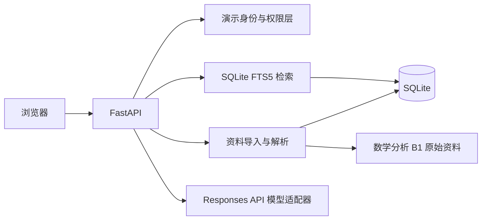

# 数学分析 B1 课程复习 Agent Demo 设计

> 状态：已由队长确认，进入实现前审计
>
> 日期：2026 年 7 月 23 日
>
> 适用版本：`v0.1 课程 Agent`

## 1. 目标

本轮迭代交付一个可运行、可演示、可测试的“数学分析 B1 课程复习 Agent”。它要把现有课程资料变成一条完整产品闭环：

```text
资料导入 -> 解析与去重 -> 权限过滤 -> 中文检索 -> 模型回答 -> 文件与页码引用 -> 删除失效
```

本轮不是完整插件平台的交付版本，而是未来插件平台要接入的第一个真实 Agent。课程 Agent 必须保持清晰 API 边界，使后续 Registry、Gateway 和 Agent Portal 能在不重写课程业务的前提下接入。

## 2. 范围

### 2.1 本轮必须完成

- 数学分析 B1 单课程知识库；
- 个人知识空间；
- 邀请制共享知识空间；
- 队友上传的 26 份 PDF 的批量登记和解析状态管理；
- 单份 PDF 上传、哈希去重、重新解析和删除；
- 基于 SQLite FTS5 的中文全文检索；
- 基于 OpenAI Responses 兼容接口的 `gpt-5.6-sol` 回答生成；
- 回答中的文件名、页码和原文片段引用；
- 两个演示用户的私人资料隔离；
- 模型不可用时返回检索结果的降级能力；
- 自动测试、固定评测集、开发说明和单容器部署说明。

### 2.2 本轮明确后置

- 概率论与数理统计正式接入；
- 扫描版 PDF 整体 OCR 和复杂公式结构化识别；
- 向量数据库、embedding 和混合检索；
- 第三方订阅知识空间的实际同步；
- Registry、Review、Gateway、Agent Portal 和第三方 Agent；
- Main Agent、自动语义路由和 Agent 间调用；
- 生产级统一身份认证、计费和开放市场。

## 3. 技术路线

第一版采用单体 Python 服务，避免为一个课程 Demo 引入微服务、Redis、消息队列或 Kubernetes。



### 3.1 主要组件

| 组件 | 职责 |
|---|---|
| FastAPI | HTTP API、输入校验、权限边界和网页托管 |
| SQLite | 用户、空间、文档、版本、分块和状态持久化 |
| SQLite FTS5 | 中文分词后的全文检索和 BM25 排序 |
| PyMuPDF | PDF 页级文本抽取和页数读取 |
| 中文分词器 | 为 FTS5 生成稳定检索词，同时保留原始文本 |
| LLM Adapter | 调用 Responses 兼容接口并处理超时、错误和降级 |
| 原生 Web UI | 身份、知识空间、资料管理和复习问答四个视图 |

### 3.2 目录结构

```text
apps/course-agent/
├── app/
│   ├── api/
│   ├── domain/
│   ├── ingestion/
│   ├── retrieval/
│   ├── llm/
│   └── web/
├── tests/
├── pyproject.toml
├── Dockerfile
└── README.md

data/
└── manifests/
    └── math-analysis-b1.yaml

学习资料/
└── 数学分析B1/
```

原始课程资料保持只读，不改名、不复制到应用源码目录。运行时 SQLite、索引、上传文件和临时文件统一放在被 Git 忽略的 `var/`。

## 4. 数据模型

核心关系如下：

```text
User
  └── KnowledgeSpace
        ├── Membership
        └── Document
              └── DocumentRevision
                    └── Chunk
```

| 对象 | 关键字段 |
|---|---|
| User | `id`、`display_name`、`is_demo` |
| KnowledgeSpace | `id`、`name`、`space_type`、`owner_id`、`visibility` |
| Membership | `space_id`、`user_id`、`role`、`status` |
| Source | `source_type`、`source_url`、`license_status`、`access_mode` |
| Document | `id`、`title`、`course`、`semester`、`material_type`、`status` |
| DocumentRevision | `content_hash`、`parser_version`、`page_count`、`parse_status` |
| Chunk | `revision_id`、`page_start`、`page_end`、`content`、`search_text` |

`space_type` 第一版支持 `personal` 与 `shared`；`subscribed` 作为保留枚举，不提供实际同步功能。

## 5. 导入与解析

### 5.1 批量导入

`data/manifests/math-analysis-b1.yaml` 登记每份资料的相对路径、标题、年份、资料类型、来源、许可状态和目标共享空间。批量导入命令读取 manifest，并复用与网页上传相同的处理管线。

### 5.2 单文档处理流程

1. 校验当前用户和目标知识空间；
2. 校验扩展名、MIME、大小和实际路径；
3. 计算 SHA-256 内容哈希；
4. 在目标空间内检查重复文档；
5. 按页提取文本并记录页码；
6. 页面过长时按段落切分，片段不跨越不可追踪的页边界；
7. 生成中文检索文本并写入 FTS5；
8. 原子更新文档版本和解析状态。

无可用文本的页面标记为 `needs_ocr`，不得伪装成已成功解析。解析失败的文档保留失败原因，可重新执行，不留下可检索的半成品片段。

## 6. 权限与检索

### 6.1 演示身份协议

第一版使用仅在 `COURSE_AGENT_DEMO_MODE=true` 时启用的本地演示会话：

1. `GET /api/users` 只返回可选演示用户的 `id` 和展示名；
2. `POST /api/session` 接收一个已预置的 `user_id`；
3. 后端验证用户存在后，通过 Starlette `SessionMiddleware` 签发 `HttpOnly`、`SameSite=Lax` 的签名 session cookie；
4. 所有业务 API 只从服务端 session 读取 `current_user_id`，不接受请求体或查询参数覆盖身份；
5. `DELETE /api/session` 清除当前会话，用户切换身份后必须获得新 cookie。

session 签名密钥来自 `COURSE_AGENT_SESSION_SECRET`。未登录返回 `401`。对文档资源的越权访问统一返回 `404`，避免通过 ID 枚举私人资料；对已登录用户在可见空间内执行不允许的写操作返回 `403`。正式身份系统后续可替换这一适配层，但业务服务仍只接收后端解析后的身份对象。

### 6.2 权限顺序

权限顺序固定为：

```text
识别用户 -> 计算可访问空间 -> 过滤文档和分块 -> 检索 -> 调用模型
```

任何私人文本都不能先进入模型上下文再做删除。个人空间只有 owner 可访问；共享空间只有 `active` 成员可访问。

### 6.3 检索字段与分词

检索字段与展示字段分离：

- `search_text` 保存中文分词、英文标识符和数学关键词归一化结果；
- `content` 保存原始抽取文本，用于引用和模型上下文；
- FTS5 返回前 8 个片段，随后按文档和页码去重；
- 模型只接收当前用户有权访问的最终片段。

中文分词实现冻结为 `jieba==0.42.1` 的 `cut_for_search`，并叠加连续汉字的二元组和 ASCII/希腊字母数学标识符。规范化规则固定为 Unicode NFKC、ASCII 小写、空白折叠和控制字符删除；原始 `content` 不做这些改写。导入和查询必须调用同一个 `tokenize_for_search()` 函数。

FTS 表固定为：

```sql
CREATE VIRTUAL TABLE chunk_fts USING fts5(
    chunk_id UNINDEXED,
    search_text,
    tokenize='unicode61 remove_diacritics 0'
);
```

`search_text` 是以空格连接的检索 token，FTS 命中后通过 `chunk_id` 回连权限过滤后的 `Chunk`。查询 token 为空时不执行 FTS，并返回参数错误。

每页解析状态为 `text_ok`、`needs_ocr`、`needs_review` 或 `failed`：

- 规范化后少于 30 个非空白字符：`needs_ocr`；
- 替换字符或控制字符比例超过 10%：`needs_review`；
- 解析器抛出异常：`failed`；
- 其余页面：`text_ok`，允许进入索引。

每份文档记录四类页数。没有任何 `text_ok` 页的文档不进入检索，状态显示为 `needs_ocr`。首轮 26 份资料的可检索页覆盖率门槛为 90%；低于门槛时 Demo 验收失败，不能用 Recall@5 掩盖解析缺口。

第一版不启用跨用户回答缓存。缓存接口可以预留，但必须等权限测试通过后才能针对纯共享空间启用。

## 7. 模型与引用

模型配置来自服务器端环境变量，不从浏览器接收，也不运行时依赖 CC Switch 数据库：

```text
COURSE_AGENT_LLM_API_KEY
COURSE_AGENT_LLM_BASE_URL
COURSE_AGENT_LLM_MODEL=gpt-5.6-sol
COURSE_AGENT_LLM_TIMEOUT_SECONDS
```

仓库只提交 `.env.example`，不得提交实际 API Key。

调用流程：

1. 后端为检索片段分配本次请求内稳定编号，如 `[S1]`；
2. 提示模型只能根据给定片段回答；
3. 模型引用 `[S1]`、`[S2]` 等编号；
4. 后端只接受本次检索集合内的引用；
5. 后端把编号映射为真实文档、页码和引用片段；
6. 没有足够证据时返回“当前资料中没有找到依据”。

模型超时、限流或不可用时，接口仍返回已检索片段和 `degraded=true`，不让知识库核心能力整体失效。

### 7.1 模型适配器契约

适配器接口固定为 `generate(question, sources) -> LLMResult`，假模型与真实模型实现同一接口。每次最多提供 8 个片段、总计不超过 12,000 个字符；单片段超过 1,800 个字符时截断并保留页码。

Responses 兼容请求使用：

- `POST {base_url}/responses`；
- Bearer API Key；
- `model`、`instructions`、`input` 和 `max_output_tokens`；
- 默认连接与完整请求超时 45 秒；
- 只对网络错误、`429`、`502`、`503`、`504` 最多重试 1 次，其他 `4xx` 不重试。

模型上下文中的每个来源采用以下结构：

```text
<source id="S1" document="第1-3章复习提纲.pdf" page="8">
原始片段内容
</source>
```

系统指令要求模型用 Markdown 回答，只能引用 `[S1]` 形式的来源编号；没有证据时明确说明找不到依据。后端从 Responses 返回的 `output_text`，或兼容返回中的 `output[].content[].text` 提取文本，再用正则 `\[S([1-8])\]` 提取引用。任何不在本次来源集合内的编号都会被移除并记为 `invalid_citation`。

检索成功但模型失败时 `/api/query` 仍返回 `200`、`degraded=true`、空或简短降级答案、检索来源和不包含敏感上游正文的 `model_error.code`。只有数据库或检索服务不可用时返回 `503`。真实 smoke test 必须验证当前目标环境的 `base_url + /responses`、`gpt-5.6-sol` 和返回解析逻辑；CI 只使用假模型。

## 8. API

| 方法 | 路径 | 用途 |
|---|---|---|
| GET | `/api/health` | 健康检查和能力状态 |
| GET | `/api/users` | 获取本地演示身份 |
| POST | `/api/session` | 创建本地演示会话 |
| GET | `/api/session` | 获取当前会话身份 |
| DELETE | `/api/session` | 清除当前演示会话 |
| GET | `/api/spaces` | 获取当前用户可访问空间 |
| GET | `/api/spaces/{id}/documents` | 获取空间资料 |
| POST | `/api/spaces/{id}/documents` | 上传单份 PDF |
| DELETE | `/api/documents/{id}` | 删除文档和关联索引 |
| POST | `/api/documents/{id}/reparse` | 重新解析 |
| POST | `/api/query` | 检索并生成带引用回答 |
| GET | `/api/documents/{id}/pages/{page}` | 获取有权限的页级文本 |

第一版返回普通 JSON。平台级 SSE 和 `platform-chat-v1` 在插件平台阶段实现，课程 Agent 内部不提前复制一套未验证的流式协议。

### 8.1 通用错误

```json
{
  "error": {
    "code": "document_not_found",
    "message": "资料不存在或当前用户不可访问",
    "retryable": false
  }
}
```

状态码规则：未登录 `401`；可见资源上的禁止操作 `403`；不存在、已删除或不可见文档 `404`；字段/MIME/空查询错误 `422`；重复上传返回 `409` 并附已有文档 ID；检索基础设施不可用 `503`。

### 8.2 最小请求与响应契约

- `POST /api/session`：JSON `{ "user_id": "demo-a" }`；成功返回 `{ "user": { ... } }`。
- `GET /api/spaces`：返回当前用户可见空间数组和成员角色。
- `GET /api/spaces/{id}/documents?page=1&page_size=20`：`page` 从 1 开始，`page_size` 范围 1--100；返回 `items`、`page`、`page_size`、`total`。
- `POST /api/spaces/{id}/documents`：`multipart/form-data`，必填 `file`、`title`、`material_type`、`license_status`，可选 `semester`、`source_url`；第一版单文件上限 50 MiB。
- `DELETE /api/documents/{id}`：成功返回 `204`，重复删除返回 `404`。
- `POST /api/documents/{id}/reparse`：成功返回最新 revision 和解析状态。
- `POST /api/query`：JSON `{ "question": "...", "space_ids": ["..."], "top_k": 5 }`；`top_k` 范围 1--8，所选空间必须全部可访问。
- `GET /api/documents/{id}/pages/{page}`：页码从 1 开始，返回文档标题、页码、页状态和可展示文本；越界或已删除返回 `404`。

`POST /api/query` 成功响应：

```json
{
  "answer": "根据复习提纲……[S1]",
  "degraded": false,
  "model": "gpt-5.6-sol",
  "retrieval_count": 5,
  "citations": [
    {
      "id": "S1",
      "document_id": "doc-id",
      "document_title": "第1-3章复习提纲.pdf",
      "page": 8,
      "excerpt": "……"
    }
  ],
  "model_error": null
}
```

`space_ids` 为空时默认检索当前用户全部可访问空间。响应不得返回其他用户的空间 ID、文档存在性或原文。

## 9. Web 界面

第一版包含四个视图：

1. 演示身份选择：用户 A、用户 B，明确标记为本地演示身份；
2. 知识空间：展示个人空间、数学分析 B1 邀请制学习小组和成员；
3. 资料管理：上传、解析状态、页数、来源、许可、删除和重新解析；
4. 复习问答：问题输入、检索/生成状态、答案、文件名、页码和引用片段。

页面不建设营销首页、复杂仪表盘或 Agent 广场。重点是让评委在一条流程中看清数据来源、权限边界和回答依据。

## 10. 错误与安全基线

- 上传仅接受 PDF，并限制单文件大小；
- 所有路径通过服务端根目录解析，阻止路径穿越；
- PDF 解析器不得根据文档内容任意联网；
- 文档、网页、OCR 文本和模型输出均按不可信输入处理；
- 模型不能决定权限、删除状态或真实引用；
- 不可见、已删除或不可枚举的文档在检索前按 `404` 处理；只有用户已能看见资源但无写权限时返回 `403`；
- 删除在事务中处理文档状态、分块和 FTS 索引；
- 日志不记录 API Key、完整私人文档正文或完整模型上下文；
- 资料未获得公开再分发许可，默认只用于私有仓库和内部演示；公开 Demo 必须使用获得授权的子集或不公开原文件。

删除采用隐私优先的软删除元数据、硬删除内容策略：`Document.status` 置为 `deleted`，保留最小审计元数据和哈希；删除所有 Chunk、FTS 行和上传目录中的文件。仓库自带的只读原始 PDF 不从 Git 工作区删除，只解除索引关系。历史回答保留文档标题和页码，但引用详情接口返回 `410 Gone` 且不再展示原文。

重新解析创建新的 `DocumentRevision`；成功切换时，在同一事务中将旧 revision 标记为 `superseded`、删除旧 Chunk/FTS 行并启用新索引。新解析失败时保留旧 revision 可用，不发生半切换。

## 11. 测试与评测

### 11.1 自动测试

- PDF 解析、分页和无文本页识别；
- 中文分词、查询构造和 FTS5 检索；
- 内容哈希去重；
- 私人空间跨用户命中为 0；
- 未受邀用户无法访问共享空间；
- 删除后查询和页码接口均不再命中；
- 无效模型引用被过滤；
- 模型超时后的检索降级；
- 文件类型、大小和路径穿越限制；
- manifest 批量导入的幂等性。

CI 测试使用可控的假模型适配器，不消耗真实 API；另设手动 smoke test 验证真实 `gpt-5.6-sol`。

### 11.2 固定评测集

- 10 个资料中有明确依据的问题；
- 5 个资料中无依据的问题；
- 5 个验证个人空间隔离的问题。

目标：

| 指标 | 目标 |
|---|---:|
| Recall@5 | 不低于 80% |
| 引用正确率 | 不低于 90% |
| 跨用户私人资料命中 | 0 |
| 删除后旧内容命中 | 0 |
| 26 份资料状态可见 | 100% |

## 12. 部署与交付

支持两种方式：

1. 本地 Python 虚拟环境，用于开发和调试；
2. 单容器 Docker，用于部署到现有开发机，持久化 SQLite、上传文件和索引目录。

标准命令约定为：

```text
python -m course_agent.cli init-db
python -m course_agent.cli import-manifest data/manifests/math-analysis-b1.yaml
uvicorn course_agent.main:app --host 127.0.0.1 --port 8000
pytest
```

Docker 镜像使用 `/app/var` 保存 SQLite、上传和索引数据，运行时挂载持久化卷；默认监听容器内 `8000`。`GET /api/health` 只有在数据库可读写、FTS5 可查询时返回 `200`，并分别报告 `database`、`search` 和 `llm_configured` 状态。LLM 未配置不影响基本健康状态，但真实 Demo smoke test 必须单独验证模型调用。

最终 Demo 的最低交付证据：

- 从空数据库完成初始化和 manifest 导入；
- 两个用户能看到不同个人空间和同一邀请制共享空间；
- 完成一次真实 `gpt-5.6-sol` 问答并展示引用；
- 删除一份测试资料后不再命中；
- 模型断开时仍能展示检索结果；
- 自动测试全部通过；
- README 给出可复现的安装、配置、启动、导入、测试和部署命令。

## 13. 后续演进

完成本 Demo 后再按证据决定：

1. 若固定问题集证明全文检索召回不足，再加入 embedding 和混合检索；
2. 接入概率论与数理统计，验证跨课程扩展；
3. 增加第三方订阅知识空间的合规样例；
4. 冻结 `platform-chat-v1`，把课程 Agent 注册为第一方参考实现；
5. 建立 Registry、Gateway、Agent Portal 和极简第三方 Agent。
