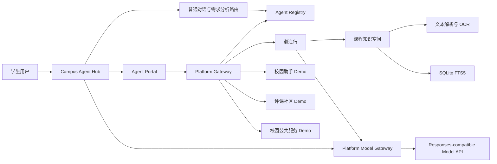

# AI for better life In USTC 设计文档

`AI for USTCERS` 是面向中国科学技术大学学生的校园 Agent 集成平台。本项目以“让分散的校园智能服务能够被统一发现、可靠接入和安全使用”为核心目标，在平台层建设 AI for USTCERS 平台，并以课程复习 Agent“瀚海行”验证真实、完整且可追溯的业务闭环。

> **项目源码仓库（GitHub，公开）：** <https://github.com/xytsakura/ai-for-better-life-in-ustc>

> **公网演示入口**
>
> - 平台：<http://39.106.98.62:4000>
> - 瀚海行 Agent：<http://39.106.98.62:4001>
> - Demo Agent：<http://39.106.98.62:4002>

## 1. 设计思路

### 1.1 现实背景与问题来源

随着大语言模型能力快速发展，校园中已经出现课程问答、资料整理、课程评价、办事指引和生活服务等多类智能应用。然而，单个 Agent 的增多并不自然等于更好的校园智能服务。对普通学生而言，不同服务分散在不同页面和项目中，使用前需要自行判断哪个工具合适；对开发者而言，各 Agent 的接口、认证方式、流式协议和错误格式各不相同，重复接入成本较高；对平台管理者而言，也缺少一套明确机制判断 Agent 是否经过审核、是否在线、是否与当前协议兼容。

课程复习场景还存在更具体的问题。大学课程资料通常由教材、讲义、课件、习题、试卷和个人笔记共同构成，格式复杂、版本不一。把整份文件直接交给通用模型，不仅容易受到上下文长度限制，还可能出现扫描文档无法解析、回答引用来源不清、知识范围超出课程进度等情况。个人资料、小组共享资料和公开资料之间还存在不同的权限边界，若检索与鉴权顺序不当，私人内容可能在模型调用阶段被越权使用。

因此，本项目不把目标限定为“再做一个聊天机器人”，而是同时解决两个层次的问题：在平台层建立校园 Agent 的统一接入与治理基础设施；在应用层选择课程复习这一高频真实场景，完成从资料导入到可验证回答的完整闭环。

### 1.2 产品定位

我们的团队名叫`AI for better life In USTC` 。团队秉持技术向善的理念，聚焦人工智能落地实践，致力于用 AI 技术解决现实场景问题，以技术力量赋能美好生活。立足科大科研土壤，我们探索有温度、有实用价值的 AI 应用，让人工智能贴近生活、服务于人。

`AI for USTCERS` 是我们团队面向中国科学技术大学学生的校园 Agent 集成平台。平台通过统一接入契约、注册审核机制、Agent 广场、需求分析路由和统一调用网关，将课程学习、校园生活和公共服务等智能体组织到同一个入口中，在宏观层面为不同类型的 Agent 提供统一调用，为科大学生的智能体开发与项目实践提供一套标准抽象接口，也为学生的日常学习生活提供便利高效的交互端口。

“瀚海行”是平台的第一个完整第一方标杆 Agent。它面向课程学习与期末复习，提供个人知识库、邀请制共享知识库和订阅知识库，支持资料解析、选择性检索、带来源回答和原文回看。瀚海行不仅是一项独立可用的校园服务，也是对平台接入契约、身份衔接、模型网关和统一交互能力的端到端验证。

校园助手、评课社区和校园公共服务 Agent 则作为按相同 Contract 接入的独立 Demo，用于证明平台能够容纳不同业务领域、不同实现复杂度的校园 Agent。其中评课社区和校园公共服务目前属于 Future Work Demo，不将示例数据表述为已经接入真实校内数据源。

### 1.3 核心设计目标

项目围绕以下目标展开：

1. 建立统一的 Agent 注册、协议验收、人工审核、展示和调用链路，使校园 Agent 从“可以运行”进一步达到“可以被平台治理和稳定使用”。
2. 通过版本化 Contract 抽象 Agent 的公共能力，让采用不同语言、框架和内部架构的 Agent 都能以明确边界接入平台。
3. 同时提供普通对话与需求分析路由，让用户既能快速获得直接回答，也能在有明确业务需求时找到合适的专业 Agent。
4. 以瀚海行完成资料导入、OCR 校验、分块索引、权限过滤、选择性 RAG、页级引用和删除失效闭环。
5. 将模型密钥、Agent 凭据和私人资料留在服务端受控边界内，避免浏览器、其他 Agent 或非授权用户获得敏感信息。
6. 通过一键启动、固定验收脚本和真实浏览器测试，为作品的完成度、稳定性和可演示性提供证据。

### 1.4 总体设计原则

#### 1.4.1 平台治理与业务能力分离

AI for USTCERS 负责接入、状态、权限、流量和审计，专业 Agent 负责理解具体业务。Gateway 不解释课程内容，也不改写 Agent 的业务回答。这样的边界使平台可以扩展新的 Agent，而不必持续把各类业务逻辑写入中心服务。

#### 1.4.2 智能推荐与确定性执行分离

语言模型可以帮助理解自然语言需求，但不能直接决定调用地址、生成凭据或绕过平台状态。路由模型只从受控能力清单中提出候选 `agent_id` 和推荐理由，服务端再与运行时 active Registry 求交集。用户点击受控入口后，平台才调用目标 Agent，从而在智能体验和系统可控性之间取得平衡。

#### 1.4.3 先鉴权，后检索与模型调用

个人、共享和订阅知识空间可以复用统一数据结构，但访问范围必须在检索前确定。系统只把当前用户有权访问且本轮明确选择的内容送入检索和模型上下文，不能先把全部资料交给模型，再对答案做表面过滤。

#### 1.4.4 回答必须可追溯

课程问答不以“生成一段看似正确的文字”为终点。系统保存文档、版本、页码、分块和来源关系，在回答中生成 `[S1]` 等引用标记，并允许用户回到原 PDF 或提取文本核对依据，让回答具备可检查、可纠错的基础。

#### 1.4.5 当前能力与未来设想严格区分

比赛版本聚焦平台闭环和瀚海行标杆场景，不宣称已经完成真实统一身份认证、商业计费、开放式市场、多实例治理或校内敏感数据接入。尚未落地的能力统一放入未来前景，避免用概念替代实现。

### 1.5 用户使用路径

学生进入 AI for USTCERS 平台后，可以在普通对话模式中直接提问，也可以切换到需求分析路由模式描述目标。若用户提出“我要复习数学分析”一类需求，平台会从当前已审核且在线的 Agent 中推荐瀚海行；用户确认后进入瀚海行工作台，选择有权限的知识库和本轮资料，发起知识检索问答，并通过引用打开原始页面核对答案。

对 Agent 开发者而言，接入过程从实现 Manifest 和协议接口开始，经过 Contract 自动检查、管理员审核和健康确认后形成活动版本，最终出现在 Agent Portal 中。这个流程把零散项目转化为具有明确版本、状态和责任边界的平台服务。

## 2. 技术架构

### 2.1 总体架构

系统由平台层、Agent 层、知识与数据层、模型服务层和展示交互层构成。平台层负责统一治理，Agent 层承载专业能力，知识与数据层保存业务状态和可检索资料，模型服务层封装外部大模型调用，展示交互层向用户提供统一而连贯的体验。

### 2.2 服务与部署划分

当前完整演示由三个独立进程承载四个逻辑 Agent：

| 服务 | 默认端口 | 核心职责 |
|---|---:|---|
| Campus Agent Hub | `8100` | Registry、审核、Gateway、Portal、首页对话、需求路由和模型配置 |
| 瀚海行 | `8002` | 课程知识库、资料问答、引用、阅读器、知识广场和 Featured 工作台 |
| Demo Agent 服务 | `8101` | 以独立 audience 承载校园助手、评课社区和校园公共服务三个逻辑 Agent |

Hub 与瀚海行具有独立数据库、独立 Session 和清晰的业务边界。Hub 不导入瀚海行业务代码，也不直接读写其数据库。这种部署方式一方面保留比赛演示的轻量性，另一方面证明平台与 Agent 可以独立演进。

当前比赛演示版本已部署到阿里云 ECS，并开放公网访问。公网入口与服务职责一一对应：平台入口为 `http://39.106.98.62:4000`，瀚海行 Agent 为 `http://39.106.98.62:4001`，Demo Agent 服务为 `http://39.106.98.62:4002`。上述公网端口对应反向代理后的访问入口；服务内部仍按表中的 `8100`、`8002` 和 `8101` 端口运行。

### 2.3 Contract 与协议层

Contract v1 是平台扩展能力的核心，固定描述 Manifest、请求结构、流式事件、统一错误、文件引用、认证声明、健康检查和兼容规则。Manifest 提供 Agent 名称、分类、标签、能力、版本和端点等元数据；健康接口则让平台持续判断 Agent 是否处于可服务状态。

对于交互能力完整的 Connected Agent，平台支持基于 AG-UI 的流式事件；对于结构简单的校园服务，可以实现 `simple-chat` JSON 接口，再由 Gateway 适配为统一事件。平台因此不限定 Agent 内部使用特定开发框架，同时又能保证用户端体验和平台治理规则一致。当前 Contract v1 锁定 `@ag-ui/core@0.0.57`，避免协议依赖随上游变化产生不可控兼容问题。

### 2.4 Registry、审核与生命周期

Agent 版本遵循“提交版本 → Contract 验收 → 管理员审核 → active → superseded 或 suspended”的生命周期。平台检查 Schema、健康响应、启动入口、协议输出和基础安全约束。只有处于 `active` 状态且存在活动版本的 Agent 才能公开展示和参与路由推荐。

Registry 不只是一个展示清单，而是平台运行时的事实来源。需求路由、Portal 展示和 Gateway 调用都以 Registry 当前状态为准，因此 Agent 被暂停、替换版本或健康状态持续异常后，不会继续通过旧入口被平台当作正常服务使用。

### 2.5 Gateway 与安全边界

Gateway 根据用户已经确认的 `agent_id` 执行确定性代理，负责身份验证、请求 Schema 校验、活动状态检查、文件引用重新鉴权、限流、超时、取消、响应大小控制、事件转发和审计。它不会自行选择多个 Agent，也不会把一个 Agent 的数据或凭据交给另一个 Agent。

第三方端点、网页、文件、OCR 文本和 Agent 输出均按不可信输入处理。外部端点在注册和调用前需要经过 URL 与 DNS 安全检查，拒绝私网、回环、链路本地、保留和未指定地址，降低 SSRF 风险。Featured 工作台采用短时一次性授权码和 EdDSA JWT 完成身份衔接，JWT 校验覆盖 issuer、audience、scope、签名和有效期，而不是只检查签名形式。

### 2.6 模型服务与流式链路

模型 Profile、服务地址、可用模型、全局默认模型和 Agent 专属绑定由服务端管理。浏览器可以请求使用平台允许的模型，但不能提交任意 `base_url`，也无法读取 API Key。Hub 普通对话和需求分析通过 Platform Model Gateway 接入模型；瀚海行问答在网关可用时走同一网关，网关未配置或暂时不可用时使用服务端回退配置。两条路径均支持 Responses-compatible API。

前后端使用 SSE 传输增量正文和状态事件。首页正文由 `model.output_text.delta` 增量显示，推荐结果由独立的 `home.recommendation` 返回，并以 `home.completed` 正常收口。取消、超时、模型错误和异常 EOF 都会结束当前运行，防止页面长期停留在“生成中”状态。Agent 调用则通过 AG-UI 或适配后的统一事件进入同一交互容器；系统不向前端暴露隐藏推理或服务端密钥。

### 2.7 知识处理与检索架构

瀚海行保留原始文件作为预览与引用依据，并将经过校验的文本用于检索。PDF 优先使用相邻 `.ocr.md` sidecar；系统核对源文件 SHA-256、总页数和连续页集合，校验失败时回退到 PyMuPDF 提取，避免把不完整或错配的 OCR 结果写入索引。Markdown 和 TXT 作为原生文本处理，PPTX 和简单图片按相应解析流程进入统一数据模型。

资料经格式识别、文本提取、按页保存、分块后写入 SQLite FTS5 索引，同时保留文档版本、空间类型、页码、来源和访问策略。当前数学分析 B1 演示语料包含 25 份唯一 PDF、510 页，其中 500 页可检索、10 个空白页不入索引，共形成 686 个分块，为课程问答提供稳定的演示基础。

## 3. 功能模块

### 3.1 AI for USTCERS 平台首页对话

首页提供两个显式模式。普通对话模式使用简短的平台身份提示，直接调用当前模型，不读取路由 Skill、功能清单或 Registry，适合概念解释和日常问答。需求分析路由模式则读取受控路由规则与 Agent 功能表，并与 active Registry 求交集，用于识别用户是否需要专业校园服务。

两个模式均支持真实流式输出、取消、错误收口和本地会话恢复。对话历史按“演示身份 + 对话模式”隔离，切换模式只恢复对应模式的最近会话，避免不同用途的上下文相互污染。

### 3.2 需求分析路由

路由模块将高置信规则与模型语义理解结合。对于“期末、考试、具体课程”与“复习”意图组合，系统优先匹配瀚海行；对于“签字、盖章”与“地点、办理、查询”意图组合，系统优先匹配校园公共服务 Agent。模糊表达再交给模型从受控清单中判断。

模型返回的候选仍需经过服务端二次校验。前端只使用服务端生成的 Agent 入口，不接受模型输出的 URL、Token 或凭据。若未命中合适 Agent、目标已下线或路由分析失败，系统回退为普通流式回答，不让推荐能力阻断基本问答体验。

### 3.3 Agent Portal 与详情展示

Agent Portal 集中展示名称、图标、分类、简介、能力标签、版本、可用状态和接入等级，并提供详情与进入服务的受控入口。瀚海行作为 Featured Agent 进入独立完整工作台；轻量 Agent 使用 Hub 的统一聊天容器。

Portal 展示内容来自 Registry 的公开视图，隐藏聊天端点、健康端点、回调地址和私有治理元数据。这样既让用户了解 Agent 能做什么，也避免把内部基础设施信息暴露给非管理端。

### 3.4 Agent 注册、审核与健康治理

开发者提交 Agent 版本后，平台执行 Contract Schema、连通性、健康接口和协议响应检查，管理员再依据结果完成审核。平台通过异步健康轮询维护运行状态，并可根据连续失败结果限制准入。新版本启用后，旧版本进入 superseded；发现安全或稳定性问题时，可将版本 suspended。

该模块把接入从一次性的“填一个 URL”提升为可追踪的版本治理过程。Agent 的展示、路由和调用共享同一活动状态，减少管理页面显示正常但实际调用已经失效的不一致情况。

### 3.5 Platform Gateway

Gateway 是用户与各 Agent 之间的统一调用边界。它校验当前身份和请求格式，确认 Agent 仍处于活动状态，对文件引用按当前用户和目标 Agent 再次鉴权，然后实施限流、超时、取消与响应大小限制。调用过程以统一事件返回前端，并记录不包含明文凭据和私人正文的必要审计信息。

对于 `simple-chat` Agent，Gateway 将简单响应转换为统一流式事件；对于原生 AG-UI Agent，则验证并转发协议事件。新增同协议 Agent 时，Gateway 不需要增加对应业务路由代码，从架构上降低横向扩展成本。

### 3.6 瀚海行知识空间

瀚海行提供三类知识空间。个人知识库默认仅本人可见，适合保存个人讲义和笔记；邀请制共享知识库面向课程小组协作；订阅知识库以只读引用方式使用经审核公开的资料，不为每个订阅者复制一份数据。

三类空间复用文档、版本、页面和分块等核心对象，但通过 `space_type`、用户身份和访问策略隔离。订阅、成员关系和作者审阅权限保持独立，资料暂停、下架、换版或取消订阅后，旧文档 ID 在下一次请求立即失效。

### 3.7 资料导入、OCR 与索引

用户上传资料后，系统识别文件格式并选择原生文本提取或 OCR 流程。PDF 的原文件始终保留，便于预览和定位；OCR sidecar 只有通过完整性校验后才进入索引。系统随后按页存储文本、执行分块、建立 FTS5 索引，并记录解析状态、版本和来源。

多文档导入、资料保存到个人库等关键操作通过数据库事务保证一致性。若中途失败，文档、页面、分块、全文索引和复制文件会一并回滚，避免出现页面可见但无法检索，或数据库已删除但文件仍残留的半完成状态。

### 3.8 选择性 RAG 与来源引用

普通问答默认不读取课程资料。进入知识检索模式后，用户先从自己有权访问的资料中选择本轮来源，后端只在该范围内执行 FTS5 检索，将相关分块与来源元数据组织为模型上下文。这种选择性 RAG 让学生能控制知识范围，也减少无关资料对回答的干扰。

回答中的 `[S1]` 等标记与文件名、页码和文档版本关联。用户可打开 PDF 原页、查看 OCR 文本、缩放页面并返回引用位置。模型回答因此不再是不可检查的结论，而成为能够沿证据链回看和纠错的学习辅助内容。

### 3.9 引用选区与独立解释分支

用户可以在同一条回答中选择多个片段加入引用篮，再围绕这些片段继续提问。引用以结构化条目展示，不直接混入可编辑正文。系统还支持在源回答下创建独立解释分支，用于追问某个概念或步骤，而不会自动污染主会话上下文。

分支请求固定经过服务端受控端点，不能由浏览器指定模型 Provider、`base_url` 或检索参数。身份切换、取消和请求失败均有状态保护，旧身份发起的异步响应不会写入新身份页面或历史。

### 3.10 知识广场与订阅闭环

知识广场允许维护者将资料以独立快照形式投稿，经审核后供其他学生订阅。发布者可以逐份控制资料是否参与 RAG、是否允许预览和是否允许下载。未订阅用户只能预览明确开放的内容，下载和检索必须具有有效订阅。

新版获批后，订阅者自动使用新版本，旧版保留用于审计与回滚。该设计兼顾内容持续更新和回答来源稳定性，也为未来形成由教师、助教和学生共同维护的课程资源生态提供基础。

### 3.11 Demo Agent 与可扩展性验证

校园助手、评课社区和校园公共服务三个逻辑 Agent 由独立 Demo 服务承载，并以不同 audience 接受 Hub JWT。它们通过相同 Contract 出现在 Portal、参与受控需求路由并使用统一交互容器。

这些 Demo 的作用是验证“平台可以接入新领域”，而不是用固定示例冒充真实数据能力。评课社区和校园公共服务页面明确标注 Future Work，真实点评、附件和行政数据只有在获得授权并建立合规机制后才会接入。

### 3.12 部署、初始化与验收

项目提供 Docker 编排和无 Docker 的 Windows 本地启动方式。标准启动过程会拉起 Hub、瀚海行和共享 Demo 服务，幂等注册四个 Agent，执行 Contract 检查与审核，生成运行时 Featured 凭据，并导入数学分析演示资料。

固定验收脚本覆盖服务健康、Agent 注册状态、核心路由、统一调用和课程问答链路，并以多轮成功率而非单次偶然结果作为标准。真实浏览器测试进一步检查流式显示、引用跳转、错误恢复、页面布局和控制台状态，使自动化接口通过与用户实际可用之间形成闭环。

## 4. 技术难度

### 4.1 技术栈无关的 Agent 接入抽象

不同 Agent 可能采用不同语言、框架、交互模式和部署方式。若平台为每个项目单独编写适配代码，Agent 数量增加后，Gateway 会迅速演变成耦合所有业务的中心系统。本项目需要在“足够统一”和“保留实现自由”之间找到边界，将稳定共性抽象为 Manifest、版本、健康检查、请求、事件、错误和认证声明，同时允许 Agent 自主实现内部推理与工具链。

难点不只在定义字段，还在协议版本冻结、兼容判断、错误映射和轻量适配。原生 AG-UI 与 `simple-chat` 共存意味着平台既要保留高级流式能力，也要避免给简单服务设置过高接入门槛。

### 4.2 模型语义能力与确定性治理协同

自然语言具有歧义，纯规则难以覆盖所有表达；但完全依赖模型又可能产生不存在的 Agent、错误 URL 或不符合当前状态的推荐。项目把语义理解限制在“提出候选”这一环节，将服务可见性、活动版本和最终入口交给 Registry 与服务端校验，并保留用户最终确认。

这一设计要求路由规则、模型输出 Schema、运行时状态和前端入口协同工作。系统还需处理模型超时、解析失败、Agent 离线和模糊需求等异常分支，并确保路由失败时普通回答仍然可用。

### 4.3 可追溯课程 RAG 的完整性

课程资料并非天然干净的文本语料。扫描 PDF 可能存在 OCR 错页、漏页和公式识别问题，课件结构也与普通文章不同。系统必须验证 OCR sidecar 与源文件是否对应，维护页级文本与分块的映射，并在检索后把证据准确关联到文档版本和原始页面。

同时，回答质量取决于权限过滤、资料选择、检索召回和模型组织多个环节。任何一环失真，都可能导致引用看似存在但无法支持结论。项目因此把原文预览、提取文本和页码定位纳入同一闭环，让用户能够检查而不是盲信模型输出。

### 4.4 多类知识空间的权限与一致性

个人、共享和订阅空间具有不同授权逻辑。作者、管理员、成员、订阅者和未订阅用户对预览、下载和 RAG 的权限也不相同。系统要在检索前完成权限过滤，并保证下架、换版、取消订阅和删除后旧索引立即失效。

数据层还需处理多文档投稿、不可变发布快照、OCR 文件复制和全文索引同步。数据库事务与文件系统操作之间没有天然的统一事务，因此失败补偿、回滚清理和审计记录是实现难点之一。

### 4.5 流式事件、取消与异常收口

流式交互不仅是把文字逐段发送到前端。系统需要识别上游不同完成和失败事件，正确处理异常 EOF、用户取消、网络中断、身份切换和重试，并确保失败的部分回答不进入后续模型历史。

前端同一页面只能维护一个活动 run，取消或失败后必须清理占位消息并恢复控件；刷新和历史恢复不能把旧的“生成中”状态永久带回。首页推荐卡片和正文又属于不同事件类型，因此还需要保证二者异步到达时不破坏消息顺序和会话状态。

### 4.6 跨服务身份与凭据安全

Hub、Featured Agent 和 Connected Agent 是独立服务，不能依赖共享内存或直接复用 Session。平台采用短时授权码、客户端认证和 EdDSA JWT 传递最小权限身份，并要求 Agent 校验 issuer、audience、scope、签名和最长有效期。

密钥轮换、JWKS 缓存、服务重启和时钟偏差都可能造成短期认证失败。系统既要支持合理的签名缓存刷新，又不能在遇到其他校验错误时放宽安全条件。模型 API Key 和 Agent `client_secret` 还必须通过运行时安全配置注入，避免进入仓库、命令行、浏览器或日志。

### 4.7 第三方端点与不可信输入防护

开放 Agent 接入意味着平台需要面对 SSRF、危险重定向、恶意响应、超大输出、超时和提示注入等风险。仅在注册时检查一次 URL 不足以应对 DNS rebinding，因此调用前仍需重新解析并验证地址；生产环境还需要出站代理或网络策略约束实际连接目的地。

此外，OCR 文本、用户上传资料、网页内容和 Agent 输出都可能包含诱导模型泄露信息或越权执行的提示。平台通过最小权限、文件引用重新鉴权、受控模型配置和严格 Gateway 边界降低跨 Agent 数据泄露风险。

### 4.8 可重复部署与稳定演示

比赛演示要求系统在有限时间内稳定启动并复现核心流程。三个进程、四个逻辑 Agent、两套数据库、模型配置、密钥材料和演示语料之间存在初始化顺序依赖。仅确认健康接口返回成功，并不能证明 Agent 已完成注册审核、Featured 凭据已生成或课程资料已经可检索。

项目通过幂等 bootstrap、统一启动脚本和多轮固定验收把隐性步骤固化为可执行流程。这部分虽然不直接体现为某个页面功能，却决定了作品能否从开发者电脑上的偶然成功转化为可靠交付。

## 5. 创新点

### 5.1 从单点 Agent 到校园 Agent 基础设施

作品没有停留在某个校园问题的单点问答，而是抽象出注册、审核、展示、路由、调用和治理链路。瀚海行证明平台能够承载深业务，多个 Demo Agent 证明平台能够横向扩展，两者共同形成“平台广度 + 标杆深度”的作品结构。

### 5.2 版本化 Contract 与分级接入

通过公开、版本化的 Contract，平台只依赖 Agent 的稳定外部能力，不依赖内部框架。原生 AG-UI 与 `simple-chat` 适配机制兼顾复杂 Agent 和轻量校园服务，使开发者可以按自身成熟度选择接入方式。Featured 与 Connected 等接入等级进一步区分完整工作台和统一聊天容器，提升平台包容性。

### 5.3 受控的自然语言服务发现

项目没有让大模型成为拥有无限权限的 Supervisor，而是把模型用于需求理解，把 Registry 用于事实判断，把用户确认用于最终授权。该机制既利用大模型理解口语化需求的优势，也保留传统软件系统的确定性、安全性和可审计性。

### 5.4 面向课程阶段的选择性 RAG

与把所有资料混合检索不同，瀚海行允许学生按本轮复习范围选择资料。用户可以限制答案基于某份讲义、某组习题或某一阶段课程内容，减少过于超前或与教师讲授体系不一致的知识干扰。这种由学习者控制知识边界的设计，更符合大学课程阶段性学习特点。

### 5.5 可验证的知识库问答闭环

作品把 OCR 完整性校验、页级文本、权限过滤、选择性检索、引用生成、PDF 原页回看和删除失效连成一个整体。创新不在于单独使用 OCR 或 RAG，而在于把影响可信度的各环节做成用户能够验证的完整产品能力。

### 5.6 知识空间与校园共创机制

个人知识库保护私人学习资料，共享知识库支持小组协作，订阅知识库通过审核、快照和权限策略支持公开资源复用。三类空间既互相关联又不混淆所有权，为未来由教师、助教、课程社群和学生共同建设知识资源提供了可扩展的数据基础。

### 5.7 将安全治理前置为平台能力

API Key 服务端托管、短时 JWT、文件引用重新鉴权、外部端点检查、活动版本校验和审计并非后期补丁，而是接入流程的一部分。对于会处理私人学习资料和第三方服务的校园平台，这种安全前置使作品具有超越普通原型的工程完整性。

## 6. 未来前景

### 6.1 建设校园 Agent 生态入口

未来可以逐步接入图书馆检索、实验室资源查询、竞赛信息、场馆预约、校园导航、就业服务和科研辅助等 Agent。统一 Contract 能让各团队保留自己的技术方案，同时借助 AI for USTCERS 平台获得统一展示、身份衔接和运行治理，降低重复开发入口、认证和交互框架的成本。

平台还可以形成面向学生开发者的沙盒、测试工具和接入文档，使课程项目和创新实践作品不再停留在孤立 Demo，而能够在安全审核后成为可持续使用的校园服务。

### 6.2 深化课程学习服务

瀚海行可以继续扩展课程计划、知识点图谱、错题整理、分阶段复习和学习效果评估。检索层可在 FTS5 基础上评估向量检索与混合排序，以改善同义表达和跨章节问题的召回；对公式、图表和复杂版面，则可引入更精细的结构化解析与多模态理解。

在得到课程资料版权授权后，平台可以邀请教师、助教和学生社群维护高质量知识库，并通过版本、来源和使用范围记录保证资料可持续更新。回答质量评测也可从演示问题扩展为按课程构建的标准测试集。

### 6.3 接入真实校园数据与服务

评课社区和校园公共服务目前只验证接入形式。未来若获得明确授权，可以通过正式 API 或合规数据同步方式接入课程评价、办事地点、开放时间和办理流程，并建立数据更新时间、来源、纠错和责任主体机制。

真实数据接入不能以抓取受限内容或共享成员凭据为代价。登录限定点评、附件、教材、真题和讲义必须在版权和隐私边界明确后使用，敏感业务还需要校内统一身份认证、细粒度授权和访问审计。

### 6.4 走向生产级平台治理

面向更大规模运行时，AI for USTCERS 平台可从本地演示身份升级为学校统一身份认证，引入组织、角色和细粒度权限模型。数据层可评估 PostgreSQL、独立检索服务和对象存储；限流、健康状态和审计可迁移到适合多实例共享的基础设施。

平台还可完善 Agent 风险分级、灰度发布、版本回滚、服务等级指标和故障告警，并使用出站代理、网络策略、Secret Store 和统一可观测性闭合当前演示环境中尚未覆盖的生产安全边界。

### 6.5 形成可复制的高校智能服务模式

不同高校都面临服务入口分散、数据边界复杂和学生开发成果难以持续使用的问题。本项目的 Contract、Registry、Gateway、Portal 与标杆 Agent 组合并不依赖某一门课程，可以在调整身份系统、数据授权和校园服务目录后迁移到其他高校。

从长期看，平台有机会形成“学校提供可信基础设施、开发团队提供专业 Agent、师生共同建设知识内容”的协作模式。其价值不仅是提高一次比赛作品的完成度，更在于为校园智能服务建立可治理、可验证、可持续扩展的技术底座。

### 6.6 分阶段演进路线

近期重点是保持比赛版本稳定，完善设计材料、演示视频、自动化验收和真实浏览器检查；中期重点是在授权前提下接入一个真实校园数据源，扩展课程类型并建立系统化评测集；长期重点是对接统一身份认证，升级数据与检索基础设施，形成开放但受治理的校园 Agent 生态。

这一演进顺序遵循“先证明闭环，再扩大范围；先明确授权，再接入数据；先建立治理，再开放生态”的原则，避免功能数量增长快于系统可信度和维护能力。
