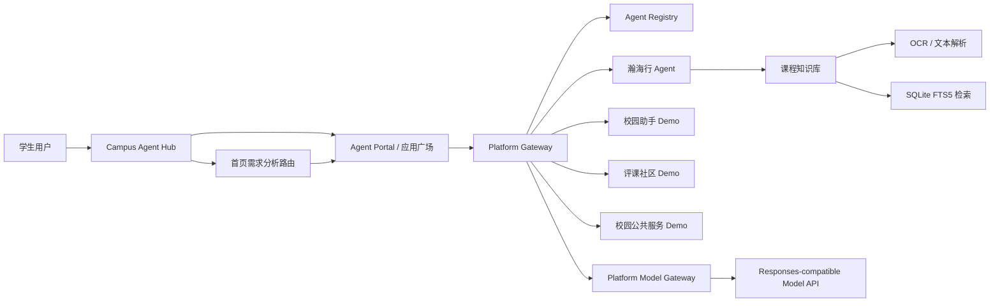

# AI for better life In USTC 设计文档

## 1. 项目概述

### 1.1 项目定位

`AI for better life In USTC` 是面向中国科学技术大学学生的校园 Agent 集成平台。平台通过统一接入契约、注册审核机制、Agent 广场、需求分析路由和统一调用网关，将课程学习、校园生活和公共服务类智能体组织到同一个入口中。

瀚海行是平台的第一个完整第一方标杆 Agent，负责验证课程资料整理、知识库问答、资料引用和期末复习场景。校园助手、评课社区和校园公共服务 Agent 是按同一 Contract 接入的独立 Demo，用于证明平台可以容纳不同领域的校园服务。

### 1.2 要解决的问题

校园智能服务通常存在以下问题：

- 不同服务入口分散，学生需要自己寻找合适的工具；
- 不同 Agent 的接口、认证和交互协议不统一，接入成本高；
- 课程资料格式复杂，直接交给模型容易出现文本乱码、来源不清和回答不可追溯；
- 用户私人资料、共享资料和公共资料的访问边界容易混淆；
- 平台无法明确判断一个 Agent 是否已经审核、上线和可用。

本项目的目标不是再做一个孤立的聊天机器人，而是提供一个可以持续接入校园 Agent 的平台基础设施，并用瀚海行完成第一条真实业务闭环。

## 2. 设计目标与边界

### 2.1 设计目标

1. 建立统一的 Agent 注册、审核、展示和调用入口；
2. 通过版本化 Contract 降低不同技术栈 Agent 的接入成本；
3. 让用户可以从首页快速对话，也可以通过需求分析路由找到合适的 Agent；
4. 完成课程资料导入、OCR、检索、引用和权限隔离闭环；
5. 保证 API Key、私人资料和 Agent 凭据不暴露给浏览器或其他 Agent；
6. 通过固定验收脚本和真实浏览器测试证明系统可部署、可运行。

### 2.2 当前版本边界

当前版本明确不包含以下能力：

- Agent 之间相互发现、互相调用或递归委派；
- 自动执行任务的 Main Agent 或 Supervisor；
- 未审核的开放式 Agent 市场；
- 真实评课社区点评和校内行政数据库的正式批量接入；
- 面向公网生产环境的真实身份认证、计费和多实例治理。

评课社区和校园公共服务 Demo 当前用于展示平台接入形式和交互边界，不能表述为已经接入真实数据源。

## 3. 总体架构



### 3.1 服务划分

| 服务 | 端口 | 职责 |
|---|---:|---|
| Campus Agent Hub | `8100` | Registry、审核、Gateway、首页对话、需求路由和模型配置 |
| 瀚海行 | `8002` | 课程知识库、资料问答、引用、工作台和课程知识广场 |
| Demo Agent 服务 | `8101` | 校园助手、评课社区、校园公共服务三个独立逻辑 Agent |

Hub 与瀚海行使用独立数据库和业务边界。Hub 不导入瀚海行业务代码，也不直接操作瀚海行数据库。

## 4. 平台层设计

### 4.1 Contract

Contract v1 定义 Agent 的公共接入边界，包括：

- Agent Manifest 和版本号；
- Agent 名称、分类、标签和能力声明；
- 健康检查接口；
- 请求和错误格式；
- AG-UI 流式事件；
- `simple-chat` 轻量适配协议；
- 认证声明、文件引用和兼容规则。

能力完整的 Agent 可以直接提供 AG-UI；简单的校园服务可以只提供 `simple-chat` JSON 接口，由 Gateway 转换成统一的 AG-UI 事件。平台不要求 Agent 内部必须使用某个框架。

### 4.2 Registry 与审核

Agent 的生命周期为：

```text
提交版本 -> Contract 验收 -> 管理员审核 -> active -> superseded / suspended
```

平台会检查 Manifest Schema、启动页、健康接口、协议响应和基础安全约束。只有处于 `active` 状态且具有活动版本的 Agent 才会进入用户广场，也只有这类 Agent 才能被需求路由推荐。

### 4.3 Platform Gateway

Gateway 根据用户最终确认的 `agent_id` 做确定性代理，负责：

- 身份和权限校验；
- 请求 Schema 校验；
- Agent 在线状态检查；
- 文件引用重新鉴权；
- 超时、取消、限流和输出大小控制；
- AG-UI / `simple-chat` 事件转发；
- 调用状态和安全审计。

Gateway 不负责理解课程业务，不修改 Agent 的业务回答，也不替用户自动调用多个 Agent。这样可以让平台治理能力和 Agent 专业能力保持清晰边界。

### 4.4 Agent Portal

应用广场展示：

- Agent 图标、名称、分类和简介；
- 能力标签、版本和可用状态；
- Featured / Connected 接入等级；
- 立即对话和详情入口。

瀚海行作为 Featured Agent，从广场点击后直接进入正式工作台；其他轻量 Agent 进入统一聊天容器。

## 5. 首页对话与需求路由

### 5.1 普通对话模式

普通对话使用最短的平台身份提示，不读取 Agent 路由清单，也不执行额外检索。用户输入简单问题后，Hub 直接调用当前模型并通过 SSE 增量返回回答。

### 5.2 需求分析路由模式

路由模式使用两个受控文档：

1. `apps/hub/skills/agent-routing/SKILL.md`：定义需求分析规则和输出边界；
2. `apps/hub/skills/agent-routing/AGENT_CATALOG.md`：以简短摘要描述已注册 Agent 的能力。

处理流程为：

```text
用户需求
  -> 读取受控路由 Skill 和 Agent 功能表
  -> 与运行时 active Registry 求交集
  -> 高置信规则或模型语义匹配
  -> 返回候选 agent_id 与推荐理由
  -> 服务端二次校验
  -> 前端生成受控 Agent 入口
  -> 用户点击后进入目标 Agent
```

当前重点演示路由包括：

- “我要复习数学分析这门课” -> 瀚海行；
- “毕业材料需要签字盖章，我应该去哪里办理？” -> 校园公共服务 Agent。

模型不能自行生成 URL、token 或凭据，前端也不接受模型直接提供的跳转地址。

### 5.3 流式事件

首页和 Agent 统一使用 SSE。模型正文通过增量事件显示，推荐通过独立的 `home.recommendation` 事件返回，正常请求以 `home.completed` 收口。超时、取消、异常 EOF 和模型错误均会结束当前运行，不在历史中留下永久的“生成中”占位消息。

## 6. 瀚海行课程 Agent

### 6.1 知识空间

瀚海行支持三类知识空间：

- 个人知识库：默认只对当前用户可见；
- 邀请制共享知识库：用于课程小组共享资料；
- 订阅知识库：以只读方式引用公开发布的资料。

权限过滤发生在检索和模型调用之前。私人资料不会进入跨用户公共缓存，删除资料后全文索引和关联缓存必须失效。

### 6.2 资料处理

当前课程 Agent 支持 PDF、PPTX 基础文本、Markdown、TXT 和简单图片 OCR。对于 PDF，系统保留原文件用于预览和引用，同时使用经过源文件 SHA-256、页数和连续页集合校验的 `.ocr.md` sidecar 作为检索文本。Markdown 和 TXT 直接作为原生文本处理，不重复 OCR。

课程资料处理链路为：

```text
上传文件
  -> 格式识别
  -> 原生文本提取或 OCR sidecar 校验
  -> 按页保存
  -> 分块
  -> SQLite FTS5 建索引
  -> 记录文档、版本和来源信息
```

当前数学分析 B1 演示库包含 25 份资料，资料页面可以查看解析状态、可检索页数、原始 PDF 和提取文本。

### 6.3 选择性 RAG 与引用

普通问题默认不访问课程索引。用户进入知识检索模式后，可以从当前有权限的资料中逐份勾选本轮来源，后端只在选定范围内检索。

回答会以 `[S1]` 等标记关联来源，并展示文件名与页码。用户可以打开原 PDF、查看 OCR 文本、放大页面或回到引用位置，从而检查回答是否有依据。

### 6.4 模型调用

瀚海行支持平台模型网关和独立运行回退两种方式：

```text
瀚海行前端
  -> 瀚海行后端 / Hub Gateway
  -> Platform Model Gateway
  -> Responses-compatible API
```

当前演示默认使用 `gpt-5.6-sol`，平台可发现并切换多个兼容模型，包括 `gpt-5.6-luna` 和 `gpt-5.6-terra`。API Key 只在服务端运行时保存和使用，浏览器只显示脱敏状态。

## 7. 关键技术难点

### 7.1 技术栈无关的 Agent 接入

平台不把业务逻辑写死在 Gateway 中，而是将公共部分抽象成 Manifest、Contract 和适配器，使原生 AG-UI Agent 与轻量 `simple-chat` Agent 可以共存。

### 7.2 自然语言推荐与确定性治理的分离

模型只负责从受控能力表中提出候选，最终能否推荐由 active Registry 决定，最终是否调用由用户点击确认。这避免了模型幻觉、下线 Agent 仍被推荐和未经确认的自动调用。

### 7.3 课程资料的可追溯 RAG

系统同时处理 OCR 质量、页级来源、资料选择、空间权限、索引失效和模型回答组织，回答不只是“有内容”，还必须能回到具体文件和页码。

### 7.4 流式协议与异常收口

多种 Agent 协议最终统一为可观察的流式事件。前端要正确处理增量正文、推荐卡片、取消、超时、异常 EOF 和重试，避免用户看到永久等待状态或错误历史污染。

### 7.5 模型配置的安全衔接

模型 Profile、可用模型发现、全局默认模型与 Agent 专属绑定由服务端维护。用户可以切换模型，但不能通过浏览器传入任意 Base URL、读取 API Key 或越权使用其他 Agent 的绑定。

## 8. 安全、隐私与版权

- 不在仓库、日志或前端保存 API Key、Cookie、JWT 和 CSRF token；
- 用户私人资料在检索前完成权限过滤；
- 第三方 Agent、网页、OCR 文本和模型输出均按不可信输入处理；
- Agent Endpoint 经过精确白名单、健康检查和 SSRF 防护；
- 文件引用由服务端按当前用户和目标 Agent 重新鉴权；
- 评课社区点评、附件、教材和真题只有在取得明确授权后才能进入知识库；
- `demo-a`、`demo-b`、`demo-c` 仅用于本地比赛演示，不是生产认证方案。

## 9. 部署与验收

### 9.1 一键部署

有 Docker 时运行：

```powershell
docker compose --env-file .env -f deploy/compose.yaml up --build
```

无 Docker 时运行：

```powershell
.\deploy\run-demo-local.ps1
```

启动脚本会启动三个服务，注册并审核四个 Agent，生成运行时 Featured 凭据，导入数学分析 B1 资料并执行基础验收。

### 9.2 当前版本验收证据

- 当前版本：Git `main`，提交 `23305bf`；
- Hub、瀚海行和 Demo Agent 健康检查均通过；
- 四个 Agent 均在 Agent 广场显示为可用；
- 固定端到端验收连续 10/10 轮通过；
- 数学分析复习需求和签字盖章需求均能生成正确推荐；
- 瀚海行资料问答成功生成文件与页码引用；
- PDF 阅读器、提取文本和页面缩放可用；
- 浏览器真实页面检查无控制台错误或警告。

正式提交前应重新执行完整自动化测试和浏览器验收，以最终运行结果替换材料中的临时截图或旧结果。

## 10. 创新点与后续计划

### 10.1 创新点

1. 从单一校园 Agent 上升到可扩展的 Agent 应用广场；
2. 用统一 Contract 和适配器降低第三方 Agent 接入成本；
3. 将自然语言需求发现与确定性平台治理结合；
4. 以瀚海行验证 OCR、选择性 RAG、权限、引用和删除失效闭环；
5. 把模型配置、Agent 状态和调用安全纳入平台基础设施。

### 10.2 后续计划

- 在取得授权后接入真实评课社区数据；
- 接入校园公共服务的真实地点和办事流程数据；
- 支持更多校园 Agent 和更丰富的 Contract 能力；
- 接入真实统一身份认证和公网 HTTPS；
- 评估 PostgreSQL、向量检索和多实例部署。

## 11. 演示对应关系

正式演示视频建议按以下顺序展开：

1. Hub 首页和四个 Agent 广场；
2. 普通对话快速回答；
3. “复习数学分析”路由到瀚海行；
4. 选择课程资料并完成带页码引用的 RAG 问答；
5. “签字盖章”路由到校园公共服务 Demo；
6. 展示注册审核和模型配置；
7. 总结平台如何容纳更多校园 Agent。

该顺序先证明平台价值，再用瀚海行证明真实业务深度，最后用 Demo Agent 证明可扩展性。
