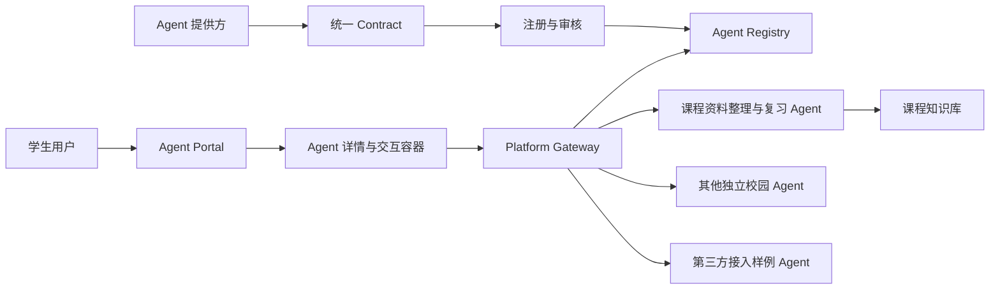

# AI for better life In ustc 项目产品文档

> 文档状态：产品基线 + 数学分析 B1 Demo v0.1
>
> 更新日期：2026 年 8 月 20 日
>
> 适用阶段：比赛产品定义、MVP 实施与团队分工
> 参赛项目：中国科学技术大学“一〇七”杯算力与智能体开发大赛本科生组智能体赛道

## 版本与方案关系

- 本文档是当前 `main` 分支的产品与实施基线，README 和后续代码设计应以本文为准。
- 当前主线采用“课程资料整理与复习 Agent + 插件化 Agent 接入平台”，首页增加只做发现推荐的需求路由助手；不包含可执行任务的 Main Agent、未经用户确认的 Agent 调用或 Agent 间调用。
- 此前的 Personal Main Agent + Specialist 单跳编排方案没有删除，完整归档于提交 `c49719e` 和标签 [`archive-v0.4-personal-main-agent`](https://github.com/xytsakura/ai-for-better-life-in-ustc/tree/archive-v0.4-personal-main-agent)。原有标签 `V0.0` 同时保留。
- 归档方案仅用于回溯设计演进，不作为当前开发依据；需要恢复或比较时应从归档标签创建独立分支，不将旧文档重新混入 `main`。
- 当前首个可运行切片已经冻结为“数学分析 B1 + 邀请制学习小组”，实现与启动说明见 [`apps/course-agent`](./apps/course-agent/README.md)，细化设计见 [`docs/superpowers/specs/2026-07-23-math-analysis-course-agent-design.md`](./docs/superpowers/specs/2026-07-23-math-analysis-course-agent-design.md)。

## 1. 文档摘要

本项目面向中国科学技术大学校园学习场景，建设一个以“课程资料整理与复习”为首个应用的插件化 AI Agent 平台。

项目包含两个相互支撑的核心任务：

1. **课程资料整理与复习 Agent**：帮助学生收集、整理、检索和使用课程资料。Agent 接入大语言模型，但产品重点不是普通聊天能力，而是建立一套可持续维护、来源清晰、权限隔离的课程知识库体系。知识库参考 ima 一类知识库产品的组织形态，分为个人知识库、共享知识库和订阅的第三方知识库。
2. **插件化 Agent 接入平台**：抽象首个 Agent 的接入过程，形成统一 Contract、后端注册与访问服务、前端 Agent 门户，使其他团队后续可以按统一规范接入独立 Agent。

本项目**不设置可执行任务的 Main Agent，也不建设多 Agent 协作网络**。各 Agent 相互独立，不互相调用或共同规划任务。用户可以从首页需求路由获得受控推荐，但仍需主动点击进入某个 Agent 使用。

一句话定义：

> 先把课程知识库 Agent 做深，再把它接入平台的方式做成可复用规范，让更多独立校园 Agent 能够像插件一样被统一接入和展示。

## 2. 比赛与团队背景

### 2.1 比赛信息

- 赛事：中国科学技术大学“一〇七”杯算力与智能体开发大赛；
- 参赛组别：本科生组；
- 参赛赛道：智能体赛道；
- 赛道定位：面向智慧科大校园场景，在教学赋能、科研支持、校园生活和服务管理等方向设计、开发智能体；
- 评审维度：创新性、实用性、技术难度、完成度；
- 线上提交时间：2026 年 8 月 1 日至 9 月 6 日；
- 线下决赛时间：2026 年 9 月 19 日至 9 月 20 日；
- 赛事提供校内模型和校外商业模型资源，具体可用模型与接口以组委会最新通知为准。

### 2.2 团队信息

- 队伍名称：`AI for better life In ustc`；
- 团队规模：3 名本科生；
- 报名状态：已完成；
- GitHub 私有仓库：`xytsakura/ai-for-better-life-in-ustc`；
- 团队协作以中文 Markdown 文档、轻量 Git 流程和明确责任边界为主。

### 2.3 项目约束

- 项目必须在有限时间内形成可运行、可演示的完整闭环；
- 所用知识库、数据、模型、代码和外部服务必须来源合法合规；
- 不得在仓库中保存 API key、密码、Cookie、CSRF token、个人敏感信息或未脱敏数据；
- 对外部课程资料、教材、讲义、真题、点评和附件应记录来源、许可状态和可使用范围；
- 比赛规则以官方通知和组委会最新说明为准，本地文档不替代官方要求。

## 3. 背景与问题

### 3.1 学生课程资料的现实问题

学生在学习一门课程时，资料通常分散在多个位置：

- 自己的电脑、网盘、课堂笔记和截图；
- 教师课程主页、教学平台和课程群；
- 同学共享的复习资料；
- GitHub、公开课程网站和其他第三方知识来源；
- 往年资料、经验总结和课程评价社区。

这些资料格式不一、更新频繁、质量参差不齐，学生经常遇到以下困难：

- 不知道资料保存在哪里，复习时重复寻找；
- 缺少统一分类、标签、版本和来源记录；
- 无法快速定位某个知识点对应的讲义、笔记或习题；
- 不清楚共享资料是否仍然有效、是否获得授权；
- 普通大模型聊天无法稳定引用个人资料，也无法保证不同用户之间的数据隔离；
- 第三方优质知识源需要重复访问，难以形成持续更新的订阅关系。

### 3.2 校园 Agent 接入的现实问题

不同团队可能分别开发选课、课程复习、校园通知、科研助手、生活服务等 Agent，但这些 Agent 通常使用不同技术栈、接口和前端：

- 用户需要寻找多个入口；
- 每接入一个新 Agent 都需要重复开发页面和适配代码；
- Agent 的名称、能力、认证、文件上传、流式输出和错误格式不统一；
- 平台难以统一进行审核、下线、限流和运行状态展示；
- 第三方开发者不知道达到什么条件才能被平台接入。

因此，本项目既需要一个有实际价值的具体 Agent，也需要把其接入过程沉淀为通用平台能力。

## 4. 产品定位

### 4.1 产品是什么

产品由“一个重点 Agent”和“一个插件化平台”组成：

```text
AI for better life In ustc
├── 课程资料整理与复习 Agent
│   ├── 个人知识库
│   ├── 共享知识库
│   └── 订阅的第三方知识库
└── 插件化 Agent 平台
    ├── Contract：统一接入契约
    ├── Backend：注册、审核、代理与治理
    └── Frontend：Agent 门户与统一交互容器
```

课程 Agent 是首个真实应用和平台的参考实现；插件化平台则让首个 Agent 的接入方式可以复用于其他校园 Agent。

### 4.2 产品不是什么

本项目明确不做：

- 不设置可执行任务的 Main Agent 或 Supervisor；
- 不让一个 Agent 自动调用另一个 Agent；首页路由助手只推荐并等待用户点击确认；
- 不做多 Agent 讨论、投票、递归委派或协作规划；
- 不以接入 Agent 数量作为首要目标；
- 不建设完全开放、无需审核的 Agent 市场；
- 不把所有校园系统和全部课程资料一次性接入；
- 不绕过数据源登录、访问控制、版权要求或反爬限制；
- 不把“使用大模型聊天”本身当作项目创新点。

### 4.3 核心产品原则

1. **知识库优先**：首个 Agent 的质量首先取决于知识如何进入、组织、更新、检索和引用，而不只取决于模型能力。
2. **Agent 相互独立**：每个 Agent 拥有独立业务逻辑、知识库和运行边界。
3. **用户最终确认**：首页可以根据聊天需求推荐 Agent，但平台不会替用户执行选择；只有用户点击受控入口后才进入目标 Agent。
4. **契约优先**：平台只依赖公开、版本化的接入契约，不依赖第三方 Agent 内部框架。
5. **渐进实现**：先完成课程 Agent 和一个可复现的第三方接入样例，再扩展生态。
6. **权限先于检索**：任何资料都必须先确定用户、知识空间和访问权限，再进入检索或模型上下文。
7. **来源可追踪**：回答应尽量保留资料名称、位置、版本和引用片段。

## 5. 目标用户与角色

### 5.1 学生用户

学生是课程 Agent 和 Agent 门户的主要使用者。他们希望：

- 上传并整理自己的课程资料；
- 使用经过授权的班级或课程共享资料；
- 订阅可信的第三方课程知识源；
- 根据全部可访问资料进行检索、总结、问答和复习；
- 在答案中看到可靠引用；
- 在统一入口中发现并使用其他校园 Agent。

### 5.2 知识库维护者

维护者可以是学生本人、课程资料整理者、团队成员或经过授权的第三方。他们负责：

- 建立知识库结构和元数据；
- 导入、更新、删除资料；
- 管理共享范围和订阅源；
- 处理重复、失效和版权状态；
- 查看解析和索引状态。

### 5.3 Agent 提供方

其他团队或开发者负责实现独立 Agent，并按照平台 Contract 提供：

- Agent Manifest；
- 标准交互端点；
- 能力、认证和数据范围说明；
- 健康检查和版本信息；
- 必要的演示与验收样例。

### 5.4 平台管理员

平台管理员负责：

- 审核 Agent 注册信息；
- 校验端点、协议和基础安全；
- 决定 Agent 是否在前端展示；
- 管理版本、状态、限流和下线；
- 查看平台级运行指标。

## 6. 核心任务一：课程资料整理与复习 Agent

### 6.1 产品目标

课程资料整理与复习 Agent 帮助学生形成从“资料进入知识库”到“基于资料完成复习”的完整闭环：

```text
资料收集
  -> 来源与权限确认
  -> 解析、分类与去重
  -> 建立索引
  -> 检索与引用
  -> 问答、总结和复习产物
  -> 更新、删除与失效
```

Agent 可以调用大语言模型完成查询改写、内容总结、问题生成和答案组织，但知识库管理、权限过滤、检索和引用应由确定性的应用逻辑控制。

### 6.2 三类知识库

#### 6.2.1 个人知识库

个人知识库仅属于当前用户，用于保存：

- 个人课堂笔记；
- 自己整理的复习提纲；
- 经许可保存的课件和作业；
- 截图、图片和 OCR 文本；
- 个人错题、学习记录和问答收藏。

关键要求：

- 默认仅本人可见；
- 不能被其他用户搜索或引用；
- 支持上传、删除、重新解析和索引失效；
- 不自动转化为共享知识库内容；
- 私人资料不得进入跨用户公共缓存。

#### 6.2.2 共享知识库

共享知识库面向经过授权的群体，例如一门课程、一个班级或一个学习小组。可包含：

- 教师公开发布的课程资料；
- 团队自制并同意共享的复习资料；
- 明确获得授权的讲义、习题和课程说明；
- 经过审核的课程 FAQ；
- 对公开来源进行结构化整理后形成的索引和摘要。

关键要求：

- 每个共享空间有明确管理员和成员范围；
- 资料需要记录来源、上传者、许可状态和更新时间；
- 新版本发布后旧索引和相关缓存应失效；
- 未明确授权的教材、真题、讲义和附件不得公开复制；
- 共享内容不能混入任何成员的个人笔记或私人回答。

#### 6.2.3 订阅的第三方知识库

第三方知识库由外部来源维护，用户或平台以订阅方式访问。可能包括：

- 课程官方网站或教师公开主页；
- 获准使用的 GitHub 课程资源；
- 公开课程知识站点；
- 经授权的课程资料服务；
- 后续接入的外部知识库提供方。

“订阅”不等于复制全部内容。平台应根据来源许可和技术条件选择：

- 只保存来源链接和元数据；
- 定期拉取公开且允许缓存的内容；
- 保存必要的解析索引，但不保存完整原文；
- 查询时实时访问外部来源；
- 在来源失效或撤回授权后停止检索并清理相关缓存。

关键要求：

- 每个订阅源有来源、更新方式、访问权限、缓存策略和许可记录；
- 外部内容按不可信输入处理，不能改变 Agent 的系统规则或工具权限；
- 登录 Cookie、API key 等凭据不得进入知识库正文、模型提示、日志或回答；
- 用户应能看出答案引用的是个人、共享还是第三方知识库。

### 6.3 知识库统一数据模型

三类知识库应复用统一的数据对象，但通过 `space_type` 和权限规则隔离。

建议的核心对象包括：

| 对象 | 作用 | 关键字段示例 |
|---|---|---|
| KnowledgeSpace | 表示一个知识空间 | `id`、`name`、`space_type`、`owner`、`visibility` |
| Source | 表示资料来源 | `source_type`、`source_url`、`license`、`access_mode` |
| Document | 表示一份逻辑文档 | `title`、`course`、`semester`、`version`、`status` |
| DocumentRevision | 表示文档版本 | `content_hash`、`created_at`、`parser_version` |
| Chunk | 表示可检索片段 | `text`、`page`、`section`、`embedding_version` |
| Subscription | 表示第三方订阅关系 | `provider`、`refresh_policy`、`last_sync_at` |
| Citation | 表示回答引用 | `document_id`、`revision_id`、`locator`、`snippet` |
| AccessPolicy | 表示访问规则 | `subject`、`permission`、`expires_at` |

所有检索结果至少应携带：知识空间、文档、版本、定位信息和访问范围，避免模型只得到一段无法追溯的文本。

### 6.4 资料导入与处理

MVP 优先支持：

- 文本型 PDF；
- PPTX 中的基础文本；
- Markdown、TXT 等纯文本；
- 清晰 PNG/JPEG 图片的基础 OCR；
- 网页 URL 的标题、来源和允许使用的正文或摘要。

标准处理流程：

1. 检查上传者身份和目标知识空间；
2. 检查文件类型、大小、来源和许可信息；
3. 计算内容指纹，识别重复文档；
4. 在受限环境中解析文件，不允许解析器任意联网；
5. 提取标题、章节、页码、课程、学期等元数据；
6. 按章节和语义边界分块；
7. 建立全文检索和向量索引；
8. 记录解析器、索引和内容版本；
9. 进行抽样质量检查后开放检索。

复杂表格、公式识别、扫描版 PDF 整体 OCR、DOCX 完整样式和音视频内容不作为第一版硬要求。

### 6.5 检索与回答流程

```text
用户问题
  -> 用户选择“直接问答”或“使用课程资料”
  -> 直接问答：跳过课程索引 -> 大模型直接回答 -> 返回无资料引用的答案
  -> 资料问答：用户勾选本轮允许模型看到的文件
       -> 服务端重新校验每个 document_id 的访问权限与有效状态
       -> 只在所选文件中查询改写、检索、去重和排序
       -> 构造带来源的上下文 -> 大模型生成回答
       -> 引用与权限复核 -> 返回答案
```

关键原则：

- 必须在检索前完成权限过滤，不能先把私人内容交给模型再删除；
- 普通知识问题默认直接回答，不得为了形式统一而自动扫描课程资料；
- 资料问答必须由用户明确勾选来源，后端不得把空选择扩展成整个知识空间；
- 每轮请求携带完整 `document_ids`，服务端不得信任前端已经完成权限检查；
- 回答应区分“资料中明确说明”“根据资料推断”和“资料中未找到”；
- 关键结论尽量附带文档名、章节或页码；
- 没有足够证据时明确说明缺失，而不是让模型自由补全；
- 个人、共享和第三方资料可以在一次查询中合并，但引用和权限标识不能丢失。

### 6.6 核心功能

MVP 功能：

- 创建和管理个人知识库；
- 创建一个演示用课程共享知识库；
- 配置至少一个第三方知识库订阅样例；
- 上传、解析、分类、去重和删除资料；
- 按课程、学期、类型、标签和知识空间筛选；
- 普通知识问题由模型直接回答；
- 展示可访问资料并支持按学习、备考场景或逐份勾选；
- 只基于本轮勾选且有权访问的资料进行检索问答；
- 生成课程资料概览、章节总结和复习提纲；
- 根据资料生成练习题或自测问题；
- 回答中展示引用来源；
- 显示资料解析、索引和订阅更新时间。

可选增强：

- 错题本与复习计划；
- 基于知识点掌握情况的个性化推荐；
- 资料变更通知；
- 多模态图表和公式理解；
- 用户确认后将高质量个人整理内容发布到共享知识库。

### 6.7 课程 Agent 验收标准

- 个人、共享和第三方知识库能够在界面中被清楚区分；
- 用户只能检索自己有权访问的资料；
- 直接问答不调用资料检索；
- 资料问答未选择文件时不能提交，选择后只能命中所选文件；
- 两个测试用户互相检索个人知识库时命中数为 0；
- 删除资料后，相关索引和缓存能够失效；
- 重复上传同一文件能够识别；
- 固定问题集的检索 Recall@5 不低于 80%；
- 引用正确率不低于 90%；
- 回答忠实度不低于 90%；
- 答案能定位到具体文档、章节或页码；
- 不出现 API key、Cookie、私人资料正文和受限下载地址泄露；
- 能稳定演示“上传资料—建立索引—提问—查看引用—删除失效”的完整流程。

## 7. 核心任务二：插件化 Agent 接入平台

### 7.1 产品目标

平台为独立 Agent 提供统一入口和统一接入方式。平台不理解或调度 Agent 的业务逻辑，只负责：

1. 定义接入 Contract；
2. 注册、审核和管理 Agent；
3. 在前端展示可用 Agent；
4. 将用户请求发送给用户选择的 Agent；
5. 提供统一鉴权、文件能力、状态展示、限流和基础可观测性。

### 7.2 整体结构



用户选择某个 Agent 后，后续请求只进入该 Agent。Agent 之间没有通信链路。

## 8. 平台组成一：Contract

### 8.1 Contract 的目标

Contract 规定“一个 Agent 要接入平台，至少需要提供什么”。它应独立于 LangGraph、CrewAI、Dify、FastAPI 或其他内部实现。

Contract 至少包括：

- Agent Manifest；
- 交互接口；
- 流式事件格式；
- 文件上传和引用方式；
- 认证与权限声明；
- 错误格式；
- 健康检查；
- 版本与兼容规则；
- 安全和验收要求。

### 8.2 Agent Manifest

当前 Contract v1 Manifest：

```json
{
  "schema_version": "1.0",
  "id": "hanhai-course-agent",
  "name": "瀚海行",
  "description": "整理课程资料，并基于个人、共享和订阅知识库进行复习问答。",
  "version": "0.8.0",
  "owner": "AI for better life In ustc",
  "category": "学习助手",
  "tags": ["课程资料", "知识库", "复习"],
  "integration": {
    "mode": "connected",
    "protocol": "ag-ui",
    "launch_url": "https://agent.example.edu.cn/",
    "chat_endpoint": "https://agent.example.edu.cn/api/hub/chat",
    "health_endpoint": "https://agent.example.edu.cn/api/health",
    "callback_urls": ["https://agent.example.edu.cn/api/hub/callback"]
  },
  "capabilities": ["streaming", "citations", "knowledge-base", "full-workspace"],
  "data_policy": {
    "receives_user_identity": true,
    "receives_files": false,
    "stores_conversation": true
  }
}
```

`trust_level`、审核状态、活动版本和凭据不属于公开 Manifest，由 Registry 单独保存。普通接口会剔除聊天端点、健康端点、回调地址和私有治理字段。

### 8.3 交互协议

统一聊天采用锁定版本 `@ag-ui/core@0.0.57`：请求使用官方 `RunAgentInput`，响应使用 `text/event-stream`，每个 `data:` 帧都是官方 AG-UI Event。最小事件链为：

- `RUN_STARTED`；
- `TEXT_MESSAGE_START`；
- 一个或多个 `TEXT_MESSAGE_CONTENT`；
- `TEXT_MESSAGE_END`；
- `RUN_FINISHED` 或 `RUN_ERROR`。

内部能力完整的 Agent 可直接暴露 AG-UI；低成本接入可实现 Contract 的 `simple-chat` JSON，请求和响应由 Gateway 通用适配为 AG-UI。Gateway 不为具体 Agent 增加分支。MCP 只作为 Agent 内部工具/知识源协议，A2A 不在 v1 范围内。

### 8.4 统一错误格式

错误至少包含：

```json
{
  "request_id": "req_xxx",
  "error": {
    "code": "KNOWLEDGE_ACCESS_DENIED",
    "message": "当前用户无权访问指定知识空间",
    "retryable": false,
    "details": {}
  }
}
```

建议统一的错误类别：

- `INVALID_REQUEST`；
- `AUTH_REQUIRED`；
- `ACCESS_DENIED`；
- `AGENT_UNAVAILABLE`；
- `RATE_LIMITED`；
- `INPUT_REQUIRED`；
- `FILE_REJECTED`；
- `BUDGET_EXCEEDED`；
- `UPSTREAM_ERROR`；
- `INTERNAL_ERROR`。

### 8.5 Contract 版本治理

- Contract 使用独立 `schema_version`；
- Agent 业务版本与 Contract 版本分开；
- 破坏兼容性的变更提升主版本；
- 新 Agent 接入前运行固定契约测试；
- 已接入 Agent 的 endpoint、协议、认证或权限声明发生变化后需要重新审核；
- 平台至少同时兼容当前版本和前一个稳定版本，或提供明确迁移期限。

## 9. 平台组成二：后端

### 9.1 后端职责

后端由以下模块组成：

| 模块 | 职责 |
|---|---|
| Agent Registry | 保存 Manifest、版本、分类、状态和审核记录 |
| Review Service | 执行 Schema、连通性、协议和安全验收 |
| Platform Gateway | 根据用户选择将请求代理给指定 Agent |
| Identity & Access | 统一用户身份、Agent 身份和权限校验 |
| Event Proxy | 转发 SSE 事件，处理断开、取消和基础超时 |
| Identity | 为 Agent 签发 120 秒 EdDSA JWT，并通过 JWKS 发布公钥 |
| Workspace Authorization | 为 Featured Agent 签发 60 秒一次性授权码并使用 `client_secret_basic` 兑换 |
| Observability | 记录 agent_id、版本、请求状态、延迟和安全审计元数据 |
| Admin API | 提供审核、启用、禁用、版本切换和下线能力 |

### 9.2 Gateway 边界

Gateway 只根据用户已经选择的 `agent_id` 进行确定性转发和治理。首页助手可以做自然语言需求匹配，但不属于 Gateway 执行链；模型只返回候选 `agent_id`，服务端按功能表与 active Registry 二次校验。Gateway 不进行：

- 自动选择 Agent；
- 将任务拆给多个 Agent；
- 修改 Agent 的业务回答；
- 让 Agent 互相发现或调用。

Gateway 可以做：

- 身份验证；
- 请求 Schema 校验；
- 目标 Agent 状态检查；
- 文件引用鉴权；
- 限流、超时和取消；
- 流式事件转发；
- 响应大小与危险内容检查；
- 结构化日志和指标统计。

### 9.3 Agent 注册生命周期

```text
submitted version: pending -> approved / rejected
approved version: staged -> active -> superseded
agent: pending -> active -> suspended -> active
```

只有 `active` 且存在活动版本的 Agent 才在用户门户展示。新版本必须重新提交和审核；批准时原子切换活动版本，管理员可以暂停、恢复或回滚。

### 9.4 后端安全基线

- 注册 endpoint 时防止 SSRF、私网访问和恶意重定向；
- 第三方 Agent 始终按不可信服务处理；
- 平台凭据和用户凭据不得直接透传；
- `file_ref` 必须由服务端根据当前用户和目标 Agent 重新鉴权；
- 日志不记录 API key、Cookie、完整文件正文和私人聊天正文；
- Agent 返回的 Markdown、HTML、URL 和文件下载均需安全处理；
- 对单 Agent 设置请求数、并发数、执行时间和输出大小上限；
- Agent 被禁用后立即停止新请求，并向用户给出可解释状态。

## 10. 平台组成三：前端

### 10.1 Agent Portal

首页以卡片或列表形式展示已启用 Agent：

- 图标、名称和一句话说明；
- 分类与标签；
- 支持的输入输出能力；
- 维护者和版本；
- 当前可用状态；
- 数据和隐私提示；
- “开始使用”入口。

用户可以按分类、标签和关键词筛选，但平台不根据聊天内容自动代替用户选择 Agent。

### 10.2 Agent 详情页

详情页展示：

- Agent 的完整用途；
- 适合和不适合处理的问题；
- 支持的文件类型；
- 使用的数据范围；
- 是否调用外部模型或服务；
- 维护者、版本和更新时间；
- 开始对话按钮。

### 10.3 统一交互容器

所有符合 Contract 的 Agent 尽量复用同一交互容器：

- 消息输入和流式输出；
- 文件上传；
- 引用展示；
- 运行状态和取消；
- 补充输入；
- 错误和重试；
- 会话列表。

对于需要特殊界面的 Agent，Contract 可通过 `ui_extensions` 声明受控扩展，但 MVP 不允许第三方在平台页面执行任意脚本。

### 10.4 管理界面

管理界面至少支持：

- 查看待审核 Manifest；
- 运行契约测试；
- 查看 Agent 健康状态；
- 启用、禁用或下线 Agent；
- 查看调用量、延迟和错误率；
- 查看版本和审核历史。

## 11. 端到端用户流程

### 11.1 使用课程资料 Agent

1. 用户登录平台；
2. 在 Agent Portal 选择“课程资料整理与复习助手”；
3. 创建或选择个人知识库；
4. 加入一个允许访问的课程共享知识库；
5. 订阅一个第三方公开知识源；
6. 上传个人课程资料并等待解析完成；
7. 提出复习问题；
8. Agent 只在用户有权访问的三类知识库中检索；
9. 页面展示回答、引用来源及所属知识空间；
10. 用户删除一份资料后，再次查询不应命中已删除内容。

### 11.2 第三方 Agent 接入

1. Agent 提供方阅读 Contract；
2. 实现标准交互端点和健康检查；
3. 提交 Agent Manifest；
4. 平台执行 Schema、连通性、安全和固定样例测试；
5. 管理员审核并启用；
6. 前端自动出现新的 Agent 卡片；
7. 用户主动选择并使用该 Agent；
8. 整个过程不修改 Gateway 的业务路由代码。

## 12. MVP 范围

### 12.1 必须完成

课程资料 Agent：

- 个人、共享、订阅第三方三类知识库；
- 至少一个课程的合规演示资料；
- 文本 PDF、基础 PPTX 文本和一种简单图片 OCR；
- 上传、解析、索引、检索、引用和删除失效；
- 课程问答、章节总结和复习提纲；
- 两个用户的权限隔离测试。

插件化平台：

- `AgentManifest` JSON Schema；
- AG-UI `RunAgentInput`、SSE 事件和错误规范；
- Agent Registry 和管理员审核状态；
- Gateway 确定性代理；
- Agent Portal、详情页和统一交互容器；
- 课程资料 Agent 作为第一方参考实现；
- 至少一个独立进程的极简第三方 Agent 接入样例；
- 新 Agent 接入不修改 Gateway 业务代码；
- 超时、取消、日志和健康检查。

### 12.2 条件增强

- 更多 AG-UI 可选事件与工具调用展示；
- MCP 工具或知识源接入模板；
- 更完整的第三方知识库自动同步；
- 共享知识库贡献审核工作流；
- 统一模型网关和更细的成本统计；
- 面向共享部署的持久限流、配额与多实例一致性；
- 更丰富的 Agent UI 扩展；
- 更复杂的 OCR、公式和表格解析。

### 12.3 明确后置

- Agent 间通信和多 Agent 协作；
- 能自动执行任务的 Main Agent、未经用户确认的 Agent 调用；
- 完全开放的公共 Agent 市场；
- 自动运行未知第三方代码；
- 生产级计费和商业结算；
- 普通用户任意配置模型 `base_url`；
- 未经授权的课程资料批量同步和再分发。

## 13. 项目创新点

比赛叙事应重点证明以下价值：

1. **系统化课程知识库**：不是简单把文件丢给大模型，而是实现个人、共享、订阅三种知识空间的来源、权限、版本、检索和引用闭环。
2. **知识库与 Agent 平台结合**：课程 Agent 不只是孤立 Demo，而是平台 Contract 的第一方参考实现。
3. **技术栈无关的插件化接入**：第三方 Agent 只需满足 Manifest 和交互契约，无需了解平台内部实现。
4. **零业务代码接入证明**：增加第三方 Agent 时，只增加注册配置和契约实现，不修改 Gateway 业务路由。
5. **用户选择而非黑盒调度**：每个 Agent 的用途、维护者、数据范围和入口对用户透明。
6. **校园资料合规治理**：资料来源、版权、隐私、删除和第三方订阅边界作为产品能力，而不是附加说明。

## 14. 评测指标

| 模块 | 指标 | MVP 目标 |
|---|---|---:|
| 知识库 | 固定问题 Recall@5 | 不低于 80% |
| 知识库 | 引用正确率 | 不低于 90% |
| 知识库 | 回答忠实度 | 不低于 90% |
| 知识库 | 跨用户私人资料命中 | 0 次 |
| 知识库 | 删除后旧内容检索命中 | 0 次 |
| 平台 | Contract 固定测试通过率 | 100% |
| 平台 | 已禁用/未审核 Agent 前端曝光 | 0 次 |
| 平台 | 第三方 Agent 接入所需 Gateway 业务代码修改 | 0 行 |
| 平台 | 演示脚本端到端成功率 | 不低于 90% |
| 安全 | 密钥、Cookie 和私人数据泄露 | 0 次 |

## 15. 实施路线

### 阶段一：产品与 Contract 冻结（已完成）

- 确认课程 Agent 的知识库对象和三类空间边界；
- 冻结 Agent Manifest、交互事件和错误码；
- 准备合规演示资料和固定评测问题；
- 确认三人分工和代码目录。

### 阶段二：课程知识库最小闭环（已完成）

- 完成文件导入、解析、分块和索引；
- 完成个人知识库；
- 完成共享知识库最小权限模型；
- 完成一个第三方订阅源样例；
- 跑通带引用问答和删除失效。

### 阶段三：插件化平台闭环（已完成）

- 完成 Registry、审核状态和 Gateway；
- 完成 Agent Portal、详情页和统一交互容器；
- 将课程 Agent 按 Contract 接入；
- 接入一个独立第三方样例 Agent；
- 验证零 Gateway 业务代码改动。

### 阶段四：评测、安全与材料（当前）

- 固化知识库检索、引用和权限测试；
- 固化 Contract、Agent 下线、超时和恶意响应测试；
- 完成部署说明、演示脚本、视频和答辩材料；
- 2026 年 9 月 4 日后原则上停止新增功能；
- 2026 年 9 月 6 日前完成线上提交。

## 16. 三人分工建议

### 角色 A：知识库与课程 Agent

- 知识空间、文档和索引数据模型；
- 文档解析、分块、全文/向量检索；
- 课程问答、总结、引用和评测；
- 第三方知识库订阅样例。

### 角色 B：平台后端与 Contract

- Agent Manifest 和交互契约；
- Registry、审核、Gateway、文件引用和鉴权；
- 流式事件、限流、超时和可观测性；
- 第三方 Agent 接入样例和契约测试。

### 角色 C：前端、产品与比赛材料

- Agent Portal、详情页和统一交互容器；
- 三类知识库管理界面和引用展示；
- 管理审核界面；
- 演示数据、视频、设计文档和答辩材料。

团队成员可以互相复核，但 Contract、知识库权限模型和演示主流程应分别指定唯一主责任人，避免多人同时无边界修改。

## 17. 风险与应对

| 风险 | 影响 | 应对方式 |
|---|---|---|
| 知识库范围过大 | 首个 Agent 迟迟无法完成 | 先完成一个课程、三类空间和少量格式 |
| 资料版权不清 | 无法公开演示或提交 | 使用公开许可、书面授权或团队自制脱敏资料 |
| 第三方订阅源不稳定 | 更新和引用不可复现 | MVP 使用固定公开源或自制订阅服务样例 |
| RAG 效果不稳定 | 回答缺少依据 | 建立固定问题集，优先改进元数据、分块和检索 |
| Contract 设计过重 | 第三方接入成本过高 | 保持最小必填字段，复杂能力使用可选扩展 |
| 过早绑定单一协议 | 后续 Agent 难接入 | 内部定义最小 Contract，通过适配器兼容外部协议 |
| 平台功能抢占业务时间 | 两边都成为半成品 | 课程 Agent 先跑通，再抽象平台接入能力 |
| Agent 返回恶意内容 | 前端或用户受到攻击 | 第三方输出按不可信内容校验和安全渲染 |
| 三人并行边界不清 | 重复开发和冲突 | 按知识库、后端 Contract、前端材料划分责任 |

## 18. 数据、隐私与版权原则

- 用户个人知识库默认仅本人可见；
- 权限过滤必须发生在检索和模型调用之前；
- 用户删除资料后，应立即停止检索，并清理索引和相关缓存；
- 不在仓库、数据库正文、日志、事件或 Agent Manifest 中保存明文密钥；
- 第三方 Agent 不应直接获得其他 Agent 的数据、状态或凭据；
- 第三方知识库订阅必须记录来源、访问方式、许可和缓存期限；
- 评课社区没有可共享的通用用户 API token，不共享任何成员的登录 Cookie；
- 评课社区源码许可不等于用户点评和附件内容获得开放许可；
- 未获授权的教材、讲义、真题、附件和登录限定内容不得进入公共知识库；
- 所有网页、文档、OCR 文本和第三方 Agent 输出均按不可信输入处理；
- 对外展示的答案尽量包含来源，避免把模型生成内容冒充原始资料事实。

## 19. 当前已冻结与后续确认事项

数学分析 B1 与 Hub v1 边界已冻结：

1. 首个演示课程为数学分析 B1，当前仓库资料只在团队私有与比赛演示边界内使用；
2. 共享知识库采用邀请制学习小组，使用 `demo-a`、`demo-b`、`demo-c` 验证角色与空间隔离；
3. 瀚海行使用 FastAPI、SQLite FTS5、PyMuPDF、DeepSeek-OCR-2 sidecar 和 Responses-compatible 模型接口；
4. Hub 是独立 FastAPI 服务和独立 SQLite，已实现 Contract、Registry、审核治理、Gateway、Portal 和 Featured 授权；
5. Contract v1 锁定 AG-UI 事件边界，并提供 `simple-chat` 通用适配器；
6. 瀚海行、校园助手 Demo、评课社区 Agent Demo 和校园公共服务 Agent Demo 已按同一 Contract 接入，Gateway 不含具体 Agent 业务分支。
7. Hub `v0.2.0` 已实现版本级自动验收与批准门禁、持久限流、缓存健康准入、安全图标代理、凭据轮换/撤销和重启稳定的 Ed25519 签名身份。
8. 固定比赛流程已连续运行 10 轮，广场、两种聊天协议、Featured 工作台和授权码防重放 10/10 轮通过。

比赛提交前仍需团队确认：

1. 第三方订阅知识库的第一个演示来源及其授权边界；
2. 是否以及何时迁移到 PostgreSQL 全文检索与向量检索；
3. 正式演示使用本机 Compose、校园服务器还是临时公网部署；
4. 外部团队 Agent 的审核责任、SLA 和下线机制；
5. 赛事提供模型的实际接口、额度和部署限制；
6. 最终作品提交格式、演示网络和公网 HTTPS 证书条件。

## 20. 最终交付定义

比赛版本完成的最低标准是：

- 一个学生可以在统一 Web 门户中选择课程资料整理与复习 Agent；
- Agent 能同时使用该学生的个人知识库、一个共享知识库和一个订阅第三方知识库；
- 学生可以上传资料、进行带引用问答并验证删除失效；
- 平台具有明确的 Agent Manifest、交互协议和验收规范；
- 另一个独立 Agent 能按同一 Contract 接入并自动出现在门户中；
- 新 Agent 接入不需要修改 Gateway 业务路由代码；
- 首页普通问题可以即时流式回答，专业需求可以推荐已上线 Agent 并由用户一键进入；
- 整个系统不包含 Main Agent，也不存在 Agent 间调用；
- 项目能够用固定脚本、评测数据、安全测试和演示视频证明上述能力。

本地比赛 Demo 的工程验收脚本为 `deploy/verify_demo.py`。公开部署仍需补真实登录、公网 HTTPS 和受控出站网络，不能把 `X-Hub-User` 演示身份直接暴露到互联网。
